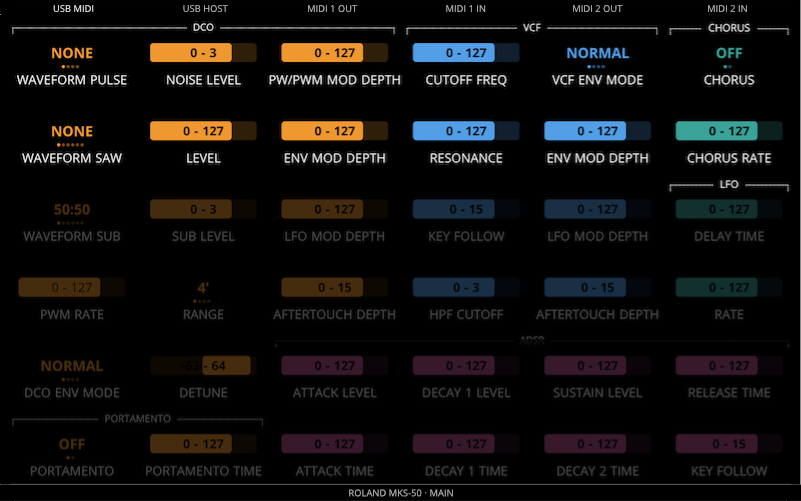
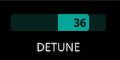
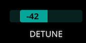
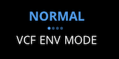

# The Concept of Control

Electra can be described as a MIDI device that:

1. **Generates** MIDI messages according to user actions, such as turning the knobs or using the touch
1. **Forwards** MIDI messages between different ports, (MIDI IO, USB host, and USB device)
1. **Merges** messages (1) to the flow of messages (2)

A Control is an instance of a synth parameter. It visualizes the value of the parameter and it generates and sends corresponding MIDI messages when the parameter value is changed. Control also reflects any change of the value according to the incoming stream of MIDI messages.

The picture below shows a Fader Control representing Filter cutoff with the value currently set to 8.

Each Control has several attributes that define its function and appearance. The most obvious attributes are:

- the type of the Control (fader, list)
- the associated MIDI message type (CC, NRPN, SysEx)
- parameter number
- minimum and maximum value.

Electra users create Presets by organizing various Controls to layouts that suit their needs. Presets are created, edited, and managed in [Electra One App](https://app.electra.one/) and uploaded to Electra One controller over the USB. The picture below is an example of one Page of a Preset:

In this example, the Preset consists of a number of Controls used to edit patch parameters of one specific synthesizer. Presets may, however, consist of Controls that are linked to many synthesizers. This allows Electra not to be only a synth programmer but gives you the possibility to be in control of the whole rig of gear.

## Control types

There are two types of controls currently:

- faders
- lists
- pads
- envelopes

The type of control tells Electra how the Control will look like. Also, it defines if the Control will work with continuous data ranges of values or with discrete values.

### Fader

Faders are ideal for showing and sending continuous ranges of parameter values. A good example of a fader is a cutoff frequency of a filter or an oscillator detune. Turning the knob smoothly changes the current value of the assigned parameter. As you turn the knob corresponding MIDI messages are sent and the fader value is updated on the display.

The value may change within a given minimum and maximum.

If the value range minimum is negative, the zero value is placed proportionally within the length of the fader. Positive values are then represented by a fader bar extending to the right, while negative values extend to the left.

 

Optionally, faders may have Overlay assigned. Overlay replaces specified values with a text label. More on info on overlays is provided below.

### Lists

The lists are one of the key features of Electra. They help to overcome the problem when discrete MIDI values have a specific meaning. Imagine a MIDI parameter VCF Envelope Mode that has the following four values:

| MIDI value | Text label             |
|------------|------------------------|
| 0          | Normal                 |
| 16         | Inverted               |
| 32         | Normal with Dynamics   |
| 48         | Inverted with Dynamics |

The fader would not be very helpful here. When the list is used for this Control, the behavior of the knob changes to act pretty much as an encoder. Turning the knob switches the values of the parameter.

Each list value is represented as a dot. The currently selected one is highlighted and the label is shown. The lists may have up to 255 values. If the number of list items exceeds 16, the visual representation of the list slightly changes to a more fader like style. The text labels are still, however, shown instead of numeric values.

The lists do not have minimum and maximum values defined, they work only with values defined in the overlay.

Should the list receive a MIDI value that is not defined in the overlay, the numeric value will be displayed and the list will be highlighted with a red background.

### Pads

The pads are controls that can be used to switch between two states / values of given parameter or to trigger transmission of MIDI messages.

The pad will transmit MIDI messages when its state is changed. It is up to the user to specify if a message will be sent on a change from _Off_ to _On_ state, or from _On_ to _Off_ state, or both. When going from _Off_ to On state, _On Value_ will be sent. When going from _On_ to _Off_ state, _Off Value_ will be sent.

 

The pads support the following MIDI message types:
- cc7
- cc14
- NRPN
- RPN
- SysEx
- Program change
- Note
- Start
- Stop
- Tune request

If the type of the associated MIDI message does not support value, eg. Start MIDI message, the value cannot be specified.

Program and Note numbers can be specified too.

The pads can act either as toggles or as momentary switches. A toggle stays switched in the new state, while a momentary switch always returns to the off state.

Pads are operated with display touch only.

### Envelopes

The envelopes are multi-value controls that greatly improve the visual representation of ADSR and ADR envelopes. They allow users to map their MIDI parameters to individual segments of envelopes. Electra can then visualize the shape of the envelope whenever the incoming MIDI data modifies it or when the user changes the values with knobs.

The following types of envelopes are supported:

- ADSR
- ADR
- DX7 multi-stage

It is possible to specify which value will be assigned to the knob by default. For example, you may choose Attack being controlled by the knob. It is possible, however, to change this assignment on the fly when working with the preset. It means one knob can be used to change all values of the envelope.

The detail window of an envelope control provides access to all parameters with knobs. The knobs are remapped so that all parameters can be changed with knobs.

