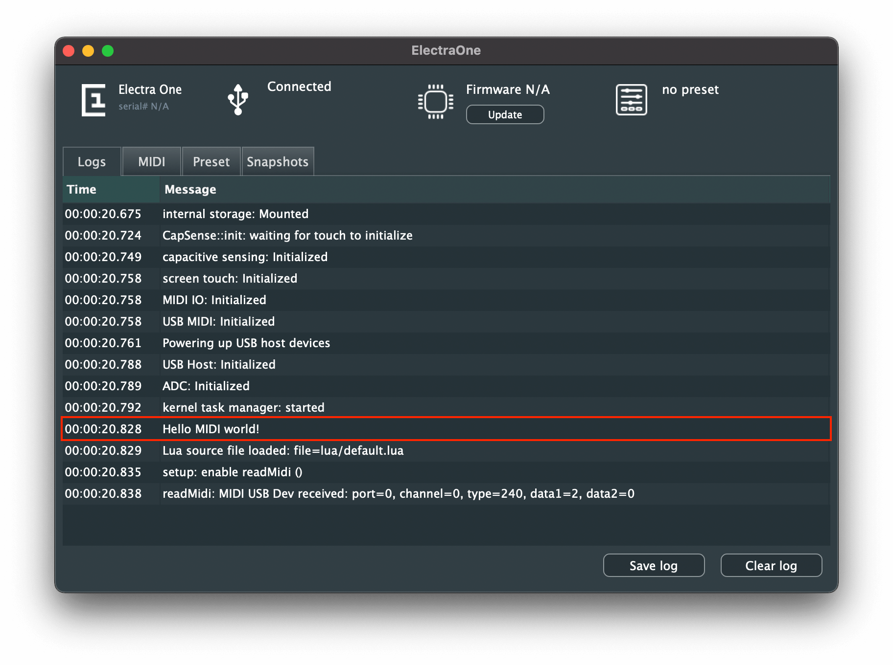

# Electra One Lua script

This document describes the Electra One Lua implementation. The Lua is a scripting programming language - a detailed information about it can be found at the [Official Lua site](http://www.lua.org/). Electra's Lua allows users to develop
their own applications and run them on the controller. This, in fact, turns the Electra One into a powerful MIDI processing device.

The applications can go from simple scripts addressing specific needs of one user to complex UI-rich applications, such as custom controllers, sequencers, and midi monitors.

The Lua script interface is under development at present and it is being modified on daily basis. If you intend to use it, make sure you join the community at the [Electra One forum](https://forum.electra.one/) and you share your ideas and frustrations.

::: warning Note
A special firmware needs to be installed in your controller in order to run Lua scripts. The firmware can be downloaded on the [Downloads](../downloads/firmware.md) page.
:::

## A brief overview

The Electra's Lua implementation provides a programming API to:

- Sending and receiving all types of MIDI messages, including SysEx
- Reading output of the capacitive touch panel
- Reading the status and positions of the touch sensitive knobs
- Reading the status of the hardware buttons
- Working with the graphics and UI components on the LCD
- Managing timer-based tasks
- Managing objects stored in the memory *
- Managing data stored in the internal permanent storage media *

\* not preset in current version of the API


## Uploading the scripts
In order to run a Lua script on the controller, it needs to be uploaded first. It can be done with the Lua script upload SysEx call. Currently, there can be only one script loaded in the controller. If there already is a Lua script stored in the controller, the upload SysEx call will overwrite it.

The Lua script gets executed immediately after the upload is completed. The script stays stored in the internal storage media permanently and it is executed whenever the controller is powered on.

### SysEx Request
```
0xF0 0x00 0x21 0x45 0x01 0x7C script-source-code 0xF7
```

- 0xF0 SysEx header byte
- 0x00 0x21 0x45 Electra One MIDI manufacturer Id
- 0x01 Upload data
- 0x7C Lua script file
- `script-source-code` bytes representing ASCII characters of the Lua script
  source code
- 0xF7 SysEx closing byte


## The first steps
::: warning Note
All the examples shown in this document can be found at [electra.lua repository on Github](https://github.com/martinpavlas/electra.lua).
:::

### Hello World example
``` lua
print ("Hello MIDI world!)
```

This is possibly the simplest Lua script you can run on Electra One. It prints text _Hello MIDI world!_ to the ElectraOne Console log view.

If you had your ElectraOne Console application open, you should see the text in the log view. Once you got this running, you are ready to take further steps.




### The structure of the script
The Electra One Lua script may consist of four different building blocks:
  - the setup section
  - the standard functions
  - the standard callbacks
  - the user functions

Let's use following example to demonstrate it:

``` lua
-- Lua script structure example

-- the Setup
clockCounter = 0
beatEnabled = 0


-- User functions
function myPrint (text)
    print ("my Lua: " .. text)
end


-- Standard callbacks
function midi.onClock (midiInput)
    if beatEnabled == 1 then
        if math.mod (clockCounter, 24) == 0 then
            myPrint ("midi beat received: interface=" .. midiInput.interface)
        end
    end
    clockCounter = clockCounter + 1
end

function onButtonDown (buttonId)
    myPrint ("button " .. buttonId .. " pressed")

    if buttonId == BUTTON_1 then
        myPrint ("Beat enabled")
        beatEnabled = 1
    elseif buttonId == BUTTON_4 then
        myPrint ("Beat disabled")
        beatEnabled = 0
    end
end
```

The script is rather straighforward. It registers all received MIDI clock messages and increases the internal counter accordingly. The top-left (`BUTTON_1`) and top-right (`BUTTON_4`) are used to enable and disable logging of the quarter note beats (which is every 24th clock message).


#### The setup
The setup part is all source code that is not part of any function, it means it resides in the global context of the script. The setup part may call any standard functions, user functions, initialize global variables, and so on. The setup part in the above script is:

``` lua
-- the Setup
clockCounter = 0
beatEnabled = 0
```

The primary purpose of the setup is to prepare your application for handling the application events at the later stage. The setup is executed immediately after the script is loaded. It does not matter where the setup part is located in the script, it is not required to be at the top. If you intend to use your own user functions in the setup, you will need to place the setup part below the definition of the user functions.


#### The standard functions
The standard functions are functions from the Lua standard libraries and the Electra One extension libraries. These functions cover vast range of functionality from printing, doing math, handling IO, MIDI messaging to working with UI components.

If you observe the above example source code carefully, you will spot two standard functions there.

``` lua
-- print text to the ElectraOne Console application
print ("my Lua: " .. text)

-- run modulo function from the math library
if math.mod (clockCounter, 24) == 0 then
```

The description of the standard functions is covered by the official [Lua documentation](http://www.lua.org/docs.html) and this document.


#### The standard callbacks
The Electra One Lua applications are strictly event driven. Once the setup is completed, all you can do is to handle various types of events. The events can be triggered by touching the pots, receiving MIDI messages, as well as by the timers that generate events in predefined time periods.

There are two callback functions in the above example script `midi.onClock ()` and `onButtonDown ()`. The `midi.onClock ()` is called whenever the MIDI clock message is received. Likewise, the `onButtonDown ()` is called when any of the hardware buttons is pressed.

``` lua
-- Standard callbacks
function midi.onClock (midiInput)
    ...
end

function onButtonDown (buttonId)
    ...
end
```


#### The user functions
Of course, user can, and actually are encouraged to, package their functionality to Lua user functions that are used to build more complex programatic blocks.

To demonstrate the user functions we added a `myPrint ()` function to the example.

``` lua
-- User functions
function myPrint (text)
    print ("my Lua: " .. text)
end
```


## Electra One Lua extension API

### Logger
The logging is a key element to understanding what is happening inside the controller. Electra One Lua API provides the `print ()` command that writes texts that can be observed in the ElectraOne Console application.

The log messages are, in fact, SysEx messages sent to the CTRL port. They carry the timestamp and the text of the message. For more details about the console logs, please review the [Electra's MIDI implementation](./developers/midiimplementation.md)

As the logging relies on the standard SysEx messaging, users can develop their own log viewers or integrate Electra logs to their own applications.

#### Functions
::: functiondesc
<b>print (text)</b>
<small>
A function to print text to the ElectraOne Console log view.
</small>

<small>
<i>text</i> - string, a text message to be displayed in the console log
</small>
:::


#### Example script
``` lua
-- Printing to the console log

print ("This message will be shown in the ElectraOne console")

for i = 1, 10 do
    print ("message #" .. i)
end

```


### Pot touch
Electra One features touch sensing hardware pots (knobs). Callback calls are triggered whenever the fingers are put down or lifted of the pots.

The pots are identified with a numeric identifier, starting with id 1 for the leftmost pot in the first row and going up to 12 for the rightmost pot in the second row. The global variables `POT_1` .. `POT_12` are provided to identify the pots.

#### Functions
::: functiondesc
<b>onPotTouchDown (potId)</b>
<small>
A callback to handle an event when the fingers touch the pots.
</small>

<small>
<i>potId</i> - integer, a numeric identifier of the pot
</small>
:::

::: functiondesc
<b>onPotTouchUp (potId)</b>
<small>
A callback to handle an event when the fingers are lifted of the pots.
</small>

<small>
<i>potId</i> - integer, a numeric identifier of the pot
</small>
:::

#### Example script
``` lua
-- Pot touch sensing demo

print ("Pot (knob) touch sensing demo loaded")

function onPotTouchDown (potId)
    print ("pot " .. potId .. " touched")

    if potId == POT_1 then
        print ("POT_1 touched")
    end
end

function onPotTouchUp (potId)
    print ("pot " .. potId .. " released")
end
```


### Pot Movement
The position of the pots can be, of course, scanned. The important thing to say here is that the pot readings are always relative, providing information about the rate of change and the direction. The rate increases with speed of the rotation. The positive rates represent clockwise rotation while negative rates are counter-clockwise.

It is up to the user application to transform the delta information retrieved into any type of absolute value. Or simply stay in the relative domain. eg. relative MIDI controls.

The callback function is called whenever a change of position is detected. On a technical note, it is important to say that the firmware scans the pot positions only if they are touched by the user.

The pots are identified with a numeric identifier, starting with id 1 for the leftmost pot in the first row and going up to 12 for the rightmost pot in the second row. The global variables `POT_1` .. `POT_12` are provided to identify the pots.

#### Functions
::: functiondesc
<b>onPotMove (potId, relativeChange)</b>
<small>
A callback to handle an event when any of the pots is turned. The relativeChange
is a subject to the speed of rotation. It is typically in the range between 1
and 10.
</small>

<small>
<i>potId</i> - integer, a numeric identifier of the pot<br />
<i>relativeChange</i> - integer, a relative change of the position<br />
</small>
:::

#### Example script
``` lua
-- Pot movement reading demo

print ("Pot (knob) reading demo loaded")

function onPotMove (potId, relativeChange)
    print ("pot " .. potId .. " moved by " .. relativeChange)
end
```


### Hardware buttons
There are six hardware buttons on the Electra One controller. The API allows the user to trigger actions whenever any of the buttons is pressed, released, or held for prolonged time period.

The buttons are identified with a numeric identifier, starting with id 1 for the top-left button and going up to 6 for the right-bottom button. The global variables `BUTTON_1` .. `BUTTON_6` are provided to identify the buttons.

#### Functions
::: functiondesc
<b>onButtonDown (buttonId)</b>
<small>
A callback to handle an event when any of the hardware buttons is pressed.
</small>

<small>
<i>buttonIdId</i> - integer, a numeric identifier of the button<br />
</small>
:::

::: functiondesc
<b>onButtonUp (buttonId)</b>
<small>
A callback to handle an event when any of the hardware buttons is released.
</small>

<small>
<i>buttonId</i> - integer, a numeric identifier of the button<br />
</small>
:::

::: functiondesc
<b>onButtonLongHold (buttonId)</b>
<small>
A callback to handle an event when any of the hardware buttons is pressed for
longer than 0.5s.
</small>

<small>
<i>buttonIdId</i> - integer, a numeric identifier of the button<br />
</small>
:::


#### Example script
``` lua
-- Hardware buttons handling demo

print ("Hardware buttons demo loaded")

function onButtonDown (buttonId)
    print ("button " .. buttonId .. " pressed")

    if buttonId == BUTTON_6 then
        print ("[MENU] button pressed")
    end
end

function onButtonUp (buttonId)
    print ("button " .. buttonId .. " released")
end

function onButtonLongHold (buttonId)
    print ("button " .. buttonId .. " held long")
end
```


### LCD touch
Electra One controller has an LCD with a capacitive touch panel attached. Callback calls are triggered whenever the fingers interact with the touch panel. The hardware supports detection of up to five touch points, the API is, however, currently
limited to one touch point only.

The callbacks receive a `touchEvent` data table as their parameter. The `touchEvent` provides complete information about the touch status

``` lua
touchEvent = {
    id = TOUCH_POINT_1,   -- integer, id of the touch point
    x = 536,              -- integer, X coordinate
    y = 87,               -- integer, Y coordinate
    componentId = 12      -- integer, id of a component that received the touch
}
```

The touch points are identified with a numeric identifier, starting with id 1 going up to 5. The global variables `TOUCH_POINT_1` .. `TOUCH_POINT_5` are provided to identify the touch points. Currently only `TOUCH_POINT_1` is available.

#### Functions
::: functiondesc
<b>onTouchDown (touchEvent)</b>
<small>
A callback to handle an event when the LCD receives an initial finger touch.
</small>

<small>
<i>touchEvent</i> - data table, information about the touch event<br />
</small>
:::

::: functiondesc
<b>onTouchHold (touchEvent)</b>
<small>
A callback to handle an event when finger is touching the LCD and is moving.
</small>

<small>
<i>touchEvent</i> - data table, information about the touch event<br />
</small>
:::

::: functiondesc
<b>onTouchUp (touchEvent)</b>
<small>
A callback to handle an event when finger is lifted of the LCD.
</small>

<small>
<i>touchEvent</i> - data table, information about the touch event<br />
</small>
:::

::: functiondesc
<b>onTouchLongHold (touchEvent)</b>
<small>
A callback to handle an event when finger is touching the LCD for longer than 0.5s.
</small>

<small>
<i>touchEvent</i> - data table, information about the touch event<br />
</small>
:::

::: functiondesc
<b>onTouchClick (touchEvent)</b>
<small>
A callback to handle a short tap on the LCD.
</small>

<small>
<i>touchEvent</i> - data table, information about the touch event<br />
</small>
:::

::: functiondesc
<b>onTouchDoubleClick (touchEvent)</b>
<small>
A callback to handle a double tap on the LCD.
</small>

<small>
<i>touchEvent</i> - data table, information about the touch event<br />
</small>
:::

#### Example script
``` lua
-- LCD touch sensing demo

print ("LCD touch reading demo loaded")


function onTouchDown (touchEvent)
    print ("id=" .. touchEvent.id ..
           " touchDown x=" .. touchEvent.x ..
           " y=" .. touchEvent.y)
end

function onTouchHold (touchEvent)
    print ("id=" .. touchEvent.id ..
           " onTouchHold x=" .. touchEvent.x ..
           " y=" .. touchEvent.y)
end

function onTouchUp (touchEvent)
    print ("id=" .. touchEvent.id ..
           " onTouchUp x=" .. touchEvent.x ..
           " y=" .. touchEvent.y)
end

function onTouchLongHold (touchEvent)
    print ("id=" .. touchEvent.id ..
           " onTouchLongHold x=" .. touchEvent.x ..
           " y=" .. touchEvent.y)
end

function onTouchClick (touchEvent)
    print ("id=" .. touchEvent.id ..
           " onTouchClick x=" .. touchEvent.x ..
           " y=" .. touchEvent.y)
end

function onTouchDoubleClick (touchEvent)
    print ("id=" .. touchEvent.id ..
           " onTouchDoubleClick x=" .. touchEvent.x ..
           " y=" .. touchEvent.y)
end
```

### MIDI
All the MIDI functionality is encapsulated in the `midi` library. The library is imported automatically by the Electra One firmware. Therefore, there is no need to include it in the script, it is always available.

The library consists for functions to send MIDI messages out, as well as it provides handful of callback functions to process the incoming MIDI data.

::: warning SysEx message length limit
The SysEx messages are intentionally trimmed max length of 256 bytes now. This limit is will be in place during this early implementation only. Electra One is capable of receiving SysEx messages with virtually unlimited length by using a memory mapped `SysexBlock` object. The `SysexBlock` is not supported by the Electra One Lua API yet.
:::


### MIDI Callbacks
The MIDI callbacks are here to process the incoming MIDI messages. There is one general callback
function `onMessage ()` that is called when any type of MIDI message is received. There is also an array of callbacks for specific MIDI messages. These callbacks are called only when a specific MIDI message is received.

The callback function is registered by the Electra One Lua interpreter as soon as the callback function defined in the Lua script. Once the callback is defined, the firmware registers an extra hook to run the function. This consumes some of the processing resources. It is advised not to leave empty callback functions in your scripts.

The first parameter of all callback functions is the `midiInput`. The `midiInput` is a data table that describes the origin of the message.

``` lua
midiInput = {
  interface = "USB dev",  -- a name of the IO interface where the messages was received
  port = 0                -- a numeric port identifier
}
```

Another important data structure is the `midiMessage` data table. the `midiMessage` carries the information about a MIDI message broken down do individual attributes. Different types of MIDI messages are represented with slightly different format of the `midiMessage` data table. The fields `channel`, `type`, `data1`, `data2` are, however, common to all types of messages.

For example, a Control Change message can be access either as:

``` lua
midiMessage = {
    channel = 1,
    type = CONTROL_CHANGE,
    data1 = 1,
    data2 = 127
}
```

or

``` lua
midiMessage = {
    channel = 1,
    type = CONTROL_CHANGE,
    controllerNumber = 1,
    value = 127
}
```

The full description of all `midiMessage` variants is provided later in this document.

#### Functions
::: functiondesc
<b>midi.onMessage (midiInput, midiMessage)</b>
<small>
A callback to handle all types of incoming MIDI messages.
</small>

<small>
<i>midiInput</i> - data table, information about where the message came from<br />
<i>midiMessage</i> - data table, description of the incoming MIDI message<br />
</small>
:::

::: functiondesc
<b>midi.onNoteOn (midiInput, channel, noteNumber, velocity)</b>
<small>
A callback to handle incoming MIDI Note On message.
</small>

<small>
<i>midiInput</i> - data table, information about where the message came from<br />
<i>channel</i> - integer, a numeric representation of the MIDI channel (1 .. 16)<br />
<i>noteNumber</i> - integer, a numeric identifier of the MIDI note (0 .. 127)<br />
<i>velocity</i> - integer, a velocity of the key hit (0 .. 127)<br />
</small>
:::

::: functiondesc
<b>midi.onNoteOff (midiInput, channel, noteNumber, velocity)</b>
<small>
A callback to handle incoming MIDI Note Off message.
</small>

<small>
<i>midiInput</i> - data table, information about where the message came from<br />
<i>channel</i> - integer, a numeric representation of the MIDI channel (1 .. 16)<br />
<i>noteNumber</i> - integer, a numeric identifier of the MIDI note (0 .. 127)<br />
<i>velocity</i> - integer, a velocity of releasing the key (0 .. 127)<br />
</small>
:::

::: functiondesc
<b>midi.onControlChange (midiInput, channel, controllerNumber, value)</b>
<small>
A callback to handle incoming MIDI Control Change (CC) message.
</small>

<small>
<i>midiInput</i> - data table, information about where the message came from<br />
<i>channel</i> - integer, a numeric representation of the MIDI channel (1 .. 16)<br />
<i>controllerNumber</i> - integer, a numeric identifier of the CC (0 .. 127)<br />
<i>value</i> - integer, a numeric value of the controller (0 .. 127)<br />
</small>
:::

::: functiondesc
<b>midi.onAfterTouchPoly (midiInput, channel, noteNumber, pressure)</b>
<small>
A callback to handle incoming MIDI Polyphonic Aftertouch message.
</small>

<small>
<i>midiInput</i> - data table, information about where the message came from<br />
<i>channel</i> - integer, a numeric representation of the MIDI channel (1 .. 16)<br />
<i>noteNumber</i> - integer, a numeric identifier of the CC (0 .. 127)<br />
<i>pressure</i> - integer, a numeric representation of the pressure applied (0 .. 127)<br />
</small>
:::

::: functiondesc
<b>midi.onProgramChange (midiInput, channel, programNumber)</b>
<small>
A callback to handle incoming MIDI Program change message.
</small>

<small>
<i>midiInput</i> - data table, information about where the message came from<br />
<i>channel</i> - integer, a numeric representation of the MIDI channel (1 .. 16)<br />
<i>programNumber</i> - integer, a numeric identifier of the CC (0 .. 127)<br />
</small>
:::

::: functiondesc
<b>midi.onAfterTouchChannel (midiInput, channel, pressure)</b>
<small>
A callback to handle incoming MIDI Channel Aftertouch message.
</small>

<small>
<i>midiInput</i> - data table, information about where the message came from<br />
<i>channel</i> - integer, a numeric representation of the MIDI channel (1 .. 16)<br />
<i>pressure</i> - integer, a numeric representation of the pressure applied (0 .. 127)<br />
</small>
:::

::: functiondesc
<b>midi.onPitchBend (midiInput, channel, value)</b>
<small>
A callback to handle incoming MIDI Pitch bend message.
</small>

<small>
<i>midiInput</i> - data table, information about where the message came from<br />
<i>channel</i> - integer, a numeric representation of the MIDI channel (1 .. 16)<br />
<i>value</i> - integer, an amount of Pitch bend applied (0 .. 16383)<br />
</small>
:::

::: functiondesc
<b>midi.onSongSelect (midiInput, songNumber)</b>
<small>
A callback to handle incoming MIDI Song Select message.
</small>

<small>
<i>midiInput</i> - data table, information about where the message came from<br />
<i>songNumber</i> - integer, a numeric identifier of the song (0 .. 127)<br />
</small>
:::

::: functiondesc
<b>midi.onSongPosition (midiInput, position)</b>
<small>
A callback to handle incoming MIDI Song Position message.
</small>

<small>
<i>midiInput</i> - data table, information about where the message came from<br />
<i>position</i> - integer, a number of beats from the start of the song (0 .. 16383)<br />
</small>
:::

::: functiondesc
<b>midi.onClock (midiInput)</b>
<small>
A callback to handle incoming MIDI Clock message. There are 24 Clock messages
to one quarter note.
</small>

<small>
<i>midiInput</i> - data table, information about where the message came from<br />
</small>
:::

::: functiondesc
<b>midi.onStart (midiInput)</b>
<small>
A callback to handle incoming MIDI System real-time Start message.
</small>

<small>
<i>midiInput</i> - data table, information about where the message came from<br />
</small>
:::

::: functiondesc
<b>midi.onStop (midiInput)</b>
<small>
A callback to handle incoming MIDI System real-time Stop message.
</small>

<small>
<i>midiInput</i> - data table, information about where the message came from<br />
</small>
:::

::: functiondesc
<b>midi.onContinue (midiInput)</b>
<small>
A callback to handle incoming MIDI System real-time Continue message.
</small>

<small>
<i>midiInput</i> - data table, information about where the message came from<br />
</small>
:::

::: functiondesc
<b>midi.onActiveSensing (midiInput)</b>
<small>
A callback to handle incoming MIDI Active Sensing message.
</small>

<small>
<i>midiInput</i> - data table, information about where the message came from<br />
</small>
:::

::: functiondesc
<b>midi.onSystemReset (midiInput)</b>
<small>
A callback to handle incoming MIDI System Reset message.
</small>

<small>
<i>midiInput</i> - data table, information about where the message came from<br />
</small>
:::

::: functiondesc
<b>midi.onTuneRequest (midiInput)</b>
<small>
A callback to handle incoming MIDI Tune Request message.
</small>

<small>
<i>midiInput</i> - data table, information about where the message came from<br />
</small>
:::

::: functiondesc
<b>midi.onSysex (midiInput, data)</b>
<small>
A callback to handle incoming MIDI SysEx message. Currently limited to 256 bytes.
</small>

<small>
<i>midiInput</i> - data table, information about where the message came from<br />
<i>data</i> - array, a sequence of received bytes. Excludes the F0h and F7h bytes.
</small>
:::


#### Example script 1
``` lua
-- Receiving MIDI messages

function midi.onMessage (midiInput, midiMessage)
    if midiMessage.type == SYSEX then
        print ("sysex message received: interface=" .. midiInput.interface ..
               " data=[" .. table.concat (midiMessage.data,", ") .. "]")
    else
        -- generic approach using the data1 and data2
        print ("midi message received: interface=" .. midiInput.interface ..
               " channel=" .. midiMessage.channel ..
               " type=" .. midiMessage.type ..
               " data1=" .. midiMessage.data1 ..
               " data2=" .. midiMessage.data2)

        -- Message type specific attributes
        if midiMessage.type == NOTE_ON then
            print ("noteOn received: interface=" .. midiInput.interface ..
                   " channel=" .. midiMessage.channel ..
                   " noteNumber=" .. midiMessage.noteNumber ..
                   " velocity=" .. midiMessage.velocity)
        end
    end
end
```

#### Example script 2
``` lua
-- Receiving MIDI messages


function midi.onControlChange (midiInput, channel, controllerNumber, value)
    print ("controlChange received: interface=" .. midiInput.interface ..
           " channel=" .. channel ..
           " controllerNumber=" .. controllerNumber .. " value=" .. value)
end


function midi.onNoteOn (midiInput, channel, noteNumber, velocity)
    print ("noteOn received: interface=" .. midiInput.interface ..
           " channel=" .. channel ..
           " noteNumber=" .. noteNumber .. " velocity=" .. velocity)
end


function midi.onNoteOff (midiInput, channel, noteNumber, velocity)
    print ("noteOff received: interface=" .. midiInput.interface ..
           " channel=" .. channel ..
           " noteNumber=" .. noteNumber .. " velocity=" .. velocity)
end


function midi.onAfterTouchPoly (midiInput, channel, noteNumber, pressure)
    print ("afterTouchPoly received: interface=" .. midiInput.interface ..
           " channel=" .. channel ..
           " noteNumber=" .. noteNumber .. " pressure=" .. pressure)
end


function midi.onProgramChange (midiInput, channel, programNumber)
    print ("programChange received: interface=" .. midiInput.interface ..
           " channel=" .. channel ..
           " programNumber=" .. programNumber)
end


function midi.onAfterTouchChannel (midiInput, channel, pressure)
    print ("afterTouchChannel received: interface=" .. midiInput.interface ..
           " channel=" .. channel ..
           " pressure=" .. pressure)
end


function midi.onPitchBendChannel (midiInput, channel, value)
    print ("pitchBend received: interface=" .. midiInput.interface ..
           " channel=" .. channel ..
           " value=" .. value)
end


function midi.onSongSelect (midiInput, songNumber)
    print ("songSelect received: interface=" .. midiInput.interface ..
           " songNumber=" .. songNumber)
end


function midi.onSongPosition (midiInput, position)
    print ("songPosition received: interface=" .. midiInput.interface ..
           " position=" .. position)
end


function midi.onClock (midiInput)
    print ("midi clock received: interface=" .. midiInput.interface)
end


function midi.onStart (midiInput)
    print ("start received: interface=" .. midiInput.interface)
end


function midi.onStop (midiInput)
    print ("stop received: interface=" .. midiInput.interface)
end


function midi.onContinue (midiInput)
    print ("continue received: interface=" .. midiInput.interface)
end


function midi.onActiveSensing (midiInput)
    print ("active sensing received: interface=" .. midiInput.interface)
end


function midi.onSystemReset (midiInput)
    print ("system reset received: interface=" .. midiInput.interface)
end


function midi.onTuneRequest (midiInput)
    print ("tune request received: interface=" .. midiInput.interface)
end


function midi.onSysex (midiInput, data)
    print ("sysex message received: interface=" .. midiInput.interface ..
           " data=[" .. table.concat (data,", ") .. "]")
end
```


### MIDI Functions
In the similar manner to receiving MIDI messages, there are two ways of sending MIDI messages out. It can be done either by composing a `midiMessage` data table and passing it to generic `midi.sendMessage ()` function, or by calling functions that send specific types of the MIDI messages, eg. `midi.sendNoteOn ()`.

All functions send MIDI messages to all Electra's interfaces (`USB Dev`, `USB host`, `MIDI IO`). The idea is that this will follow the configuration of the low-level router of the Electra One controller. This might change in near future.


::: functiondesc
<b>midi.sendMessage (port, midiMessage)</b>
<small>
A function to send a MIDI message defined as a `midiMessage` data table.
</small>

<small>
<i>port</i> - integer, a port identifier (`PORT_1`, `PORT_2`, `PORT_CTRL`))<br />
<i>midiMessage</i> - data table, an outgoing MIDI message<br />
</small>
:::

::: functiondesc
<b>midi.sendNoteOn (port, channel, noteNumber, velocity)</b>
<small>
A function to send a Note On MIDI message.
</small>

<small>
<i>port</i> - integer, a port identifier (`PORT_1`, `PORT_2`, `PORT_CTRL`))<br />
<i>channel</i> - integer, a numeric representation of the MIDI channel (1 .. 16)<br />
<i>noteNumber</i> - integer, an identifier of the MIDI note (0 .. 127)<br />
<i>velocity</i> - integer, a velocity (0 .. 127)<br />
</small>
:::

::: functiondesc
<b>midi.sendNoteOff (port, channel, noteNumber, velocity)</b>
<small>
A function to send a Note Off MIDI message.
</small>

<small>
<i>port</i> - integer, a port identifier (`PORT_1`, `PORT_2`, `PORT_CTRL`))<br />
<i>channel</i> - integer, a numeric representation of the MIDI channel (1 .. 16)<br />
<i>noteNumber</i> - integer, an identifier of the MIDI note (0 .. 127)<br />
<i>velocity</i> - integer, a velocity (0 .. 127)<br />
</small>
:::

::: functiondesc
<b>midi.sendControlChange (port, channel, parameterNumber, value)</b>
<small>
A function to send a Control Change MIDI message.
</small>

<small>
<i>port</i> - integer, a port identifier (`PORT_1`, `PORT_2`, `PORT_CTRL`))<br />
<i>channel</i> - integer, a numeric representation of the MIDI channel (1 .. 16)<br />
<i>controllerNumber</i> - integer, an identifier of the Control Change (0 .. 127)<br />
<i>value</i> - integer, a value to be sent (0 .. 127)<br />
</small>
:::

::: functiondesc
<b>midi.sendAfterTouchPoly (port, channel, noteNumber, pressure)</b>
<small>
A function to send a Polyphonic Aftertouch MIDI message.
</small>

<small>
<i>port</i> - integer, a port identifier (`PORT_1`, `PORT_2`, `PORT_CTRL`))<br />
<i>channel</i> - integer, a numeric representation of the MIDI channel (1 .. 16)<br />
<i>noteNumber</i> - integer, an identifier of the MIDI note (0 .. 127)<br />
<i>pressure</i> - integer, a value representing the pressure applied (0 .. 127)<br />
</small>
:::

::: functiondesc
<b>midi.sendAfterTouchChannel (port, channel, pressure)</b>
<small>
A function to send a Channel Aftertouch MIDI message.
</small>

<small>
<i>port</i> - integer, a port identifier (`PORT_1`, `PORT_2`, `PORT_CTRL`))<br />
<i>channel</i> - integer, a numeric representation of the MIDI channel (1 .. 16)<br />
<i>pressure</i> - integer, a value representing the pressure applied (0 .. 127)<br />
</small>
:::

::: functiondesc
<b>midi.sendProgramChange (port, channel, programNumber)</b>
<small>
A function to send a Program Change MIDI message.
</small>

<small>
<i>port</i> - integer, a port identifier (`PORT_1`, `PORT_2`, `PORT_CTRL`))<br />
<i>channel</i> - integer, a numeric representation of the MIDI channel (1 .. 16)<br />
<i>programNumber</i> - integer, an identifier of the CC (0 .. 127)<br />
<i>pressure</i> - integer, a value to be sent (0 .. 127)<br />
</small>
:::

::: functiondesc
<b>midi.sendPitchBend (port, channel, value)</b>
<small>
A function to send a Pitch Bend MIDI message.
</small>

<small>
<i>port</i> - integer, a port identifier (`PORT_1`, `PORT_2`, `PORT_CTRL`))<br />
<i>channel</i> - integer, a numeric representation of the MIDI channel (1 .. 16)<br />
<i>value</i> - integer, an amount of Pitch Bend to be applied (0 .. 16383)<br />
</small>
:::

::: functiondesc
<b>midi.sendSongSelect (port, songNumber)</b>
<small>
A function to send a Song Select MIDI message.
</small>

<small>
<i>port</i> - integer, a port identifier (`PORT_1`, `PORT_2`, `PORT_CTRL`))<br />
<i>songNumber</i> - integer, a numeric identifier of the song (0 .. 127)<br />
</small>
:::

::: functiondesc
<b>midi.sendSongPosition (port, position)</b>
<small>
A function to send a Song Position MIDI message.
</small>

<small>
<i>port</i> - integer, a port identifier (`PORT_1`, `PORT_2`, `PORT_CTRL`))<br />
<i>songNumber</i> - integer, a number of beats from start of the song (0 .. 16383)<br />
</small>
:::

::: functiondesc
<b>midi.sendClock (port)</b>
<small>
A function to send a System real-time Clock MIDI message.
</small>

<small>
<i>port</i> - integer, a port identifier (`PORT_1`, `PORT_2`, `PORT_CTRL`))<br />
</small>
:::

::: functiondesc
<b>midi.sendStart (port)</b>
<small>
A function to send a System real-time Start MIDI message.
</small>

<small>
<i>port</i> - integer, a port identifier (`PORT_1`, `PORT_2`, `PORT_CTRL`))<br />
</small>
:::

::: functiondesc
<b>midi.sendStop (port)</b>
<small>
A function to send a System real-time Stop MIDI message.
</small>

<small>
<i>port</i> - integer, a port identifier (`PORT_1`, `PORT_2`, `PORT_CTRL`))<br />
</small>
:::

::: functiondesc
<b>midi.sendContinue (port)</b>
<small>
A function to send a System real-time Continue MIDI message.
</small>

<small>
<i>port</i> - integer, a port identifier (`PORT_1`, `PORT_2`, `PORT_CTRL`))<br />
</small>
:::

::: functiondesc
<b>midi.sendActiveSensing (port)</b>
<small>
A function to send a Active Sensing MIDI message.
</small>

<small>
<i>port</i> - integer, a port identifier (`PORT_1`, `PORT_2`, `PORT_CTRL`))<br />
</small>
:::

::: functiondesc
<b>midi.sendSystemReset (port)</b>
<small>
A function to send a System Reset MIDI message.
</small>

<small>
<i>port</i> - integer, a port identifier (`PORT_1`, `PORT_2`, `PORT_CTRL`))<br />
</small>
:::

::: functiondesc
<b>midi.sendTuneRequest (port)</b>
<small>
A function to send a Tune Request MIDI message.
</small>

<small>
<i>port</i> - integer, a port identifier (`PORT_1`, `PORT_2`, `PORT_CTRL`))<br />
</small>
:::

::: functiondesc
<b>midi.sendSysex (port, data)</b>
<small>
A function to send a Sysex MIDI message. Currently limited to 256 bytes.
</small>

<small>
<i>port</i> - integer, a port identifier (`PORT_1`, `PORT_2`, `PORT_CTRL`))<br />
<i>data</i> - array, an array with sequence of bytes to be sent. Do not enter F0 and F7 bytes.
</small>
:::

::: functiondesc
<b>midi.sendNrpn (port, channel, parameterNumber, value)</b>
<small>
A function to send a NRPN MIDI message.
</small>

<small>
<i>port</i> - integer, a port identifier (`PORT_1`, `PORT_2`, `PORT_CTRL`))<br />
<i>channel</i> - integer, a numeric representation of the MIDI channel (1 .. 16)<br />
<i>parameterNumber</i> - integer, an identifier of the NRPN (0 .. 16383)<br />
<i>value</i> - integer, a value to be sent (0 .. 16383)<br />
<i>lsbFirst</i> - boolean, when true, the lsb and msb bytes will be swapped<br />
</small>
:::

::: functiondesc
<b>midi.sendRpn (port, channel, parameterNumber, value)</b>
<small>
A function to send a RPN MIDI message.
</small>

<small>
<i>port</i> - integer, a port identifier (`PORT_1`, `PORT_2`, `PORT_CTRL`))<br />
<i>channel</i> - integer, a numeric representation of the MIDI channel (1 .. 16)<br />
<i>parameterNumber</i> - integer, an identifier of the RPN (0 .. 16383)<br />
<i>value</i> - integer, a value to be sent (0 .. 16383)<br />
<i>lsbFirst</i> - boolean, when true, the lsb and msb bytes will be swapped<br />
</small>
:::

::: functiondesc
<b>midi.sendControlChange14 (port, channel, parameterNumber, value)</b>
<small>
A function to send a Control Change 14bit MIDI message.
</small>

<small>
<i>port</i> - integer, a port identifier (`PORT_1`, `PORT_2`, `PORT_CTRL`))<br />
<i>channel</i> - integer, a numeric representation of the MIDI channel (1 .. 16)<br />
<i>controllerNumber</i> - integer, an identifier of the NRPN (0 .. 31)<br />
<i>value</i> - integer, a value to be sent (0 .. 16383)<br />
<i>lsbFirst</i> - boolean, when true, the lsb and msb bytes will be swapped<br />
</small>
:::


#### Example script
``` lua
-- Sending MIDI messages using the sendMessage ()


-- Control Change
midiMessage = {
   channel = 1,
   type = CONTROL_CHANGE,
   controllerNumber = 1,
   value = 127
}
midi.sendMessage (PORT_1, midiMessage)


-- Note On
midiMessage = {
   channel = 1,
   type = NOTE_ON,
   noteNumber = 60,
   velocity = 100
}
midi.sendMessage (PORT_1, midiMessage)


-- Note Off
midiMessage = {
   channel = 1,
   type = NOTE_OFF,
   noteNumber = 60,
   velocity = 100
}
midi.sendMessage (PORT_1, midiMessage)


-- Program Change
midiMessage = {
   channel = 1,
   type = PROGRAM_CHANGE,
   programNumber = 10
}
midi.sendMessage (PORT_1, midiMessage)


-- Pitch Bend
midiMessage = {
   channel = 1,
   type = PITCH_BEND,
   value = 513
}
midi.sendMessage (PORT_1, midiMessage)


-- Poly Pressure
midiMessage = {
   channel = 1,
   type = POLY_PRESSURE,
   noteNumber = 60,
   pressure = 100
}
midi.sendMessage (PORT_1, midiMessage)


-- Channel Pressure
midiMessage = {
   channel = 1,
   type = CHANNEL_PRESSURE,
   pressure = 64
}
midi.sendMessage (PORT_1, midiMessage)


-- Clock
midiMessage = {
   type = CLOCK
}
midi.sendMessage (PORT_1, midiMessage)


-- Start
midiMessage = {
   type = START
}
midi.sendMessage (PORT_1, midiMessage)


-- Stop
midiMessage = {
   type = STOP
}
midi.sendMessage (PORT_1, midiMessage)


-- Continue
midiMessage = {
   type = CONTINUE
}
midi.sendMessage (PORT_1, midiMessage)


-- Active Sensing
midiMessage = {
   type = ACTIVE_SENSING
}
midi.sendMessage (PORT_1, midiMessage)


-- System Reset
midiMessage = {
   type = RESET
}
midi.sendMessage (PORT_1, midiMessage)


-- Song Select
local ss = {
   type = SONG_SELECT,
   songNumber = 20
}
midi.sendMessage (PORT_1, ss)


-- Song Position
midiMessage = {
   type = SONG_POSITION,
   position = 10
}
midi.sendMessage (PORT_1, midiMessage)


-- Tune Request
midiMessage = {
   type = TUNE_REQUEST
}
midi.sendMessage (PORT_1, midiMessage)
```


#### Example script
``` lua
-- Sending MIDI messages out

print ("Sending MIDI out demo loaded")


-- Control change
midi.sendControlChange (PORT_1, 1, 10, 64)

-- Notes
midi.sendNoteOn (PORT_1, 1, 60, 100)
midi.sendNoteOff (PORT_1, 1, 60, 100)

-- Program change
midi.sendProgramChange (PORT_1, 1, 10)

-- Pitch bend
midi.sendPitchBend (PORT_1, 1, 513)

-- Polyphonic aftertouch
midi.sendAfterTouchPoly (PORT_1, 1, 60, 100)

-- Channel aftertouch
midi.sendAfterTouchChannel (PORT_1, 1, 100)

-- Send NRPN
midi.sendNrpn (PORT_1, 1, 512, 8192)

-- Send RPN
midi.sendRpn (PORT_1, 1, 1, 4096)

-- Send Control change 14bit
midi.sendControlChange14Bit (PORT_1, 1, 1, 2048)

-- Clock
midi.sendClock (PORT_1)

-- Start
midi.sendStart (PORT_1)

-- Stop
midi.sendStop (PORT_1)

-- Continue
midi.sendContinue (PORT_1)

-- Active sensing
midi.sendActiveSensing (PORT_1)

-- System reset
midi.sendSystemReset (PORT_1)

-- Song select
midi.sendSongSelect (PORT_1, 1)

-- Song position
midi.sendSongPosition (PORT_1, 200)

-- Tune request
midi.sendTuneRequest (PORT_1)

-- SysEx
midi.sendSysex (PORT_1, { 67, 32, 0 })
```

### Windows
Electra One supports the concept of application windows. Anything that is displayed on the screen is always a part belonging to a window. The window object is also a recipient of LCD touch events. While it is possible to have multiple windows open in the same time, for example the detail windows in our MIDI Controller firmware, the current Electra One Lua firmware supports only one window at time now. This window is created automatically at the startup. User can access the window functions with the `window` module.

The window is used to register components as its child objects. A component cannot be shown unless it is assigned to the window with the `window.addAndMakeVisible ()` function.

#### Functions
::: functiondesc
<b>window.addAndMakeVisible (component)</b>
<small>
Adds a component object and makes is a child object of the window and makes
the component visible.
</small>

<small>
<i>component</i> - component object, a component to be added<br />
</small>
:::

::: functiondesc
<b>window.repaint ()</b>
<small>
Initiates a repaint of the window and all its children components.
</small>
:::


### Components
Electra One is rather component and event oriented. Even though it is possible to paint graphics directly to the window, it is preferred to wrap any graphic objects to the components. The main advantage of the components is that provide all the functionality that allows users to interact with them.

The current Electra One Lua implementation is intentionally limited to one plain component that is represented by the square with a label. This will be extended after some general agreement on the component interface is reached.

#### Functions
::: functiondesc
<b>Component (id, color, label, bounds)</b>
<small>
Constructs a new Component object and returns a reference to it.
</small>

<small>
<i>id</i> - integer, a numeric identifier of the object<br />
<i>color</i> - integer, a numeric identifier of the color, restricted to six Electra colours<br />
<i>label</i> - string, a text to be displayed inside the component<br />
<i>bounds</i> - data table, structure holding the position and dimensions of the component<br />
</small>
<br />
<small>
<i>returns</i> - a reference to a newly constructed Component object<br />
</small>
:::

::: functiondesc
<b>\<component\>.repaint ()</b>
<small>
A class method to schedule a repaint of the component.
</small>
:::

::: functiondesc
<b>\<component\>.setLabel (label)</b>
<small>
Sets a new label of the component.
</small>

<small>
<i>label</i> - string, a new label to be displayed<br />
</small>
:::

::: functiondesc
<b>\<component\>.getLabel ()</b>
<small>
Retrieves the current label of the component.
</small>

<small>
<i>returns</i> - string, current component label<br />
</small>
:::

::: functiondesc
<b>\<component\>.setName (name)</b>
<small>
Sets a new name of the component. The component name is not shown.
The constructor sets it to the same text as the label.
</small>

<small>
<i>name</i> - string, a new name of the component<br />
</small>
:::

::: functiondesc
<b>\<component\>.getName ()</b>
<small>
Retrieves the current name of the component.
</small>

<small>
<i>returns</i> - string, current component name<br />
</small>
:::

::: functiondesc
<b>\<component\>.setId (id)</b>
<small>
Sets a new identifier of the component.
</small>

<small>
<i>id</i> - integer, a new id of the component<br />
</small>
:::

::: functiondesc
<b>\<component\>.getId ()</b>
<small>
Retrieves the current id of the component.
</small>

<small>
<i>returns</i> - integer, current component id<br />
</small>
:::

::: functiondesc
<b>\<component\>.setActive (shouldBeActive)</b>
<small>
Sets a active flag of the component. When set (true) the component is highlighted.
When unset (false) the component is shown in the normal state.
</small>

<small>
<i>shouldBeActive</i> - boolean, a desired active state of the component<br />
</small>
:::

::: functiondesc
<b>\<component\>.isActive ()</b>
<small>
Retrieves the current state of the active flag of the component.
</small>

<small>
<i>returns</i> - boolean, current state of the active flag<br />
</small>
:::

::: functiondesc
<b>\<component\>.setDimmed (shouldBeDimmed)</b>
<small>
Sets a dimmed flag of the component. When set (true) the component is dimmed.
When unset (false) the component is shown in the normal state.
</small>

<small>
<i>shouldBeDimmed</i> - boolean, a desired dim state of the component<br />
</small>
:::

::: functiondesc
<b>\<component\>.isDimmed ()</b>
<small>
Retrieves the current state of the dimmed flag of the component.
</small>

<small>
<i>returns</i> - boolean, current state of the dimmed flag<br />
</small>
:::

::: functiondesc
<b>\<component\>.setVisible (shouldBeVisible)</b>
<small>
Sets a visibility flag of the component. When set (true) the component is shown.
When unset (false) the component is hidden.
</small>

<small>
<i>shouldBeVisible</i> - boolean, a desired visibility state of the component<br />
</small>
:::

::: functiondesc
<b>\<component\>.isVisible ()</b>
<small>
Retrieves the current state of the visibility flag of the component.
</small>

<small>
<i>returns</i> - boolean, current state of the visibility flag<br />
</small>
:::

::: functiondesc
<b>\<component\>.setColor (color)</b>
<small>
Sets a color of the component.
</small>

<small>
<i>color</i> - integer, a numeric identifier of the color, restricted to six Electra colours<br />
</small>
:::

::: functiondesc
<b>\<component\>.getColor ()</b>
<small>
Retrieves the current color of the component.
</small>

<small>
<i>returns</i> - integer, current color of the component<br />
</small>
:::

::: functiondesc
<b>\<component\>.setBounds (bounds)</b>
<small>
Sets a new bounding box, ie. the position and dimensions of the component.
</small>

<small>
<i>bounds</i> - data table, structure holding the position and dimenstions of the component<br />
</small>
:::

#### Example script
``` lua
-- The component demo

print ("UI Component demo loaded")

-- Create and display the component
button = Component (1, ORANGE, "Button 1", { x = 462, y = 250, width = 100, height = 100 })
window.addAndMakeVisible (button)


-- Call a few getter methods
print ("component id=" .. button:getId ())
print ("component name=" .. button:getName ())
print ("component label=" .. button:getLabel ())

-- Change the component a bit
button:setBounds (412, 200, 200, 200)
button:setColor (BLUE)
button:setLabel ("Button 2")
```
