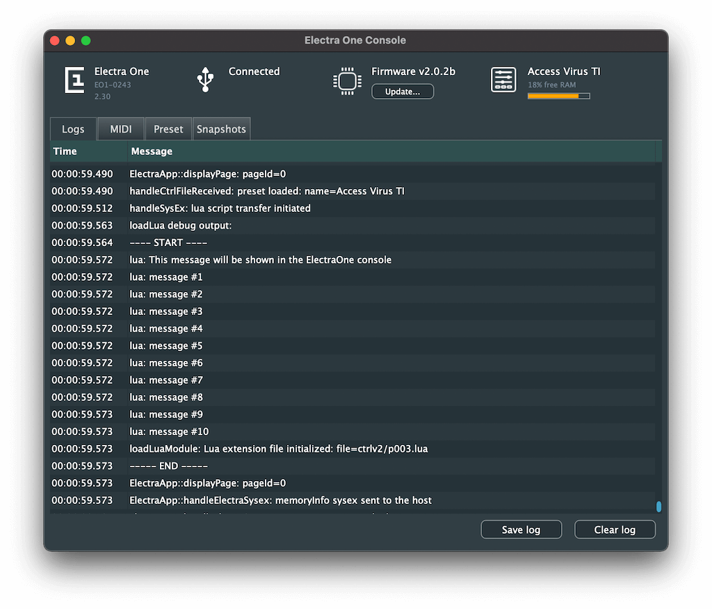

# Preset Lua extension

This document describes the Lua Extension of the Electra One MIDI Controller firmware. The extension adds procedural programming to the Electra One [Preset format](./presetformat.md). If you are looking for possibility to develop your own applications for Electra One, you might want to visit [Electra One Lua Script](./lua.md) document instead.

The Lua is a scripting programming language - a detailed information about it can be found at the [Official Lua site](http://www.lua.org/).

::: warning Note
Firmware version 2.0.5b or later is required to use the Electra One Lua Extension.
:::

## A brief overview

The Electra One Preset Lua extension allows you to embed Lua function calls to the preset JSON. Current implementation provides following functionality:

- Trigger Lua function calls on control value changes
- Format display values
- Change visibility, location, name, colour of controls
- Run custom patch request calls
- Implement your own sysex parsers
- Calculate SysEx template bytes

The main idea here is to have a healthy split between the static data defined with the declarative JSON and the dynamic processing of this data in the run-time with the Lua script. The JSON preset is used to pre-load all pages, lists, devices, groups, and controls. Once, the preset is loaded, the Lua Extension may be used to modify it to fulfill a particular purpose. This is enforced by the fact that the Lua Extension API cannot create new objects. It can, however, modify, move, and change visibility of existing objects.


## Examples
Examples of presets with the Lua Extensions are available at [Github Electra.One repository](https://github.com/martinpavlas/electra.one/tree/master/lua)


## SysEx Implementation

### Uploading the scripts
In order to make a Lua script extension functions accessible from the preset, it needs to be uploaded first. It can be done with the Lua script upload SysEx call. The script is uploaded and assigned to currently active preset. If there already exists a Lua script for given preset, the upload SysEx call will overwrite it.

This effectively means that one preset may have one Lua script assigned. From this perspective a preset can be seen as a combo of the JSON preset .epr file and the Lua script .lua file.

The Lua script can be also uploaded with the [Preset editor](https://beta.electra.one/) or the [Development sandbox tool](https://beta.electra.one/sandbox/).

#### SysEx Request
```
0xF0 0x00 0x21 0x45 0x01 0x0C script-source-code 0xF7
```

- `0xF0` SysEx header byte
- `0x00` 0x21 0x45 Electra One MIDI manufacturer Id
- `0x01` Upload data
- `0x0C` Lua script file
- `script-source-code` bytes representing ASCII characters of the Lua script source code
- `0xF7` SysEx closing byte


### Executing a Lua command
A call to run an arbitrary Lua commands. This can be seen as an API endpoint for
managing Electra One preset from external devices and applications.

#### SysEx Request
```
0xF0 0x00 0x21 0x45 0x08 0x0D lua-command-text 0xF7
```
<syxDownloadLink href="/sysex/update-control.syx" description="download .syx"/>

- `0xF0` SysEx header byte
- `0x00` `0x21` `0x45` Electra One MIDI manufacturer Id
- `0x08` Execute command
- `0x0D` Lua command
- `lua-command-text` ASCII bytes representing the log message
- `0xF7` SysEx closing byte

The `lua-command-text` is free form sting containing Lua command to be executed. The maximum length is limited to 128 characters. It is recommended to call predefined functions.

##### An example of the lua-command-text
``` lua
print ("Hello MIDI world!")
```


## The structure of the script
The Electra One Lua script may consist of four different building blocks:
  - the setup section
  - the standard functions
  - the standard callbacks
  - the user functions

Let's use following example to demonstrate it:

``` lua
-- Display controls related to specific value of another control

-- a function to hide all controls within the groups
function hideAllGroups (groups)
    for groupId = 0, #groups do
        for i, controlId in ipairs (groups[groupId]) do
            control = controls.get (controlId)
            control:setVisible (false)
        end
    end
end

-- show given control group
function showGroup (groups, groupId)
    for i, controlId in ipairs (groups[groupId]) do
        control = controls.get (controlId)
        control:setSlot (i + 1)
    end
end

-- the callback function called from the preset
function displayGroup (valueObject, value)
    hideAllGroups (controlGroups)
    showGroup (controlGroups, value)
end

-- a standard callback function to handle PATCH REQUEST event
function patch.onRequest (device)
  print ("Requesting patches from device " .. device.id);
  midi.sendProgramChange (PORT_1, device.channel, 10)
end


-- set the initial state. group 0 is displayed

-- define assignment of controls to groups
controlGroups = {
    [0] = { 20, 21, 22 },
    [1] = { 26, 27, 28 },
    [2] = { 32, 33 }
}

showGroup (controlGroups, 0)

print ("Lua ext initialized")
```

### The setup
The setup part is all source code that is not part of any function, it means it resides in the global context of the script. The setup part may call any standard functions, user functions, initialize global variables, and so on. The setup part in the above script is:

``` lua
-- set the initial state. group 0 is displayed

-- define assignment of controls to groups
controlGroups = {
    [0] = { 20, 21, 22 },
    [1] = { 26, 27, 28 },
    [2] = { 32, 33 }
}

showGroup (controlGroups, 0)

print ("Lua ext initialized")
```

The primary purpose of the setup is to prepare your extension for handling the application events at the later stage. The setup is executed immediately after the preset is loaded. It does not matter where the setup part is located in the script, it is not required to be at the top. If you intend to use your own user functions in the setup, you will need to place the setup part below the definition of the user functions.


### The standard functions
The standard functions are functions from the Lua standard libraries and the Electra One extension libraries. These functions cover vast range of functionality from printing, doing math, MIDI messaging to working with UI components.

The description of the standard functions is covered by the official [Lua documentation](http://www.lua.org/docs.html) and this document.

A `print` function is a typical example of a standard function.

``` lua
print ("Lua ext initialized")
```


### The standard callbacks
The Electra One Lua Extension brings number of predefined event handlers - callbacks. These are called upon specific events and give you way to assign your own functionality to them.


``` lua
-- a standard callback function to handle PATCH REQUEST event
function patch.onRequest (device)
  print ("Requesting patches from device " .. device.id);
  midi.sendProgramChange (PORT_1, device.channel, 10)
end
```


### The user functions
Of course, as a user you can, and actually you are encouraged to, package your functionality to the user functions. These are used to build more complex programatic blocks.

A good example of a user function is a `displayGroup` callback from the above example source code. It a function defined by the user and bound to a function callback hook in the preset JSON.

``` lua
-- the callback function called from the preset
function displayGroup (valueObject, value)
    hideAllGroups (controlGroups)
    showGroup (controlGroups, value)
end
```


## Electra One Lua extension API

### Logger
The logging is a key element to understanding what is happening inside the controller. Electra One Lua API provides the `print ()` command that writes texts that can be observed in the ElectraOne Console application. The log messages created with the `print ()` function are always prefixed with the `lua:` text.

The log messages are, in fact, SysEx messages sent to the CTRL port. They carry the timestamp and the text of the message. For more details about the console logs, please review the [Electra's MIDI implementation](./midiimplementation.md)

As the logging relies on the standard SysEx messaging, users can develop their own log viewers or integrate Electra logs to their own applications.

#### Functions
::: functiondesc
<b>print (text)</b>
:::
A function to print text to the ElectraOne Console log view.

- `text` - string, a text message to be displayed in the console log.


##### Example script
``` lua
-- Printing to the console log

print ("This message will be shown in the ElectraOne console")

for i = 1, 10 do
    print ("message #" .. i)
end
```

The example script will produce following output in the ElectraOne Console




### Controls
The controls module provides functionality to manage preset controls. It is not meant to change properties of individual controls. The individual controls are managed by manipulating the Control object, see below.

#### Functions
::: functiondesc
<b>controls.get (controlId)</b>
:::
Retrieves a reference to a Control object (userdata). A control is a representation of a fader, list, and other types of controls.

- `controlId` - integer, a numeric identifier of the control. <i>id</i> attribute from the preset.
- `returns` - userdata, a reference to a control object.
:::

##### Example script
``` lua
-- Retrieving a reference to given control

local control = controls.get (1)
```

### Control
A representation of a Control object. It holds the data and functions to modify itself.

#### Functions
::: functiondesc
<b>\<control\>:getId ()</b>
:::
Retrieves an identifier of the Control. The identifier is assigned to the control in the preset JSON.

- `returns` - integer, identifier of the control (1 .. 432).


##### Example script
``` lua
-- Retrieving a control and getting its Id

local volumeControl = controls.get (10)
print ("got Control with Id " .. volumeControl:getId ())
```


::: functiondesc
<b>\<control\>:setVisible (shouldBeVisible)</b>
:::
Changes the visibility of given control. The initial visibility is set in the Preset JSON. The setVisibility method may change the visibility at the run-time.

- `shouldBeVisible` - boolean, desired state of the visibility.


::: functiondesc
<b>\<control\>:isVisible ()</b>
:::
Retrieves a status of control's visibility.

- `returns` - boolean, true when the control is visible.


##### Example script
``` lua
-- a function to toggle visibility of a control

function toggleControl (control)
    control:setVisible (not control:isVisible ())
end
```


::: functiondesc
<b>\<control\>:setName (name)</b>
:::
Sets a new name of the control.

- `name` - string, a new name to be assigned to the control.


::: functiondesc
<b>\<control\>:getName ()</b>
:::
Retrieves current name of the control.

- `returns` - string, current name of the control.


##### Example script
``` lua
-- print out a name of given control

function printName (controlId)
    local control = controls.get (controlId)
    print ("Name: " .. control:getName ())
end
```


::: functiondesc
<b>\<control\>:setColor (color)</b>
:::
Sets a new color of the control. Due to performance reasons, only predefined six colors are available at present time.

- `color` - integer, a new color to be used (see [Globals](./luaext.html#globals) for details).


::: functiondesc
<b>\<control\>:getColor ()</b>
:::
Retrieves current color of the control.

- `returns` - integer, current color of the control (see [Globals](./luaext.html#globals) for details).


##### Example script
``` lua
-- A callback function that changes color of the control
-- when its value exceeds 100

function functionCallback (control, valueId, value)
    if (value > 100) then
        control:setColor (RED)
    else
        control:setColor (WHITE)
    end
end
```


::: functiondesc
<b>\<control\>:setBounds ({ x, y, width, height })</b>
:::
Changes position and dimensions (bounds) of the control. The helpers library provides functions to convert bounds to preset slots.

- `bounds` - array, a array consisting of x, y, width, height boundary box attributes.


::: functiondesc
<b>\<control\>:getBounds ()</b>
:::
Retrieves current position and dimensions (bounds) of the control.

- `returns` - array, an array consisting of x, y, width, height boundary box attributes.

`X`, `Y`, `WIDTH`, `HEIGHT` variables are available to access the bounding box attributes, (see [Globals](./luaext.html#globals) for details).


##### Example script
``` lua
-- print out position and dimensions of given control

control = controls.get (2)
control:setBounds ({ 200, 200, 170, 65 })
bounds = control:getBounds ()
print ("current bounds: " ..
    "x=" .. bounds[X] ..
    ", y=" .. bounds[Y] ..
    ", width=" .. bounds[WIDTH] ..
    ", height=" .. bounds[HEIGHT])
```


::: functiondesc
<b>\<control\>:setPot (controlSet, pot)</b>
:::
Assigns the control to given controlSet and pot.

- `controlSet` - integer, a numeric identifier of the control set (see [Globals](./luaext.html#globals) for details).
- `pot` - integer, a numeric identifier of the pot (see [Globals](./luaext.html#globals) for details).


##### Example script
``` lua
-- Reassign the control to different controlSet and pot

control = controls.get (1)
control:setPot (CONTROL_SET_1, POT_2)
```


::: functiondesc
<b>\<control\>:setSlot (slot)</b>
:::
Moves given control to a preset slot on the current page. The control set and pot are
are assigned accordingly and the control is made visible.

- `slot` - integer, a numeric identifier of the preset slot (1 .. 36).


##### Example script
``` lua
-- Change location of the control within the 6x6 grid

control = controls.get (1)
control:setSlot (7)
```

::: functiondesc
<b>\<control\>:getValueIds ()</b>
:::
Retrieves a list of all valueIds associated with the control. The valueIds are defined in the JSON preset.

- `returns` - array, a list of value identifier strings.


##### Example script
``` lua
-- list all value Ids of a control

local control = controls.get (1)
local valueIds = control:getValueIds ()

for i, valueId in ipairs (valueIds) do
    print (valueId)
end
```


::: functiondesc
<b>\<control\>:getValue (valueId)</b>
:::
Retrieves the Value object of given control using the valueId handle.<br />
The valueId is defined in the JSON preset. If not present, it defaults to "value"

- `valueId` - string, an identifier of the value within the control definition.
- `returns` - userdata, a reference to a value object.


##### Example script
``` lua
-- Display min and max display values

local control = controls.get (1)
local value = control:getValue ("attack")

print ("value min: " .. value:getMin ())
print ("value max: " .. value:getMax ())
```

::: functiondesc
<b>\<control\>:getValues ()</b>
:::
Retrieves a list of all value objects associated with the control. The value objects are defined in the JSON preset.

- `returns` - array, a list of references to userdata value objects.


##### Example script
``` lua
-- list all value objects of a control

local control = controls.get (1)
local valueObjects = control:getValues ()

for i, valueObject in ipairs (valueObjects) do
    print (string.format ("%s.%s", control:getName (), valueObject:getId ())
end
```


### Value
A representation of a Value object within the Control. A Control object contains one or more Value objects, each identified by the `valueId`. The Value object describes the properties of the data value that users can change with their interaction. The Value holds the data and functions to modify it.

#### Functions
::: functiondesc
<b>\<value\>:getId ()</b>
:::
Retrieves the identifier of the Value. The identifier is assigned to the Value
in the preset JSON.

- `returns` - string, identifier of the Value.


::: functiondesc
<b>\<value\>:setDefault (defaultValue)</b>
:::
Sets the default display value of the Value object

- `defaultValue` - integer, the default display value.


::: functiondesc
<b>\<value\>:getDefault ()</b>
:::
Retrieves the default display value of the Value object

- `returns` - integer, the default display value.


::: functiondesc
<b>\<value\>:setMin (minumumValue)</b>
:::
Sets the minimum display value of the Value object

- `minimumValue` - integer, the minimum display value.


::: functiondesc
<b>\<value\>:getMin ()</b>
:::
Retrieves the minimum display value of the Value object

- `returns` - integer, the minimum display value.


::: functiondesc
<b>value:setMax (maximumValue)</b>
:::
Sets the maximum display value of the Value object

- `maximumValue` - integer, the maximum display value.
:::

::: functiondesc
<b>\<value\>:getMax ()</b>
:::
Retrieves the maximum display value of the Value object

- `returns` - integer, the maximum display value.


::: functiondesc
<b>\<value\>:setOverlayId (overlayId)</b>
:::
Assigns an overlay list to the Value object

- `overlayId` - integer, an identifier of the overlay, as specified in the preset.


::: functiondesc
<b>\<value\>:getOverlayId ()</b>
:::
Retrieves the overlay assigned to the Value object

- `returns` - integer, an identifier of the overlay, as specified in the preset.


``` lua
--  swap overlay lists of two controls

listA = controls.get (1)
listB = controls.get (2)

valueA = listA:getValue ("value")
valueB = listB:getValue ("value")

print ("list A: " .. valueA:getOverlayId ())
print ("list B: " .. valueB:getOverlayId ())

valueB:setOverlayId (1)
valueA:setOverlayId (2)
```

::: functiondesc
<b>\<value\>:getMessage ()</b>
:::
Retrieves the MIDI message object assigned to the Value object

- `returns` - userdata, a reference to a Message object.

``` lua
-- Get the message associated with the release value

local value = control:getValue ("release")
local message = value.getMessage ()
```


### Message
The Message consists of a subset of attributes of the Message object from preset JSON.


#### Functions
::: functiondesc
<b>\<message\>:getDeviceId ()</b>
:::
Retrieves the identifier of counterparty device that receives and sends this message.

- `returns` - integer, a numeric identifier of the device (1 .. 32).


::: functiondesc
<b>\<message\>:getType ()</b>
:::
Retrieves the type of the MIDI message. For the list of message types, please refer to the overview in the Globals section.

- `returns` - integer, a numeric identifier of Electra's parameter type (0 .. 11).


::: functiondesc
<b>\<message\>:getParameterNumber ()</b>
:::
Retrieves the identifier of the parameter as it as specified in the preset JSON.

- `returns` - integer, a numeric identifier of the parameter (0 .. 16383).


::: functiondesc
<b>\<message\>:getValue ()</b>
:::
Retrieves the current MIDI value of the Message object.

- `returns` - integer, current MIDI value (0 .. 16383).


::: functiondesc
<b>\<message\>:getOffValue ()</b>
:::
Retrieves the Off MIDI value of the Pad control.

- `returns` - integer, MIDI value of the Off state (0 .. 16383).


::: functiondesc
<b>\<message\>:getOnValue ()</b>
:::
Retrieves the On MIDI value of the Pad control.

- `returns` - integer, MIDI value of the On state (0 .. 16383).


``` lua
-- Print info about the message

function valueCallback (valueObject, value)
    local message = valueObject:getMessage ()

    print ("Device Id: " .. message:getDeviceId ())
    print ("Type: " .. message:getType ())
    print ("Parameter Number: " .. message:getParameterNumber ())
    print ("Current value: " .. message:getValue ())
end
```


### Pages
The `pages` module provides functionality to manage preset pages.

#### Functions
::: functiondesc
<b>pages.get (pageId)</b>
:::
Retrieves a reference to a page object (userdata).

- `pageId` - integer, a numeric identifier of the page (1 .. 12). <i>id</i> attribute from the preset.
- `returns` - userdata, a reference to a page object.


::: functiondesc
<b>pages.getActive ()</b>
:::
Retrieves a reference to a page object (userdata) of current active page.

- `returns` - userdata, a reference to a page object.


::: functiondesc
<b>pages.display (pageId)</b>
:::
Displays given preset page.

- `pageId` - integer, a numeric identifier of the page (1 .. 12). <i>id</i> attribute from the preset.


::: functiondesc
<b>pages.setActiveControlSet (controlSetId)</b>
:::
Changes current control set.

- `controlSetId` - integer, a numeric identifier of the control set (1 .. 3).


::: functiondesc
<b>pages.getActiveControlSet ()</b>
:::
Retrieves an identifier of the current active control set.

- `returns` - integer, a numeric identifier of the control set (1 .. 3).


#### Example script
``` lua
-- Retrieve a reference to given page

local page = pages.get (3)
```


### Page
A representation of a Page object. It holds the data and functions to modify itself.

#### Functions
::: functiondesc
<b>\<page\>:getId ()</b>
:::
Retrieves the identifier of the Page. The identifier is assigned to the page
in the preset JSON.

- `returns` - integer, identifier of the page (1 .. 12).


::: functiondesc
<b>\<page\>:setName (name)</b>
:::
Sets a new name to a given page.

- `name` - string, a new name to be used.


::: functiondesc
<b>\<page\>:getName ()</b>
:::
Retrieves current name of given page.

- `returns` - string, current name of the page.

##### Example script
``` lua
-- change name of a pge

local page = pages.get (1)

page:setName ("LPF")
print ("page name: " .. page:getName ())
```


### Groups
The `groups` module provides functionality to manage groups within the preset. A Group is a graphics object used to improve layout and structure of the preset pages.

#### Functions
::: functiondesc
<b>groups.get (groupId)</b>
:::
Retrieves a reference to a group object (userdata). The groupId can be defined
in the preset JSON. If not, group ids are assigned to to groups automatically.
Starting with 1 and following the order or groups in the JSON.

- `groupId` - integer, a numeric identifier of the group. <i>id</i> attribute from the preset.
- `returns` - userdata, a reference to a group object.


#### Example script
``` lua
-- Retrieve a reference to given group

local group = groups.get (1)
```


### Group
A representation of a Group object. The Group object holds the data and functions to modify it.

#### Functions
::: functiondesc
<b>\<group\>:getId ()</b>
:::
Retrieves the identifier of the group. The identifier is assigned to the group
in the preset JSON or generated automatically.

- `returns` - integer, identifier of the page (1 .. 432).


::: functiondesc
<b>\<group\>:setLabel (label)</b>
:::
Sets a new label of a given group. The label gives a name to the group. When an empty string is provided, the label is now shown.

- `label` - string, a new label to be shown at the top of the group.


::: functiondesc
<b>\<group\>:getLabel ()</b>
:::
Retrieves current label of given group.

- `returns` - string, current label of the group.


::: functiondesc
<b>\<group\>:setVisible (shouldBeVisible)</b>
:::
Changes the visibility of given group.

- `shouldBeVisible` - boolean, desired state of the visibility.


::: functiondesc
<b>\<group\>:isVisible ()</b>
:::
Gets status of given group's visibility.

- `returns` - boolean, true when the group is visible.


::: functiondesc
<b>\<group\>:setColor (color)</b>
:::
Sets a new color of the control. Due to performance reasons, only predefined six colors are available at present time.

- `color` - integer, a new color to be used (see [Globals](./luaext.html#globals) for details).

::: functiondesc
<b>\<group\>:getColor ()</b>
:::
Retrieves current color of the group.

- `returns` - integer, current color of the control (see [Globals](./luaext.html#globals) for details).


::: functiondesc
<b>\<group\>:setBounds ({ x, y, width, height })</b>
:::
Changes position and dimensions (bounds) of the group.

- `bounds` - array, a array consisting of x, y, width, height boundary box attributes.


::: functiondesc
<b>\<group\>:getBounds ()</b>
:::
Retrieves current position and dimensions (bounds) of the group.

- `returns` - array, an array consisting of x, y, width, height boundary box attributes.

`X`, `Y`, `WIDTH`, `HEIGHT` variables are available to access the bounding box attributes (see [Globals](./luaext.html#globals) for details).


::: functiondesc
<b>\<group\>:setSlot (slot, width, height)</b>
:::
Moves given group to a slot on current page. The width represents a span accross the slots. Optionally, a height can be specified to form a rectangle group.

- `slot` - integer, a numeric identifier of the preset slot (1 .. 36).
- `width` - integer, a numeric identifier of the preset slot (1 .. 6).
- `height` - integer, a numeric identifier of the preset slot (0 .. 6).


##### Example script
``` lua
-- change group slot and dimentions

-- Verical line only
local group1 = groups.get (1)

print ("Label name: " .. group1:getLabel ())
group1:setSlot (3, 2)

-- Renctangle group
local group2 = groups.get (2)

print ("Label name: " .. group2:getLabel ())
group2:setSlot (9, 2, 2)
```


### Devices
The `devices` module provides functionality to manage preset devices. A device represents a connected instrument, such as a synth, sampler, FX unit. The device consists of information about the port and channel where the device is connected.

#### Functions
::: functiondesc
<b>devices.get (deviceId)</b>
:::
Retrieves a reference to a device object (userdata).

- `deviceId` - integer, a numeric identifier of the device. <i>id</i> attribute from the preset.
- `returns` - userdata, a reference to a device object.


##### Example script
``` lua
-- Retrieving a reference to given device

local device = devices.get (1)
```

### Device
A representation of a Device object. It holds the data and functions to modify it.

#### Functions
::: functiondesc
<b>\<device\>:getId ()</b>
:::
Retrieves the identifier of the Device. The identifier is assigned to the device
in the preset JSON.

- `returns` - integer, identifier of the device (1 .. 32).


::: functiondesc
<b>\<device\>:setPort (port)</b>
:::
Assigns given device to a hardware port.

- `port` - integer, a port identifier (see [Globals](./luaext.html#globals) for details).


::: functiondesc
<b>\<device\>:getPort ()</b>
:::
Gets an identifier of the hardware port currently assigned to the device.

- `returns` - integer, a port identifier (see [Globals](./luaext.html#globals) for details).


::: functiondesc
<b>\<device\>:setChannel (channel)</b>
:::
Assigns given device to a MIDI channel.

- `channel` - integer, a numeric representation of the MIDI channel (1 .. 16).


::: functiondesc
<b>\<device\>:getChannel ()</b>
:::
Gets an identifier of the MIDI channel currently assigned to the device.

- `returns` - integer, a numeric representation of the MIDI channel (1 .. 16).


##### Example script
``` lua
-- This needs to reflect the preset device settings

AccessVirusDeviceId = 2


-- Display info about the device

local device = devices.get (AccessVirusDeviceId)
print ("device port: " .. device:getPort ())
print ("device channel: " .. device:getChannel ())


-- A function to set channel of device with a Control

function setChannel (control, value)
    device = devices.get (AccessVirusDeviceId)
    device:setChannel (value)
end
```


### Parameter Map
The Parameter map is the heart of the Electra Controller firmware. It is used to store and retrieve information about all parameter values across all connected devices. Whenever a MIDI message is received, pot turned, or a value change made with the touch, the information about the change is routed to the Parameter map and the map, in turn, updates all relevant components and sends MIDI messages out.


#### Functions
::: functiondesc
<b>parameterMap.resetAll ()</b>
:::
Resets all parameters of all devices to zero.


::: functiondesc
<b>parameterMap.resetDevice (deviceId)</b>
:::
Resets all parameters of given device to zero.


- `deviceId` - integer, a numeric identifier of the device (1..32).


::: functiondesc
<b>parameterMap.set (deviceId, parameterType, parameterNumber, midiValue)</b>
:::
Sets a midiValue of particular Electra parameter within the parameter map.

- `deviceId` - integer, a numeric identifier of the device (1 .. 32).
- `parameterType` - integer, a numeric identifier of Electra's parameter type (see [Globals](./luaext.html#globals) for details).
- `ParameterNumber` - integer, a numeric identifier of the parameter (0 .. 16383).
- `midiValue` - integer, a MIDI value (0 .. 16383).


::: functiondesc
<b>parameterMap.apply (deviceId, parameterType, parameterNumber, midiValueFragment)</b>
:::
Apply a partial value to current value of particular Electra parameter within the
parameter map. The midiValueFragment is ORed to the parameter value.


- `deviceId` - integer, a numeric identifier of the device (1 .. 32).
- `parameterType` - integer, a numeric identifier of Electra's parameter type (see [Globals](./luaext.html#globals) for details).
- `ParameterNumber` - integer, a numeric identifier of the parameter (0 .. 16383).
- `midiValueFragment` - integer, a MIDI value frangement to be applied (0 .. 16383).


::: functiondesc
<b>parameterMap.get (deviceId, parameterType, parameterNumber)</b>
:::
Sets a midiValue of particular Electra parameter within the parameter map.

- `deviceId` - integer, a numeric identifier of the device (1 .. 32).
- `parameterType` - integer, a numeric identifier of Electra's parameter type (see [Globals](./luaext.html#globals) for details).
- `ParameterNumber` - integer, a numeric identifier of the parameter (0 .. 16383).
- `returns` - integer, a MIDI value of given parameter (0 .. 16383).


::: functiondesc
<b>parameterMap.send (deviceId, parameterType, parameterNumber)</b>
:::
Sends current midiValue via all controls linked to the parameter map entry.


- `deviceId` - integer, a numeric identifier of the device (1 .. 32).
- `parameterType` - integer, a numeric identifier of Electra's parameter type (see [Globals](./luaext.html#globals) for details).
- `ParameterNumber` - integer, a numeric identifier of the parameter (0 .. 16383).


##### Example script
``` lua
-- set the value of a parameter when processing the patch response SysEx message

function patch.onResponse (device, responseId, data)
  parameterMap.set (device.id, PT_CC7, 2, sysexBlock.peek (data, 8))
end
```

::: functiondesc
<b>parameterMap.getValues (deviceId, parameterType, parameterNumber)</b>
:::
Retrieves a list of all value objects associated with the ParameterMap entry. The value objects are defined in the JSON preset.

- `deviceId` - integer, a numeric identifier of the device (1 .. 32).
- `parameterType` - integer, a numeric identifier of Electra's parameter type (see [Globals](./luaext.html#globals) for details).
- `ParameterNumber` - integer, a numeric identifier of the parameter (0 .. 16383).
- `returns` - array, a list of references to userdata value objects.


::: functiondesc
<b>parameterMap.onChange (valueObjects, origin, midiValue)</b>
:::
An onChange is a user function called whenever there is a change made to the ParameterMap. The function is provided with a list of all associated value objects and the current MIDI value.

- `valueObjects` - array, a list of references to userdata value objects.
- `origin` - interger, a numeric identifier of the change origin (see [Globals](./luaext.html#globals) for details).
- `midiValue` - integer, a MIDI value (0 .. 16383).


##### Example script
``` lua
-- Display info about the change in the ParameterMap

function parameterMap.onChange (valueObjects, origin, midiValue)
    print (string.format ("a new midiValue %d from origin %d",
        midiValue, origin))

        for i, valueObject in ipairs (valueObjects) do
            local control = valueObject:getControl ()
            print (string.format ("affects control value %s.%s",
                control:getName (), valueObject:getId ()))
        end
end
```


### Value formatters
Value formatter is a user function used to format the display value of a control. It is a function that takes a display value as an input and computes a value that will be displayed. The formatted value is returned in the form of a string, therefore, given the user a vast range of formatting possibilities.

To invoke the formatter function, it needs to be assigned to a Value in the preset JSON first. It is done by adding a `formatter` attribute to the `value` object.

#### Example preset JSON
``` JSON
"values": [
   {
      "message": {
         "deviceId": 1,
         "type": "cc7",
         "parameterNumber": 2,
         "min": 0,
         "max": 127
      },
      "id": "value",
      "min": 0,
      "max": 127,
      "formatter": "formatFractions"
   }
]
```

For more detailed information please review the [Electra's MIDI implementation](./midiimplementation.md) page.

#### Functions
::: functiondesc
<b>\<formatterFunction\> (valueObject, value)</b>
:::
A user function to transform the input display value to a text string that is displayed on the LCD.

- `valueObject` - userdata, a reference to a value object.
- `value` - integer, a display value as defined by the preset JSON.
- `returns` - string, transformed version of the input display value.


##### Example script
``` lua
-- Convert number to a range with decimal numbers
function formatFractions (valueObject, value)
    return (string.format("%.1f", value / 20))
end

-- add percentage to the value
function addPercentage (valueObject, value)
    return (value .. "%")
end
```


### Value function callbacks
Value function callback is a user function allowing running complex user actions whenever the control value is changed.

To invoke the callback function, it needs to be assigned to a Value in the preset JSON first. It is done by adding a `function` attribute to the `value` object. You may see the callback function as an alternative to the `message`. While the `message` represent a statically defined MIDI message, `function` is a dynamic Lua function call run on the value change.

#### Example preset JSON
``` JSON
"values": [
   {
      "message": {
         "deviceId": 1,
         "type": "cc7",
         "parameterNumber": 2,
         "min": 0,
         "max": 127
      },
      "id": "attack",
      "min": 0,
      "max": 127,
      "function": "highlightOnOverload"
   }
]
```

For more detailed information please review the [Electra's MIDI implementation](./midiimplementation.md) page.

##### Functions
::: functiondesc
<b>\<callbackFunction\> (valueObject, value)</b>
:::
A user function to run custom Lua extension function.


- `valueObject` - userdata, a reference to a value object.
- `value` - integer, a display value as defined by the preset JSON.
:::

##### Example script
``` lua
function highlightOnOverload (valueObject, value)
    if (value > 64) then
        control:setColor (ORANGE)
    else
        control:setColor (WHITE)
    end
end
```


### SysEx byte function
A SysEx byte functions may be used in SysEx templates, patch requests, and patch response headers to calculate and insert bytes to specific locations of the SysEx message. The function is provided information about the device and a parameter number. It is expected to return one byte containing a 7bit value.

#### Example preset JSON
The following snippet demonstrates use of Lua functions in both, the patch request and the response header. In this particular case, it is used to request and match SysEx patch dump from TX7 on a specific MIDI channel.

``` JSON
"devices":[
   {
      "id":1,
      "name":"Yamaha DX7",
      "port":1,
      "channel":16,
      "patch":[
         {
            "request":[
               "43",
               {
                  "type":"function",
                  "name":"getRequestByte"
               },
               "00"
            ],
            "responses":[
               {
                  "header":[
                     "43",
                     {
                        "type":"function",
                        "name":"getResponseByte"
                     },
                     "00",
                     "01",
                     "1B"
                  ],
                  "rules":[
                     {
                        "id":136,
                        "pPos":0,
                        "byte":136,
                        "bPos":0,
                        "size":1,
                        "msg":"sysex"
                     }
                  ]
               }
            ]
         }
      ]
   }
]
```

The following snippet shows how to use the Lua SysEx byte function in the SysEx template.

``` JSON
"values":[
   {
	  "id":"value",
	  "message":{
		 "type":"sysex",
		 "deviceId":1,
		 "data":[
			"43",
			{
			   "type":"function",
			   "name":"getChannelByte"
			},
			"00",
			"66",
			{
			   "type":"value",
			   "rules":[
				  {
					 "parameterNumber":102,
					 "bitWidth":5,
					 "byteBitPosition":0
				  }
			   ]
			}
		 ],
		 "parameterNumber":102,
		 "min":0,
		 "max":31
	  },
	  "min":0,
	  "max":31
   }
]
```

##### Functions
::: functiondesc
<b>\<sysexByteFunction\> (deviceObject, parameterNumber)</b>
:::
A function to insert a calculated SysEx byte.


- `deviceObject` - userdata, a reference to a device object.
- `parameterNumber` - integer, parameter number, provided when used in the SysEx template.
- `returns` - byte, 7bit value that will be inserted to the SysEx message.
:::

##### Example script
``` lua
-- returns a byte that TX7 uses to identify the MIDI channel

function getChannelByte (device)
    return (0x10 + (device:getChannel() - 1))
end
```


### SysexBlock
A library to work with SysEx message. On contrary to simple arrays of bytes, SysexBlock allows users to work with large SysEx message efficiently.

#### Functions
::: functiondesc
<b>\<sysexBlock\>:getLength ()</b>
:::
Retrieves the total length of the SysEx message. The length includes the leading and trailing 0xF0 and 0xF7 bytes.

- `length` - integer, a number of bytes in the SysexBlock object.


::: functiondesc
<b>\<sysexBlock\>:getManufacturerSysexId ()</b>
:::
Retrieves the SysEx manufacturer identifier from the SysexBlock object. It is either one byte-wide number or a number componsed of the three bytes with LSB at position 3 and MSB at position 1.

- `sysexManufacturerId` - integer, an identifier of SysEx Manufacturer id.


::: functiondesc
<b>\<sysexBlock\>:seek (position)</b>
:::
Sets the SysexBlock's current position at given ofset.

- `position` - integer, the position of the read/write pointer in the SysexBlock.


::: functiondesc
<b>\<sysexBlock\>:read ()</b>
:::
Reads one byte from current position within the SysexBlock. The read/write pointer is automatically increased after the read is completed.

- `returns` - byte, the byte value at current SysexBlock position, or -1.


::: functiondesc
<b>\<sysexBlock\>:peek (position)</b>
:::
Reads one byte from position provided as an input parameter. The read/write pointer is not affected by the peek operation.

- `returns` - byte, the byte value at current SysexBlock position, or -1.


### Patch
A library to handle requesting patch dumps and parsing patch dump SysEx MIDI messages. The `patch.onResponse ()` callback is called when the Patch response header, as defined in the preset JSON, is matched. This means, you need to define the Patch object in the Preset if you want the patch callbacks to be invoked.

The following `Patch` definition is the bare minimum implementation. The `patch.onReponse ()` will be called whenever a SysEx message with leading bytes `67`, `0`, `0`, `1`, `27` is received.

``` JSON
"patch":[
   {
      "responses":[
         {
            "id":1,
            "header":[
               67,
               0,
               0,
               1,
               27
            ]
         }
      ]
   }
]
```

#### Functions
::: functiondesc
<b>patch.onRequest (device)</b>
:::
A callback to send a patch request to a particular device. The function is called upon the `[PATCH REQUEST]` button has been pressed and it is sent to all device that have a patch request defined in their `patch` definition.

- `device` - data table, a device description data structure (see below).


::: functiondesc
<b>patch.onResponse (device, responseId, sysexBlock)</b>
:::
A callback to handle incoming SysEx message that matched the Patch response definition.


- `device` - data table, a device description data structure (see below).
- `responseId` - integer, a numeric identifier of the matching Patch response (1 .. 127).
- `sysexBlock` - light userdata, an object holding the received SysEx message (see below).


::: functiondesc
<b>patch.requestAll ()</b>
:::
Sends patch requests to all connected devices.


##### Device data table (obsolete)
``` lua
device = {
  id = 1,                 -- a device Id
  port = 0                -- a numeric port identifier
  channel = 1,            -- a channel number
}
```

##### Example script
``` lua
-- Issue a patch requests
patch.requestAll ()

-- Send a program change
function patch.onRequest (device)
    print ("Requesting patches...");

    if (device.id == 1) then
        midi.sendProgramChange (PORT_1, device.channel, 10)
    end
end

-- Parse an incoming response
function patch.onResponse (device, responseId, data)
    -- print the header information
    print ("device id = " .. device.id)
    print ("device channel = " .. device.channel)
    print ("device port = " .. device.port)
    print ("responseId = " .. responseId)
    print ("manufacturer Id = " .. sysexBlock.getManufacturerSysexId (data))

    -- print the received data
    for i = 1, sysexBlock.getLength (data) do
        print ("data[" .. i .. "] = " .. sysexBlock.peek (data, i))
    end

    -- update two parameters
    parameterMap.set (device.id, PT_CC7, 1, sysexBlock.peek (data, 7));
    parameterMap.set (device.id, PT_CC7, 2, sysexBlock.peek (data, 8));
end
```

### Timer
The timer library provides functionality to run perpetual task. The timer calls `timer.onTick ()` function at given time periods or BPM. The timer makes it possible to implement MIDI clocks, LFOs, and many other repetitive processes. The timer is disabled by default and the initial rate is 120 BMP.

#### Functions
::: functiondesc
<b>timer.enable ()</b>
:::
Enable the timer. Once the timer is enabled, the `timer.onTick ()` is run at given time periods.


::: functiondesc
<b>timer.disable ()</b>
:::
Disable the timer. The period of the timer is kept.


::: functiondesc
<b>timer.isEnabled ()</b>
:::
Get the status of the timer.

- `returns` - boolean, `true` when the timer is enabled.


::: functiondesc
<b>timer.setPeriod ()</b>
:::
Set the period to run the timer ticks.

- `period` - integer, period specified in milliseconds (10..60000).


::: functiondesc
<b>timer.getPeriod ()</b>
:::
Get the period of the timer ticks.

- `returns` - integer, period specified in milliseconds.


::: functiondesc
<b>timer.setBpm ()</b>
:::
Set the BPM of running the timer ticks.

- `period` - integer, period specified in BPM (1..6000).


::: functiondesc
<b>timer.getBpm ()</b>
:::
Get the BPM of the timer ticks.

- `returns` - integer, period specified in BPM.


::: functiondesc
<b>timer.onTick ()</b>
:::
A user function that will be run at the start of every timer cycle.


##### Example script
``` lua
-- A naive MIDI LFO implementation

faderValue = 0

timer.enable ()
timer.setBpm (120 * 16)

function timer.onTick ()
    parameterMap.set (1, PT_CC7, 1, faderValue)
    parameterMap.send (1, PT_CC7, 1)
    faderValue = math.fmod (faderValue + 1, 127)
end
```


### Transport
The transport library is similar to the timer. The main difference is that the tick signal is not generated by the library itself but requires MIDI real-time system and clock messages. The transport makes it possible to implement repetitive processes that are synced to the external MIDI clock. The transport is disabled by default.

#### Functions
::: functiondesc
<b>transport.enable ()</b>
:::
Enable the transport. Once the timer is enabled, the transport callback user functions will be called when related MIDI messages are received.


::: functiondesc
<b>timer.disable ()</b>
:::
Disable the transport. Keep the transport disabled when you do not use it. You will save processing resources.


::: functiondesc
<b>transport.isEnabled ()</b>
:::
Get the status of the transport.

- `returns` - boolean, `true` when the transport is enabled.


::: functiondesc
<b>transport.onClock (midiInput)</b>
:::
A callback to handle incoming MIDI Clock message. There are 24 Clock messages
to one quarter note.

- `midiInput` - data table, information about where the message came from.


::: functiondesc
<b>transport.onStart (midiInput)</b>
:::
A callback to handle incoming MIDI System real-time Start message.

- `midiInput` - data table, information about where the message came from.


::: functiondesc
<b>transport.onStop (midiInput)</b>
:::
A callback to handle incoming MIDI System real-time Stop message.

- `midiInput` - data table, information about where the message came from.


::: functiondesc
<b>transport.onContinue (midiInput)</b>
:::
A callback to handle incoming MIDI System real-time Continue message.

- `midiInput` - data table, information about where the message came from.


::: functiondesc
<b>transport.onSongSelect (midiInput, songNumber)</b>
:::
A callback to handle incoming MIDI Song Select message.

- `midiInput` - data table, information about where the message came from.
- `songNumber` - integer, a numeric identifier of the song (0 .. 127).


::: functiondesc
<b>transport.onSongPosition (midiInput, position)</b>
:::
A callback to handle incoming MIDI Song Position message.

- `midiInput` - data table, information about where the message came from.
- `position` - integer, a number of beats from the start of the song (0 .. 16383).
:::

##### Example script
``` lua
faderValue = 0

function setup ()  
  if (not transport.isEnabled ()) then
    transport.enable ()
  end

  print ("Transport enabled: " .. (transport.isEnabled () and "yes"  or "no"))
end

function transport.onClock (midiInput)
  parameterMap.set (1, PT_CC7, 2, faderValue)
  faderValue = faderValue + 1

  if (faderValue > 127) then
    faderValue = 0
  end
end

function transport.onStart (midiInput)
  print ("Start")
end

function transport.onStop (midiInput)
  print ("Stop")
end

function transport.onContinue (midiInput)
  print ("Continue")
end

function transport.onSongPosition (midiInput, position)
  print ("Song position " .. position)
end

function transport.onSongSelect (midiInput, songNumber)
  print ("Song select " .. songNumber)
end
```


### MIDI
The MIDI library provides functions to send raw MIDI messages. There are two ways of sending MIDI messages out. It can be done either by composing a `midiMessage` data table and passing it to generic `midi.sendMessage ()` function, or by calling functions that send specific types of the MIDI messages, eg. `midi.sendNoteOn ()`.

All functions send MIDI messages to all Electra's interfaces (`USB Dev`, `USB host`, `MIDI IO`). The idea is that this will follow the configuration of the low-level router of the Electra One controller. This might change in near future.

#### Functions
::: functiondesc
<b>midi.sendMessage (port, midiMessage)</b>
:::
A function to send a MIDI message defined as a `midiMessage` data table.

- `port` - integer, a port identifier (see [Globals](./luaext.html#globals) for details).
- `midiMessage` - data table, an outgoing MIDI message.


::: functiondesc
<b>midi.sendNoteOn (port, channel, noteNumber, velocity)</b>
:::
A function to send a Note On MIDI message.

- `port` - integer, a port identifier (see [Globals](./luaext.html#globals) for details).
- `channel` - integer, a numeric representation of the MIDI channel (1 .. 16).
- `noteNumber` - integer, an identifier of the MIDI note (0 .. 127).
- `velocity` - integer, a velocity (0 .. 127).


::: functiondesc
<b>midi.sendNoteOff (port, channel, noteNumber, velocity)</b>
:::
A function to send a Note Off MIDI message.

- `port` - integer, a port identifier (see [Globals](./luaext.html#globals) for details).
- `channel` - integer, a numeric representation of the MIDI channel (1 .. 16).
- `noteNumber` - integer, an identifier of the MIDI note (0 .. 127).
- `velocity` - integer, a velocity (0 .. 127).


::: functiondesc
<b>midi.sendControlChange (port, channel, parameterNumber, value)</b>
:::
A function to send a Control Change MIDI message.

- `port` - integer, a port identifier (see [Globals](./luaext.html#globals) for details).
- `channel` - integer, a numeric representation of the MIDI channel (1 .. 16).
- `controllerNumber` - integer, an identifier of the Control Change (0 .. 127).
- `value` - integer, a value to be sent (0 .. 127).


::: functiondesc
<b>midi.sendAfterTouchPoly (port, channel, noteNumber, pressure)</b>
:::
A function to send a Polyphonic Aftertouch MIDI message.

- `port` - integer, a port identifier (see [Globals](./luaext.html#globals) for details).
- `channel` - integer, a numeric representation of the MIDI channel (1 .. 16).
- `noteNumber` - integer, an identifier of the MIDI note (0 .. 127).
- `pressure` - integer, a value representing the pressure applied (0 .. 127).


::: functiondesc
<b>midi.sendAfterTouchChannel (port, channel, pressure)</b>
:::
A function to send a Channel Aftertouch MIDI message.

- `port` - integer, a port identifier (see [Globals](./luaext.html#globals) for details).
- `channel` - integer, a numeric representation of the MIDI channel (1 .. 16).
- `pressure` - integer, a value representing the pressure applied (0 .. 127).


::: functiondesc
<b>midi.sendProgramChange (port, channel, programNumber)</b>
:::
A function to send a Program Change MIDI message.

- `port` - integer, a port identifier (see [Globals](./luaext.html#globals) for details).
- `channel` - integer, a numeric representation of the MIDI channel (1 .. 16).
- `programNumber` - integer, an identifier of the CC (0 .. 127).


::: functiondesc
<b>midi.sendPitchBend (port, channel, value)</b>
:::
A function to send a Pitch Bend MIDI message.

- `port` - integer, a port identifier (see [Globals](./luaext.html#globals) for details).
- `channel` - integer, a numeric representation of the MIDI channel (1 .. 16).
- `value` - integer, an amount of Pitch Bend to be applied (-8192 .. 8191).


::: functiondesc
<b>midi.sendSongSelect (port, songNumber)</b>
:::
A function to send a Song Select MIDI message.

- `port` - integer, a port identifier (see [Globals](./luaext.html#globals) for details).
- `songNumber` - integer, a numeric identifier of the song (0 .. 127).


::: functiondesc
<b>midi.sendSongPosition (port, position)</b>
:::
A function to send a Song Position MIDI message.

- `port` - integer, a port identifier (see [Globals](./luaext.html#globals) for details).
- `songNumber` - integer, a number of beats from start of the song (0 .. 16383).


::: functiondesc
<b>midi.sendClock (port)</b>
:::
A function to send a System real-time Clock MIDI message.

- `port` - integer, a port identifier (see [Globals](./luaext.html#globals) for details).


::: functiondesc
<b>midi.sendStart (port)</b>
:::
A function to send a System real-time Start MIDI message.

- `port` - integer, a port identifier (see [Globals](./luaext.html#globals) for details).


::: functiondesc
<b>midi.sendStop (port)</b>
:::
A function to send a System real-time Stop MIDI message.

- `port` - integer, a port identifier (see [Globals](./luaext.html#globals) for details).


::: functiondesc
<b>midi.sendContinue (port)</b>
:::
A function to send a System real-time Continue MIDI message.

- `port` - integer, a port identifier (see [Globals](./luaext.html#globals) for details).


::: functiondesc
<b>midi.sendActiveSensing (port)</b>
:::
A function to send a Active Sensing MIDI message.

- `port` - integer, a port identifier (see [Globals](./luaext.html#globals) for details).


::: functiondesc
<b>midi.sendSystemReset (port)</b>
:::
A function to send a System Reset MIDI message.

- `port` - integer, a port identifier (see [Globals](./luaext.html#globals) for details).


::: functiondesc
<b>midi.sendTuneRequest (port)</b>
:::
A function to send a Tune Request MIDI message.

- `port` - integer, a port identifier (see [Globals](./luaext.html#globals) for details).


::: functiondesc
<b>midi.sendSysex (port, data)</b>
:::
A function to send a Sysex MIDI message. Currently limited to 256 bytes.

- `port` - integer, a port identifier (see [Globals](./luaext.html#globals) for details).
- `data` - array, an array with sequence of bytes to be sent. Do not enter F0 and F7 bytes.


::: functiondesc
<b>midi.sendNrpn (port, channel, parameterNumber, value)</b>
:::
A function to send a NRPN MIDI message.

- `port` - integer, a port identifier (see [Globals](./luaext.html#globals) for details).
- `channel` - integer, a numeric representation of the MIDI channel (1 .. 16).
- `parameterNumber` - integer, an identifier of the NRPN (0 .. 16383).
- `value` - integer, a value to be sent (0 .. 16383).
- `lsbFirst` - boolean, when true, the lsb and msb bytes will be swapped.


::: functiondesc
<b>midi.sendRpn (port, channel, parameterNumber, value)</b>
:::
A function to send a RPN MIDI message.

- `port` - integer, a port identifier (see [Globals](./luaext.html#globals) for details).
- `channel` - integer, a numeric representation of the MIDI channel (1 .. 16).
- `parameterNumber` - integer, an identifier of the RPN (0 .. 16383).
- `value` - integer, a value to be sent (0 .. 16383).
- `lsbFirst` - boolean, when true, the lsb and msb bytes will be swapped.


::: functiondesc
<b>midi.sendControlChange14 (port, channel, parameterNumber, value)</b>
:::
A function to send a Control Change 14bit MIDI message.

- `port` - integer, a port identifier (see [Globals](./luaext.html#globals) for details).
- `channel` - integer, a numeric representation of the MIDI channel (1 .. 16).
- `controllerNumber` - integer, an identifier of the NRPN (0 .. 31).
- `value` - integer, a value to be sent (0 .. 16383).
- `lsbFirst` - boolean, when true, the lsb and msb bytes will be swapped.


##### Example script
``` lua
-- Sending MIDI messages using the sendMessage ()


-- Control Change
midiMessage = {
   channel = 1,
   type = CONTROL_CHANGE,
   controllerNumber = 1,
   value = 127
}
midi.sendMessage (PORT_1, midiMessage)


-- Note On
midiMessage = {
   channel = 1,
   type = NOTE_ON,
   noteNumber = 60,
   velocity = 100
}
midi.sendMessage (PORT_1, midiMessage)


-- Note Off
midiMessage = {
   channel = 1,
   type = NOTE_OFF,
   noteNumber = 60,
   velocity = 100
}
midi.sendMessage (PORT_1, midiMessage)


-- Program Change
midiMessage = {
   channel = 1,
   type = PROGRAM_CHANGE,
   programNumber = 10
}
midi.sendMessage (PORT_1, midiMessage)


-- Pitch Bend
midiMessage = {
   channel = 1,
   type = PITCH_BEND,
   value = 513
}
midi.sendMessage (PORT_1, midiMessage)


-- Poly Pressure
midiMessage = {
   channel = 1,
   type = POLY_PRESSURE,
   noteNumber = 60,
   pressure = 100
}
midi.sendMessage (PORT_1, midiMessage)


-- Channel Pressure
midiMessage = {
   channel = 1,
   type = CHANNEL_PRESSURE,
   pressure = 64
}
midi.sendMessage (PORT_1, midiMessage)


-- Clock
midiMessage = {
   type = CLOCK
}
midi.sendMessage (PORT_1, midiMessage)


-- Start
midiMessage = {
   type = START
}
midi.sendMessage (PORT_1, midiMessage)


-- Stop
midiMessage = {
   type = STOP
}
midi.sendMessage (PORT_1, midiMessage)


-- Continue
midiMessage = {
   type = CONTINUE
}
midi.sendMessage (PORT_1, midiMessage)


-- Active Sensing
midiMessage = {
   type = ACTIVE_SENSING
}
midi.sendMessage (PORT_1, midiMessage)


-- System Reset
midiMessage = {
   type = RESET
}
midi.sendMessage (PORT_1, midiMessage)


-- Song Select
local ss = {
   type = SONG_SELECT,
   songNumber = 20
}
midi.sendMessage (PORT_1, ss)


-- Song Position
midiMessage = {
   type = SONG_POSITION,
   position = 10
}
midi.sendMessage (PORT_1, midiMessage)


-- Tune Request
midiMessage = {
   type = TUNE_REQUEST
}
midi.sendMessage (PORT_1, midiMessage)
```


##### Example script
``` lua
-- Sending MIDI messages out

print ("Sending MIDI out demo loaded")


-- Control change
midi.sendControlChange (PORT_1, 1, 10, 64)

-- Notes
midi.sendNoteOn (PORT_1, 1, 60, 100)
midi.sendNoteOff (PORT_1, 1, 60, 100)

-- Program change
midi.sendProgramChange (PORT_1, 1, 10)

-- Pitch bend
midi.sendPitchBend (PORT_1, 1, 513)

-- Polyphonic aftertouch
midi.sendAfterTouchPoly (PORT_1, 1, 60, 100)

-- Channel aftertouch
midi.sendAfterTouchChannel (PORT_1, 1, 100)

-- Send NRPN
midi.sendNrpn (PORT_1, 1, 512, 8192)

-- Send RPN
midi.sendRpn (PORT_1, 1, 1, 4096)

-- Send Control change 14bit
midi.sendControlChange14Bit (PORT_1, 1, 1, 2048)

-- Clock
midi.sendClock (PORT_1)

-- Start
midi.sendStart (PORT_1)

-- Stop
midi.sendStop (PORT_1)

-- Continue
midi.sendContinue (PORT_1)

-- Active sensing
midi.sendActiveSensing (PORT_1)

-- System reset
midi.sendSystemReset (PORT_1)

-- Song select
midi.sendSongSelect (PORT_1, 1)

-- Song position
midi.sendSongPosition (PORT_1, 200)

-- Tune request
midi.sendTuneRequest (PORT_1)

-- SysEx
midi.sendSysex (PORT_1, { 67, 32, 0 })
```


### Helpers
The helpers library consists of helper functions to make handling of certain common
situations easier.

#### Functions
::: functiondesc
<b>slotToBounds (slot)</b>
:::
Converts a preset slot to a boundary box data table.

- `slot` - integer, a numeric identifier of the preset slot (1 .. 36).
- `returns` - array, an array consisting of x, y, width, height boundary box attributes.


::: functiondesc
<b>boundsToSlot (bounds)</b>
:::
Converts a bounding box (bounds) to slot.

- `bounds` - array, an array consisting of x, y, width, height boundary box attributes
- `returns` - integer, a numeric identifier of the preset slot (1 .. 36).


##### Example script
``` lua
-- Move control to given slot

control = controls.get (1)
control:setBounds (helpers.slotToBounds (6))
```


::: functiondesc
<b>showComponentFrames (shouldBeVisible)</b>
:::
Display bounding boxes of graphical objects.

- `shouldBeVisible` - boolean, when true, all graphical objects will have their<br />
bounding boxes shown.


### Globals
The global variables are used to identify common constants that can be used instead of numbers.

#### Hardware ports
Identifiers of the MIDI ports.

`PORT_1`
`PORT_2`
`PORT_CTRL`


#### Interfaces
Types of MIDI interfaces.

`MIDI_IO`
`USB_DEV`
`USB_HOST`


#### Change origins
Identifiers of the sources of the MIDI value change. Origin is passed as a parameter of the ParameterMap `onChange` callback.

`INTERNAL`
`MIDI`
`LUA`


#### Parameter types
Types of Electra MIDI parameters. These types are higher abstraction of the standard MIDI message types.

`PT_VIRTUAL`
`PT_CC7`
`PT_CC14`
`PT_NRPN`
`PT_RPN`
`PT_NOTE`
`PT_PROGRAM`
`PT_SYSEX`
`PT_START`
`PT_STOP`
`PT_TUNE`
`PT_UNKNOWN`


#### Control sets
Identifiers of the control sets. The control sets are groups of controls assigned to the pots.

`CONTROL_SET_1`
`CONTROL_SET_2`
`CONTROL_SET_3`


#### Pots
Identifiers of the hardware pots. The pots are the rotary knobs to change the control values.

`POT_1`
`POT_2`
`POT_3`
`POT_4`
`POT_5`
`POT_6`
`POT_7`
`POT_8`
`POT_9`
`POT_10`
`POT_11`
`POT_12`


#### Colors
Identifiers of standard Electra colors.

`WHITE`
`RED`
`ORANGE`
`BLUE`
`GREEN`
`PURPLE`


#### Bounding box
Identifiers of individual attributes of the bounding box (bounds).

`X`
`Y`
`WIDTH`
`HEIGHT`


#### MIDI message types
Identifiers of standard MIDI messages.

`CONTROL_CHANGE`
`NOTE_ON`
`NOTE_OFF`
`PROGRAM_CHANGE`
`POLY_PRESSURE`
`CHANNEL_PRESSURE`
`PITCH_BEND`
`CLOCK`
`START`
`STOP`
`CONTINUE`
`ACTIVE_SENSING`
`RESET`
`SONG_SELECT`
`SONG_POSITION`
`TUNE_REQUEST`
`TIME_CODE_QUARTER_FRAME`
`SYSEX`
