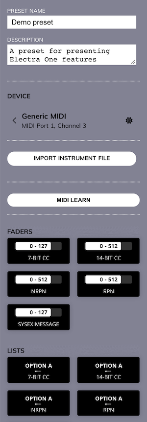
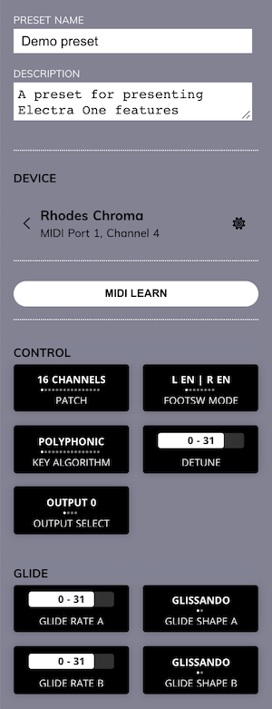
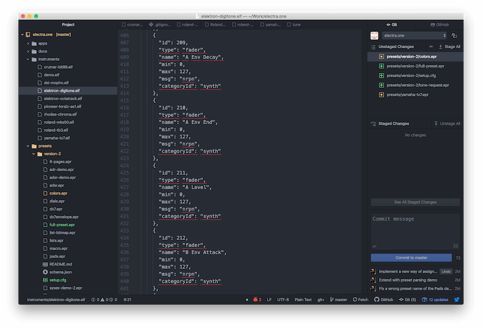

# Devices

With Electra One a MIDI message is always send to or received from some sort of MIDI device. It can be any type of device capable of communicating using the MIDI protocol either using MIDI IO or USB:

- hardware synthesizer
- sampler
- DSP
- software plugin

A Device represents a musical instrument connected to one of Electra’s hardware ports and listening on a particular MIDI channel. You will not be able to communicate with your instrument unless you register it as a device. A Device effectively tells Electra what instrument is connected to a particular port and channel. If you have two Waldorf Microwaves connected to your Electra One, you will need to have two devices configured.

One preset may have up to 32 devices configured. All of them can be used at the same time.

Controls do not refer to MIDI port and channel directly, instead they are linked to a Device. This makes it easy to do things such as changing a port of a Device. No changes to Controls are needed. Once you adjust the settings of the device, all Controls linked to this device will use the new settings.

Another important aspect of Devices is that they tell Electra what synthesizers are connected. This makes it possible for Electra to request and fetch patches from connected devices.

## Level of device integration

When you are setting up a device, you can use two levels of device integration:

- the generic MIDI devices
- the specific models of MIDI instruments
- the specific models of MIDI instruments with a patch reading

### Generic devices

A generic Device tells Electra that there is some MIDI device connected given port and channel. Generic devices offer a palette of common predefined MIDI Controls that let users configure them as they wish.

Using a generic device is a very common practice, especially when you are building presets for your own use.

### Integrated device

Integrated Device types on the other hand provide the implementation of particular models of musical instruments, such as, for example Yamaha DX7, Roland MKS-50, etc. Such devices are implemented by so-called Electra Instrument Files (EIF). These are configuration files that provide information about all parameters, overlays, supported MIDI messages.

An integrated device provides you with predefined controls in the Editor sidebar. Your work on the preset is then minimized to making the layout of the preset, the hard work on the MIDI messaging is hidden with the device.

Of course, you still need to let Electra One know what port and channel the device is connected to.

### Integrated device with patch parsing

An Integrated device with patch parsing is an extension of the Integrated device. Its instrument file consists of extra information about patch requesting and patch parsing SysEx definitions.

Such a device allows you to read the current settings of your instruments. This gives you perfect control over the instrument as you can read and visualize patches stored in instruments.

To create Integrated device users must have good knowledge of MIDI protocol and work with files in JSON format. The format of instrument files is described in the Developers section of the documentation.

