# Electra Editor

## Electra App account
Electra App is preset management and editor

::: warning
Please note, browser with WebMIDI support is required. WebMIDI is currently supported with [Chrome](https://www.google.com/chrome/) and [Edge](https://www.microsoft.com/cs-cz/edge) browsers.
:::

### Login to the application
Signing in to your Electra App account is required for accessing the library of presets and the Preset editor.

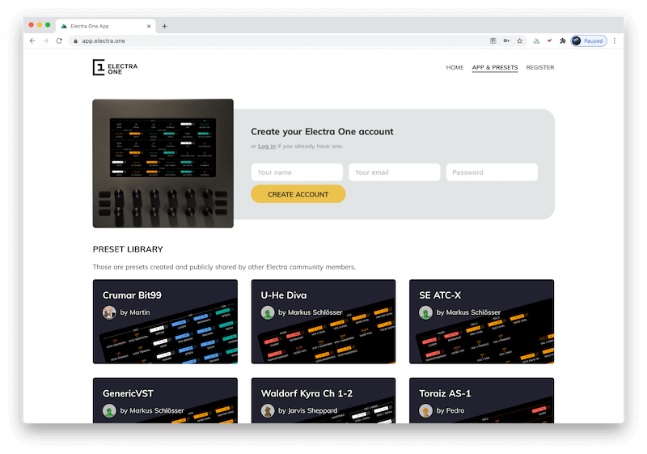

Once you log in you get access to two libraries of presets. One is owned by you while the other is a library of presets shared by other Electra App users.

### My presets
My presets, as the name suggests, is a library of your own presets. There are three ways to add presets to My presets library:

1. Create them from scratch
1. Import .epr files
1. Get a copy of a preset shared in the public Preset library

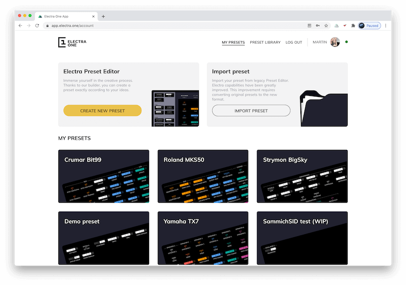

The presets of your preset library are shown as tiles, each tile representing one preset. A click on the tile takes you to the Preset detail page. The tile also gives you an option to send the preset to Electra One controller directly from the My presets listing.

### Preset library
The Preset library is a collection of all presets maintained and shared by other Electra App account users. A click on the preset tile takes you to the Preset detail page.

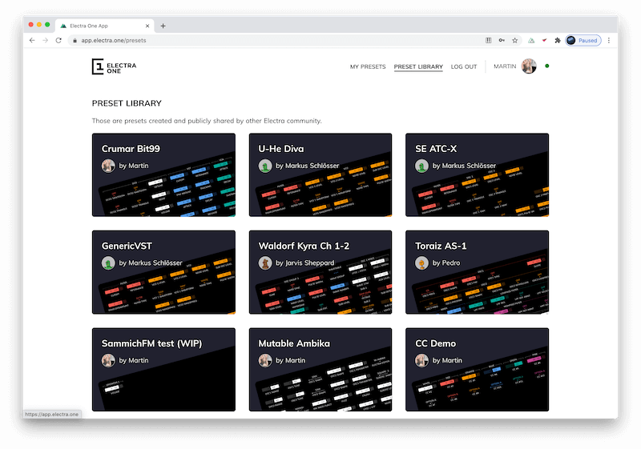

### Preset detail
The Preset detail page gives you complete information about the and number of actions to take.

The top banner reads brief information about the name and the author of the preset. The actions are listed on the right side of the banner.

Below the banner, the left panel describes the preset while the right side shows the renderings of all preset pages. That means you can review the preset even without opening an Electra Editor or loading the preset to Electra One controller.

The preset detail has different actions for presets you own and for public presets.

With your own presets you can:

1. Send the preset to your Electra One MIDI controller
1. Open the preset in the Electra Editor to make changes to it
1. Download the preset as a file
1. Make a copy of the preset
1. Share the preset with other Electra App account users, ie. made it public
1. Delete it

::: tip
Deleting a preset removes the preset from your preset library. It does not remove it from Electra One controller internal storage.
:::

With public presets you can:

1. Send the preset to your Electra One MIDI controller
1. Get a copy of the public preset to your library, ie. clone the preset.

## Preset Editor
The editor screen is divided into two sections, the sidebar, and the canvas.

The sidebar provides context information about the application and the selected element. It consists of:

- General information about the preset
- Predefined controls
- Available devices
- Device details
- Control details

The main window consists of:

- Preset name
- Page selection
- Working grid
- Action buttons

### Working with controls

When you start the editor, the default sidebar with tools related to the Devices is shown. The tools provide slightly differ depending on whether a Generic MIDI device or an Integrated MIDI device (defined with the instrument file)

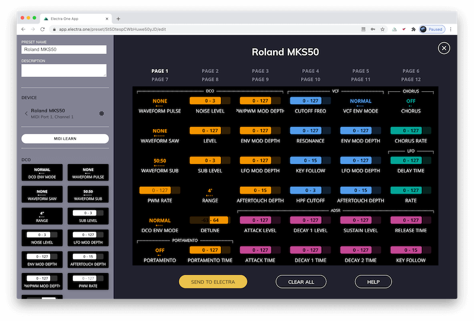

For Generic MIDI devices, a palette of controls representing common MIDI messages such as generic CC, NRPN, RPN, and SysEx messages is provided:

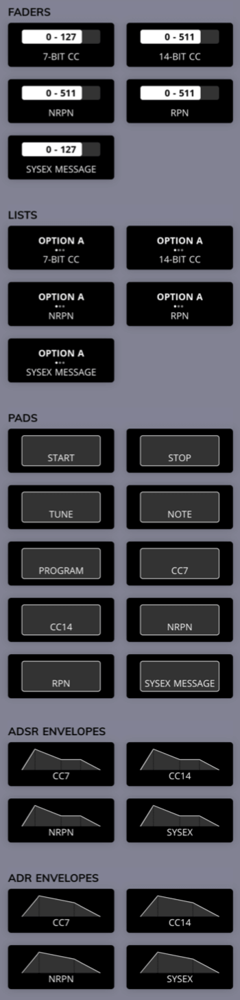

For integrated MIDI devices a palette of controls that reflect patch parameters of a given device is provided:

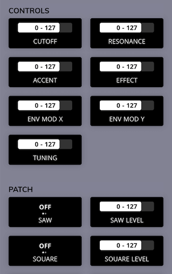

### Grid
The grid mirrors Electra’s display. Users place the Controls from the sidebar palette to the grid by dragging them with a mouse. Drag and drop is also used to move Controls around the grid.

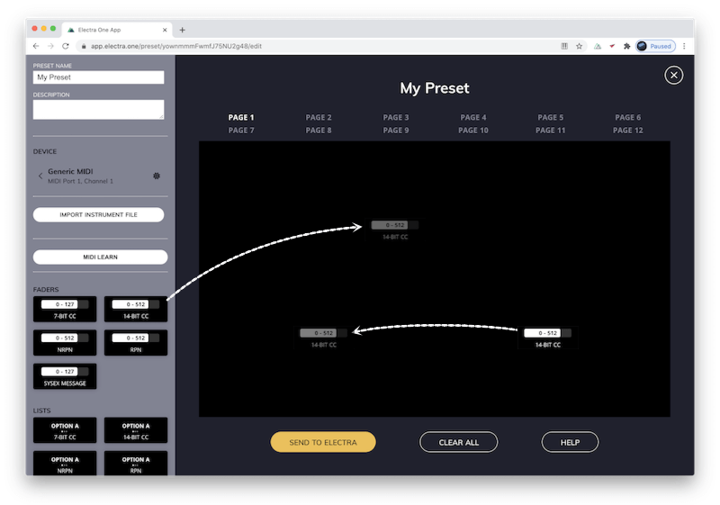

The grid can be also navigated with keyboard arrows and a number of keyboard shortcut commands is supported:

| Keyboard shortcut                   | Action         |
|-------------------------------------|----------------|
| SHIFT&nbsp;+&nbsp;mouse&nbsp;click	|	select a continuous range of Controls |
| CMD&nbsp;/&nbsp;CTRL&nbsp;+&nbsp;C  | copy to the clipboard |
| CMD&nbsp;/&nbsp;CTRL&nbsp;+&nbsp;X  | cut to the clipboard |
| CMD&nbsp;/&nbsp;CTRL&nbsp;+&nbsp;V  | paste from the clipboard |
| BACKSPACE                           | remove |
| ARROWS                              | navigating within the grid |
| SPACE                               | will display information about Category and Parameter assignment for all Controls on the page |

The keyboard shortcuts are extremely helpful when multiple controls are selected. This is handy when a group of controls needs to be moved around the pages.

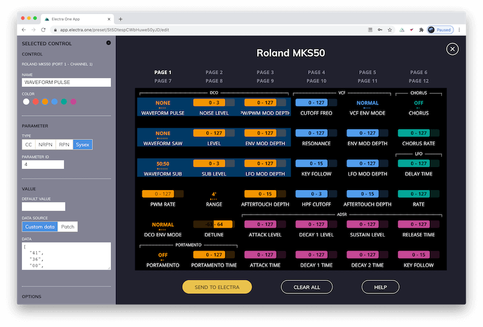

### Control attributes

Each Control has several attributes to configure. Some of the attributes are common for all types of Controls, while others are available only for certain types of Controls. Control attributes are configured in Electra Editor.

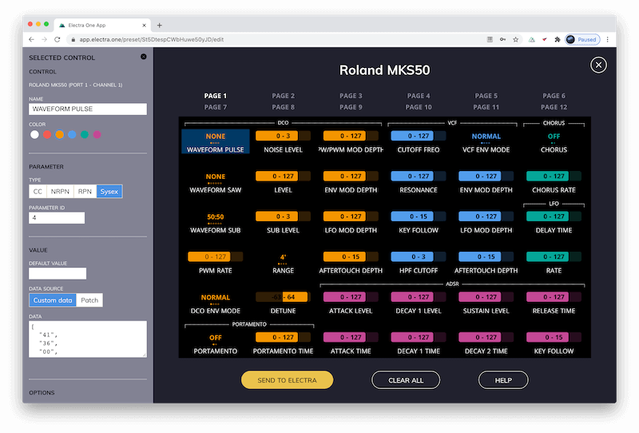

The Control details sidebar is shown for selected Control. The control is selected by clicking the Control on the grid. The selected Control is highlighted with a dark-blue background.

The attributes shown in the Control details are different types of controls.

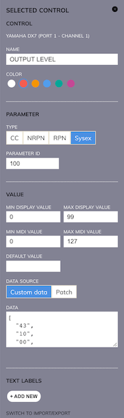 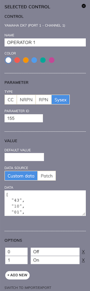 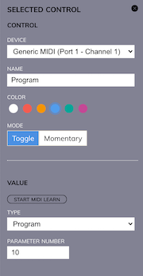 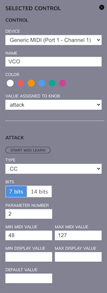

The Control attributes are divided into several groups, each covering a specific part of the Control's functionality:

- General
- Parameter
- Value
- Text values, also known as an Overlay

Multi-value controls, such as envelopes, provide these sections for all values present in the controls, ie. for ADSR envelope, there will be Attack, Decay, Sustain, and Release section.

#### General attributes
As the name suggests the general group of attributes covers attributes common to all types of Controls.

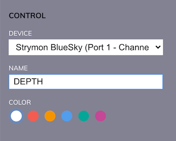 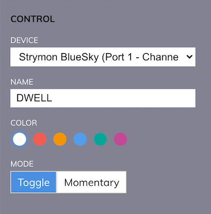

##### Device
An identification of the synthesizer, sampler, VST plugin, or any other MIDI device where the MIDI messages generated by the Control MIDI messages will be sent to and the MIDI messages the Control listens to. An example of a device is “Yamaha DX7, Rack 1”. The device represents a particular synthesizer connected to a MIDI port and channel.

##### Name
The name of the Control that will be shown on the display. The name is shown below the value. For example a “Filter cutoff”

##### Color
Color of the Control. It is up to the user how the colors are used. They are meant to improve the readability of the presets and to help to organize controls to logical groups and clusters of parameters. For example, users might want to have all Controls of one device to share the same color or to have one color for all parameters related to the VCF parameters.

##### Mode
The mode is applicable only to pad controls. It instructs the control whether it returns back to the _Off_ state after it is released or if it stays in the new state.

- Momentary pads always return to the _Off_ position after they are released
- Toggle pads act as switches between the _Off_ and _On_ values

#### Parameter
The parameter attributes group is used to describe the MIDI message operated by the Control.

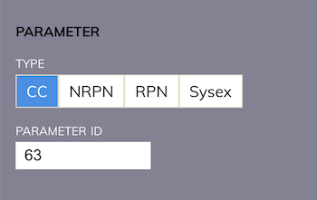 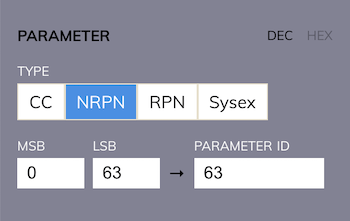

##### Type
The parameter type defines the type of MIDI message assigned to the Control. Whenever the value of Control is changed by turning the knob or with touch, a given MIDI message will be sent to the connected synthesizer. On the receiving side, whenever there is a MIDI message coming from a connected synthesizer and it matches a parameter settings of the Control, the value of the Control will be updated accordingly.

Electra supports the following MIDI message types:

###### CC
7-bit or 14-bit Control Change MIDI message. The value of 7-bit Control change is restricted to a range of 127 values. There is an option to switch CC to 14-bit Control Change mode. 14-bit Control change follows the MIDI standard which says that the first 32 7-bit control change messages (CC #0 .. CC #31) can be used as 14-bit messages. The parameter that users specify is the MSB part of the control change, LSB part is automatically calculated by Electra. It is always MSB parameter + 32.

###### NRPN
NRPM MIDI message type is used to send a standard MIDI NRPN message. The parameter and the value are both 14-bit numbers.

###### RPN
RPM MIDI message type is used to send a standard MIDI RPN message. The parameter and the value are both 14-bit numbers.

###### SYSEX
SysEx MIDI message type is used to send templated MIDI SysEx messages. Users are allowed to specify an array of bytes that will be sent whenever the Control’s value is changed. The fact that the message is *templated* means that users are not restricted to sending constant bytes only, instead, they can insert Variable, Checksum, Parameter placeholders to the message. The placeholders will be transformed to values at the time of sending the templated SysEx MIDI message. More detailed information about SysEx templates can be found in [Writing SysEx templates](./tutorials/sysextemplates.md).

###### NOTE
NOTE is used to send note on and off MIDI messages. The note type is supported only by pads. The note on is triggered when pad is pressed and note off is send when the pad is released.

###### PROGRAM
PROGRAM type sends a standard MIDI Program change message. The program can be used only with pads.

###### START
START type sends a standard MIDI real-time Start message. The start can be used only with pads.

###### STOP
STOP type sends a standard MIDI real-time Stop message. The stop can be used only with pads.

###### TUNE
TUNE type sends a standard MIDI Tune request message. The tune can be used only with pads.

##### Parameter Id
Identifier of the parameter to be assigned to the Control. When control is used to send CC MIDI message and parameter is set to 56, the value of the Control will be sent as CC #56 MIDI message. There are situations when there is no real parameter, for example, if the parameter is represented only by a few bits with a byte of a SysEx message. In such situations, users must invent their own Parameter Ids. More information on this can be found in [Writing SysEx templates](./tutorials/sysextemplates.md).

When working with NRPN and RPN Controls, the MSB and LSB fields are shown. These fields make it easier to enter the parameter Id if the synthesizer manual uses MSB and LSB notation. The MSB and LSB must be entered in decimal notation.

#### Value
The value attributes group tells Electra how the values should be handled and how to translate MIDI values to values shown on the display.

##### Fader values
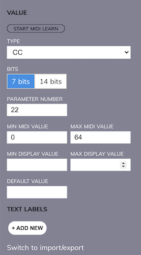 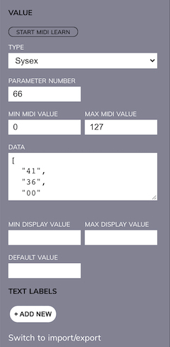

##### List values
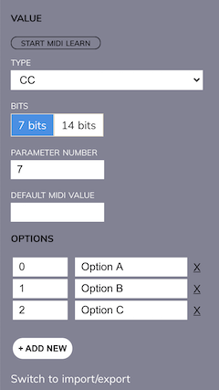

##### Envelope values
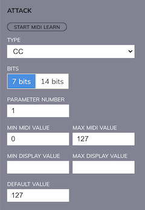 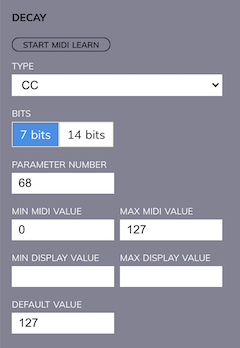 

##### Pad values
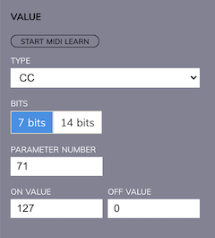

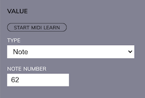 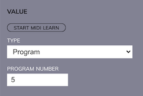

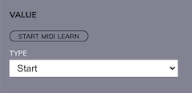

##### Min display value
Defines the minimum value of the data range controlled with a fader. The minimum may be negative.

##### Max display value
Defines the maximum value of the data range controlled with a fader.

##### Min MIDI value
Defines the minimum midi value mapped to the Min display value. A typical example is mapping Min MIDI value of 0 to the Min display value of -64. In such a case, the Control will show negative figures while it will still send out positive data in MIDI messages according to this setting.

##### Max MIDI value
Defines the maximum MIDI value mapped to the Max display value.

##### Default value
A default value to be pre-filled when a preset is loaded. The default value is set to 0 when not filled in. Double-tap on the Control will reset the current value of the Control to the default value.

##### On Value
A MIDI value to be sent when the pad goes from the _Off_ state to the _On_ state. If the field is left empty, no MIDI message will be sent.

##### Off Value
A MIDI value to be sent when the pad goes from the _On_ state to the _Off_ state. If the field is left empty, no MIDI message will be sent.

##### Default state
Tells Electra if the pad is set to _On_ or _Off_ state, when the preset is loaded.

##### Bits
When the control is set up to send CC MIDI messages, you can specify whether it will be a simple 7-bit message or a two-byte 14-bit message.

##### Bits order
14-bit CC, NRPN, and RPN MIDI messages send the value of the parameter in the form of two 7-bit bytes. These two bytes represent MSB (most significant/coarse) and LSB (least significant/fine) part of the 14-bit value. Although the MIDI standard says what part is the MSB and what the LSB is, some synthesizers do not follow the standard. Bits order option gives you a chance to swap MSB and LSB part of the 14-bit value.

##### Two's complement
When the display value configuration allows going below zero to negative values, the Two's complement option tells Electra One controller if two's complement representation of the negative numbers should be used.

##### No reset
It has become quite a common practice that each NRPN or RPN message is followed by the Reset instructions (sending CC #100 and CC #101). If this is not appropriate for your instrument, set No reset to TRUE.

##### Data source
In the majority of cases, the Custom data does the job. The Custom data means that the SysEx template defined in the Data attribute is a single message sent whenever Control's value changes. The Patch, on contrary, is an option that instructs Electra to send the whole Patch definition to the Device when the Control's value changes. As Patch is a rather advanced option, it will be described in a separate document.

##### Data
The data field is available for SysEx Controls. The field allows you to enter SysEx bytes and variables in the form of a JSON document. Detailed description of the JSON format can be found at Tutorial on [Writing SysEx templates](./tutorials/sysextemplates.md).

#### Text labels / Overlays
Overlays are text labels that can be assigned to specific values. Overlays are required to be used with List Controls. They define the list items. Overlays may, however, be also used with faders. In that case, the text value will be displayed on the fader instead of a numeric value. This is often used for some special cases, where for example a maximum value of a fader is *infinite*, or when the parameter value is a mixture of both continuous value and a few discrete values.

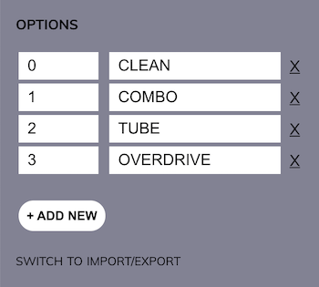 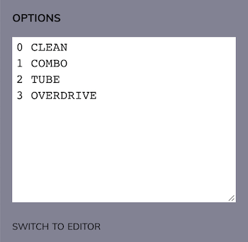

### Groups

Groups are meant to improve the layout of the preset and give it more structure. They can be used to make collections of Controls that are related to a specific type of parameters, for example, parameters of VCF section. Groups, however, do not impose any functionality. It is fully up to users who the groups will be used.

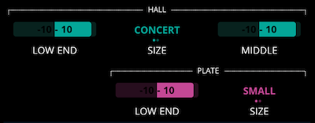

To add a group, click on the group placeholder on the grid, the group details sidebar will be shown.

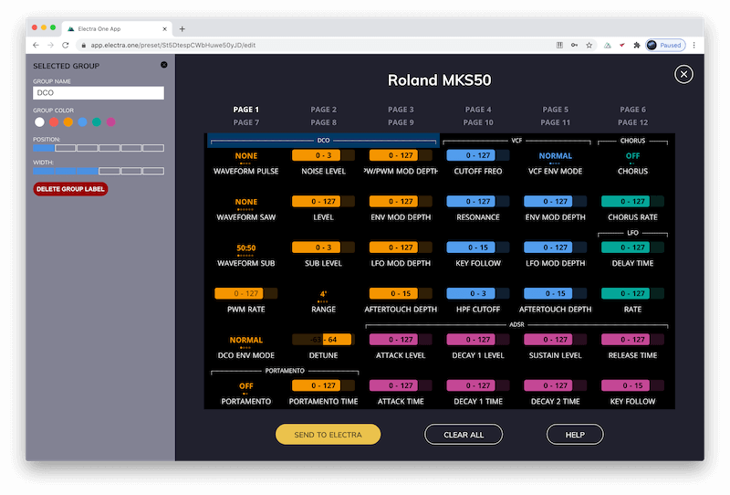

Each group can be customized to suit your needs. The following can be set:

- Name of the group
- Color
- Horizontal position within the grid
- Width of the group

You can also use the Group details to remove an existing group.

### Devices

As it is important to understand the concept of devices, their meaning was described in a [separate chapter](./devices.md) of this User Guide. The following paragraphs just describe how to manage devices.

The new controls are always picked in the context of a Device. The currently chosen device can be seen in the main sidebar. Any Control you pick and place on the grid will be always associated with that device.

If your preset uses more than one device, you can switch between them, by clicking the Device in the sidebar. A list of all available devices will be shown. You can choose the Device that you want to work with. Once you make your choice the sidebar will show a palette of controls for the selected Device. Any Control that you drag on the grid now will be associated with that Device.

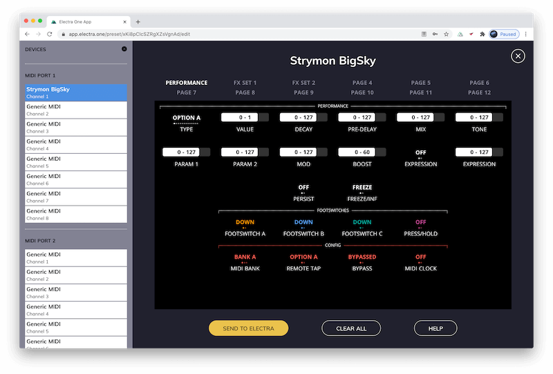

If you need to adjust the settings of a device, for example when the MIDI channel of the device was changed, click the Device settings icon (cog symbol). The Device details will be shown in the sidebar.

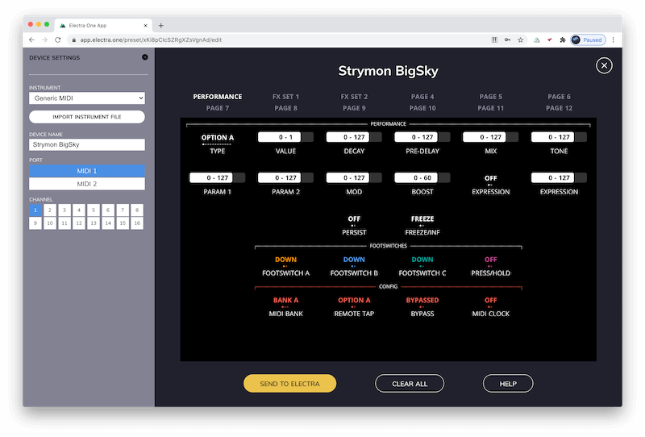

You can set here:

- Name of the Device
- MIDI port
- MIDI channel
- Type of device from the list of predefined instruments
- Load a custom Instrument file

### Import an Instrument file
Although the Electra One Instrument Files are normally imported in the Device details sidebar, this button provides a quick way to upload an Instrument file.

An Instrument file is a file containing a pre-defined set of Controls for a given model of a synthesizer or any other MIDI device.

Loading an instrument file will populate the sidebar with a palette of Controls related to the given instrument. Work on the presets is greatly simplified when the instrument file is available. Simply because the tedious work of defining MIDI messages, value ranges, text labels, and patch definitions is already done for you. The picture below shows Preset editor with Crumar Bit 99 Instrument file loaded:

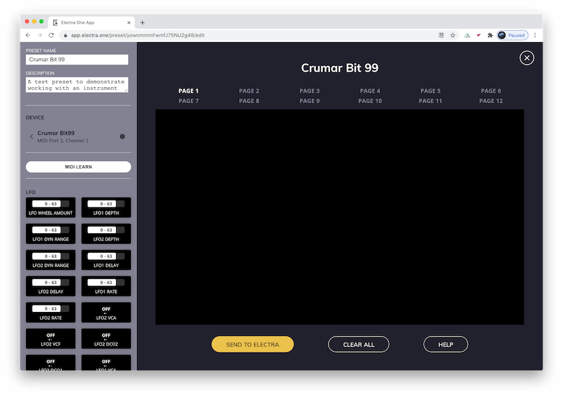

### MIDI learn
The MIDI learn function is another tool to make preset creation less tedious. When the MIDI learn is activated.

Electra One MIDI Control is switched to a special mode when it reports all incoming messages to the editor. If the MIDI message matches currently selected devices (MIDI port and channel), a new Control reflecting the incoming MIDI message is created and shown in the sidebar.

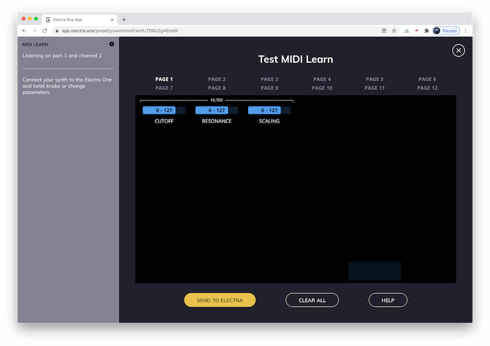

The best approach to let Electra and the Editor to understand the MIDI implementation of your instrument, is to twist the knobs of the instrument for various parameters.

This way a Control is created for each parameter and shown in the sidebar. The MIDI learn does not detect MIDI message type and parameter number only, it can also detect the minimum and the maximum MIDI value.

::: tip
Always try to twist the knob all the way to the left and then to the right. This way Electra will be able to detect the full range of the values of the given parameter.
:::

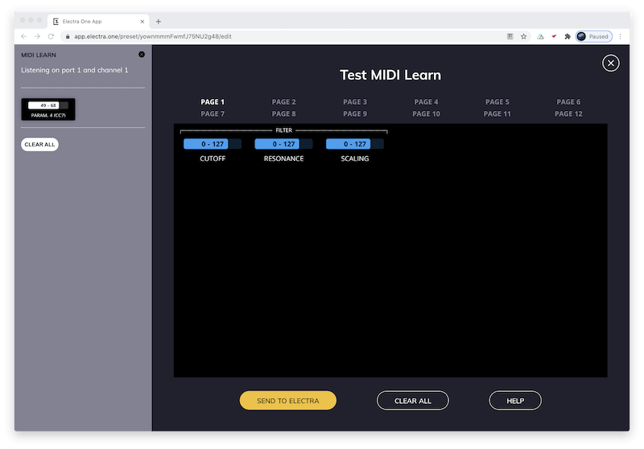

The Controls residing in the MIDI learn sidebar can be dragged and dropped to the grid as any other Control. The `CLEAR` button removes all learned Controls from the sidebar so that you can start the process of learning all over again.

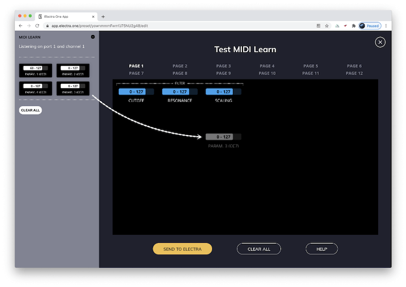

### Page selection
Pages are an important element of Electra. They multiply the number of available controls. It is up to the user how the pages will be used. They do not provide any other function, they are merely a tool to organize the controls within the preset. Usually, users use pages to hold sets of related Controls. Other uses are possible too, for example, a page may represent a set of Controls for each song or a scene of your performance.

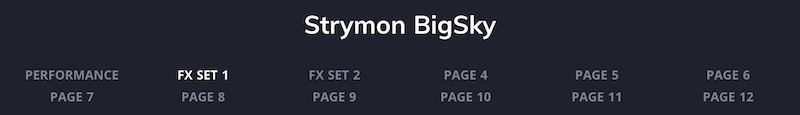

The Page selection at the top of the editor allows users to switch between the pages. Clicking on the page name will switch the active page and the Page detail will be shown in the sidebar. The Page detail allows you to rename the page.

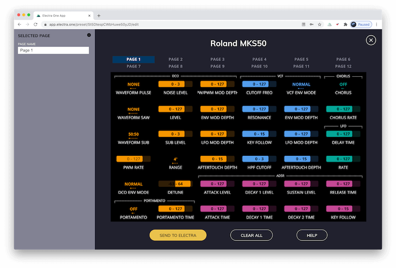

### Preset actions
There are two actions you can do with a preset. You can:

- Send it to Electra One MIDI Controller
- You can clear all its contents

::: warning Preset slots
The `SEND TO ELECTRA` button initiates the transfer of the preset to the currently selected preset slot in the controller. It means you should select the preset slot on the hardware controller first. If you fail to do so, you may accidentally overwrite a previously stored preset.
:::
