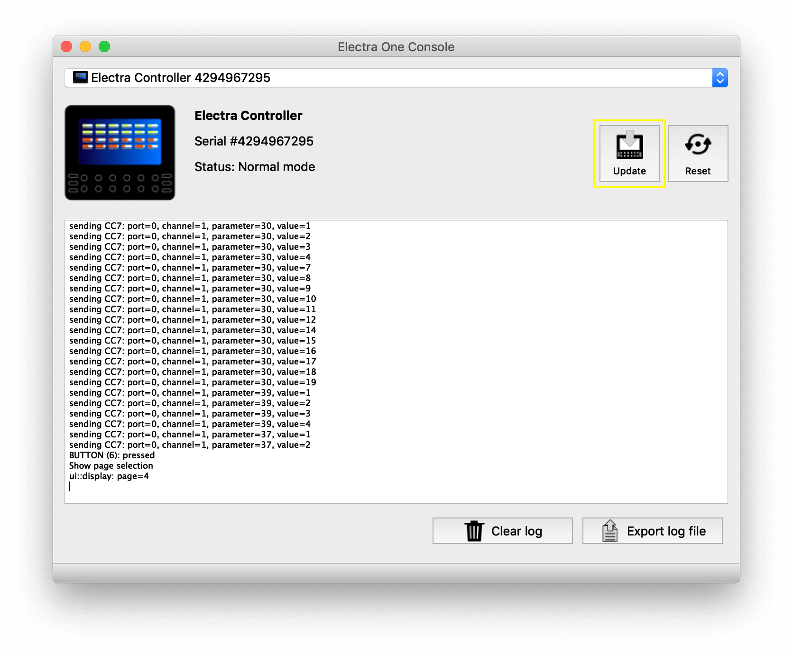

# ElectraOne Console

ElectraOneConsole is a management tool to update Electra's firmware and review internal debugging logs.

::: tip
We encourage all Electra owners to install the ElectraOneConsole and use it to update firmware frequently. The firmware updates are safe, fast, and easy.
:::

There is a number of actions supported:

### Update
The `Update` button lets you choose and upload a new firmware file to Electra One MIDI controller. Under normal circumstances the firmware update is fully facilitated by the application, there is no need to switch Electra One to the update mode.

### Reset
The `Reset` button initiates a soft reset of the MIDI controller. You can use it to restart Electra if you feel it does not work properly.

### Clear
The `Clear` button removes all debugging messages from the Log window.

### Export log file
The `Export log file` exports the contents of the Log window to a file. Exported log files are a great help for us (Electra developers) to understand possible software defects in your firmware.

## Firmware update

In order to update the firmware of your Electra take the following steps:

1. Download ElectraOneConsole application on your computer from the [App downloads page](./downloads/hostapps.md)
1. Download the latest firmware from the [Firmware downloads page](./downloads/firmware.md)
1. Unzip the file. You need to have a file with .frm extension
1. Connect Electra to your computer
1. Run the Electra One Console application
1. Click the "Update" button in the application, choose your firmware file, and confirm.

1. Electra firmware update will be performed. Wait until Electra boots up and the Electra One Console indicates _Normal Mode_ again. You can verify the firmware has been updated on Electra's start-up screen.
