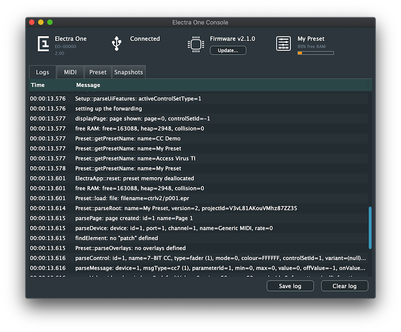
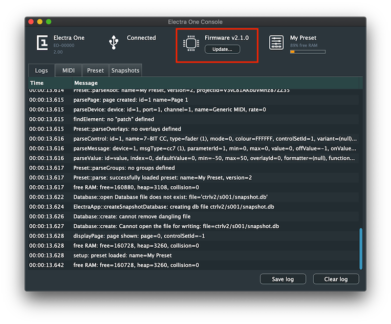

# Electra One Console

Electra One Console is a management tool to update Electra's firmware and review internal debugging logs.

::: tip
We encourage all Electra owners to install the ElectraOneConsole and use it to update firmware frequently. The firmware updates are safe, fast, and easy.
:::

There is a number of actions supported:

### Update
The `Update` button lets you choose and upload a new firmware file to Electra One MIDI controller. Under normal circumstances the firmware update is fully facilitated by the application, there is no need to switch Electra One to the update mode.

### Clearing log messages
The `Clear log` button removes all debugging messages from the Log window.

### Saving a log file
The `Save log` exports the contents of the Log window to a file. Exported log files are great help for us (Electra developers) to understand possible software defects in your firmware.

## Firmware update

In order to update the firmware of your Electra take the following steps:

1. Download Electra One Console application to your computer from the [App downloads page](./downloads/hostapps.md).
1. Download the latest firmware from the [Firmware downloads page](./downloads/firmware.md).
1. Unzip the file. You need to have a file with the .img extension.
1. Connect Electra to your computer.
1. Run the Electra One Console application.
1. Click the "Update" button in the application, choose your firmware file, and confirm.

1. Electra firmware update will be performed. Wait until Electra boots up and the Electra One Console indicates _Connected_ USB status again. You can verify that the firmware has been updated on Electra's start-up screen and in the Electra One Console application.

::: note
When updating to firmware version 2.1.0 for the first time, it means from version 1.5, press the update button on the back panel of the controller before clicking the update button in the Electra One Console app.

The update button is the recessed button next to the MIDI IO DIN connectors.
:::
