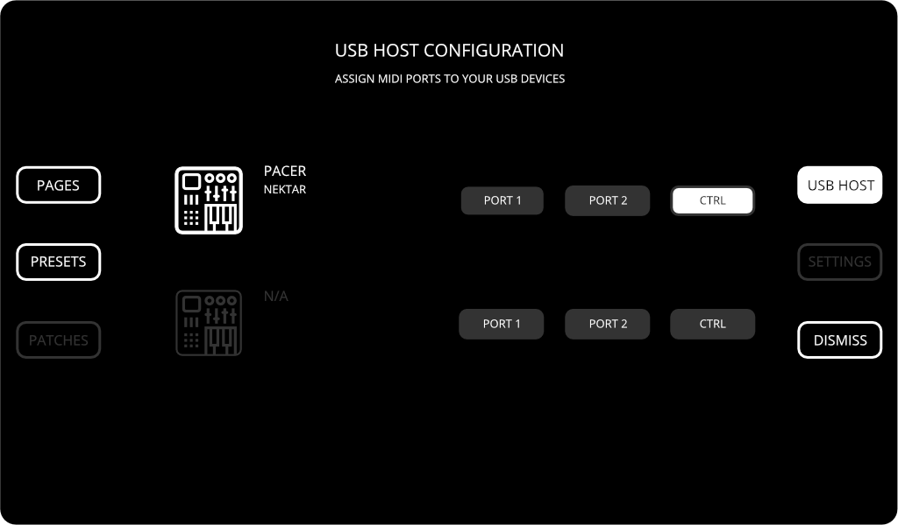

# External MIDI control

There are often situations during your gig when you need both hands to perform and switching presets of pages could be cumbersome. The external MIDI control provides a neat solution.

The external MIDI control allows you to map a number of Electra actions to MIDI messages sent over to Electra's `<USB HOST>` port. The currently supported actions are:

- switch to a specific page, identified by the page number
- switch to the previous page
- switch to the next page
- load a specific preset, identified by the preset slot number
- load previous preset
- load next preset

## Configuring a USB Host device

In order to use a MIDI Controller to send commands to Electra, it must be connected to Electra's `<USB HOST>` and assigned to CTRL port. This assignment can be done manually at the USB Host configuration in the Menu.

A permanent assignment can be done by uploading a custom configuration file to your Electra One.

## MIDI message assignments

Electra uses default mapping of MIDI messages as shown below. The default settings can be overridden by uploading a custom configuration file to your Electra One. When overriding default assignments, the following MIDI message types can be used:

- control change (CC)
- note on
- program change

We recommend Nektar Pacer and LaunchPads made by Novation for external MIDI control.
