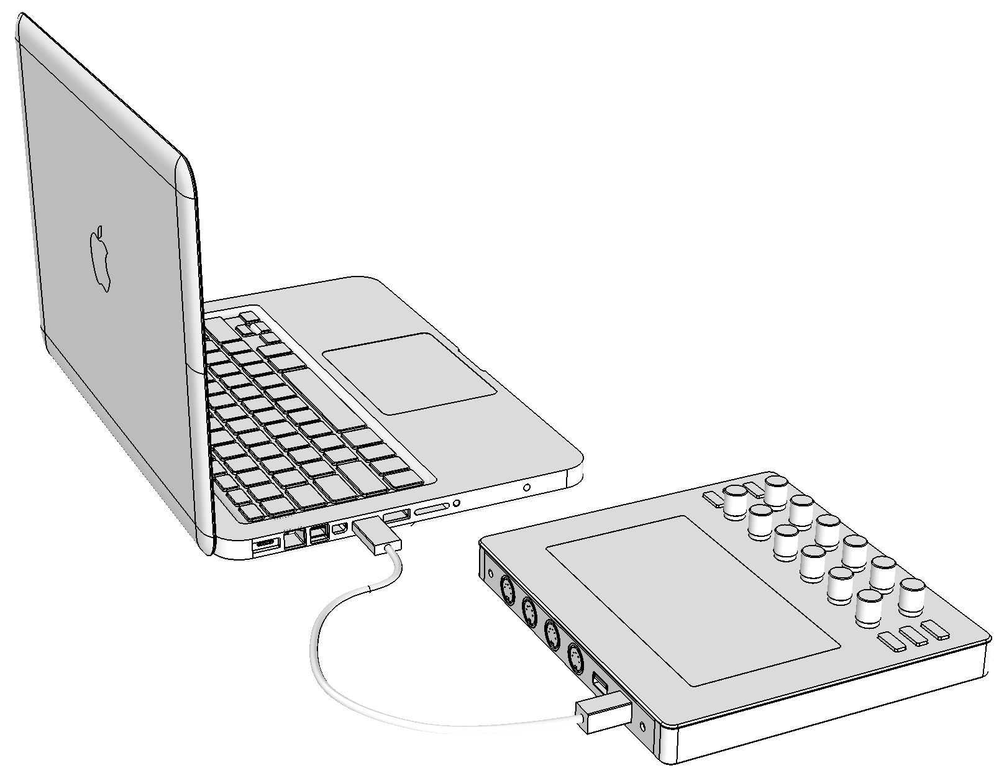
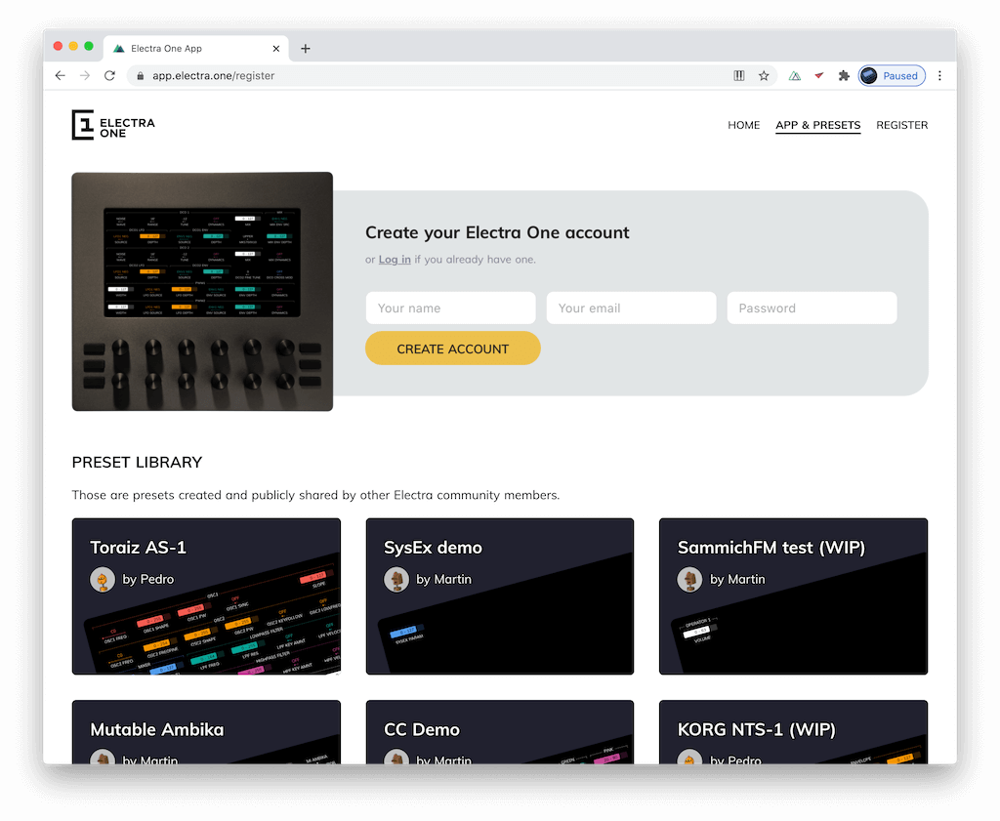
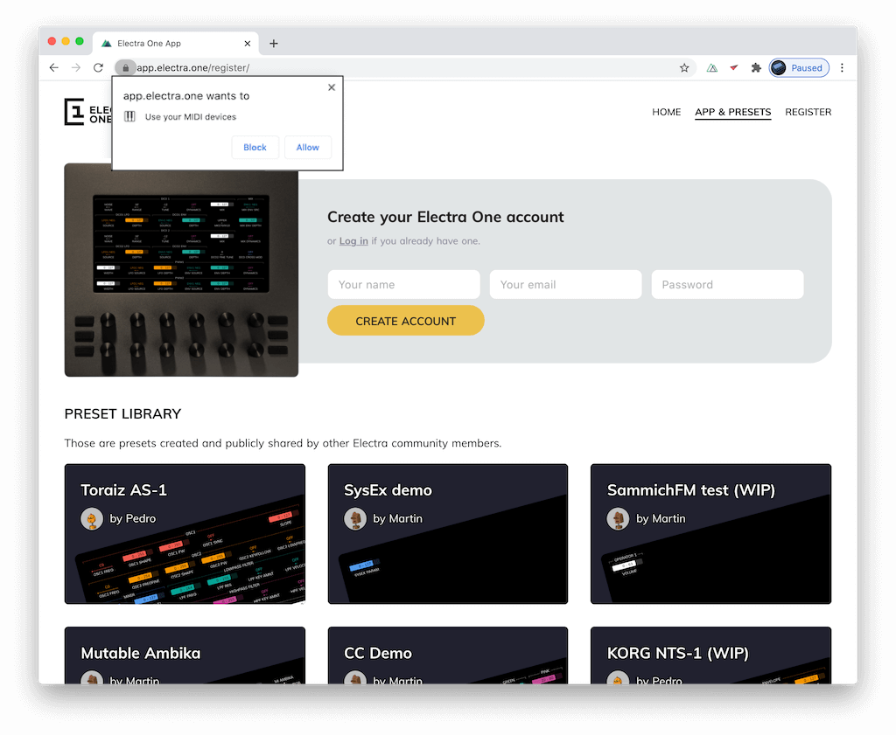
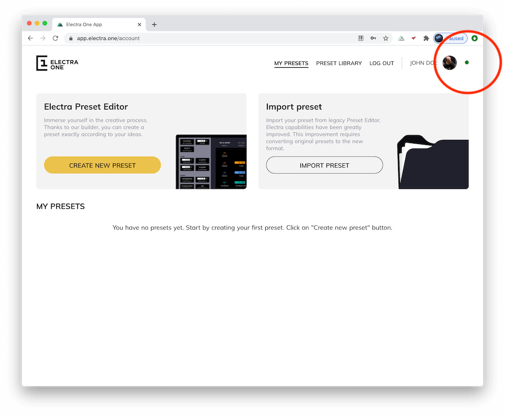
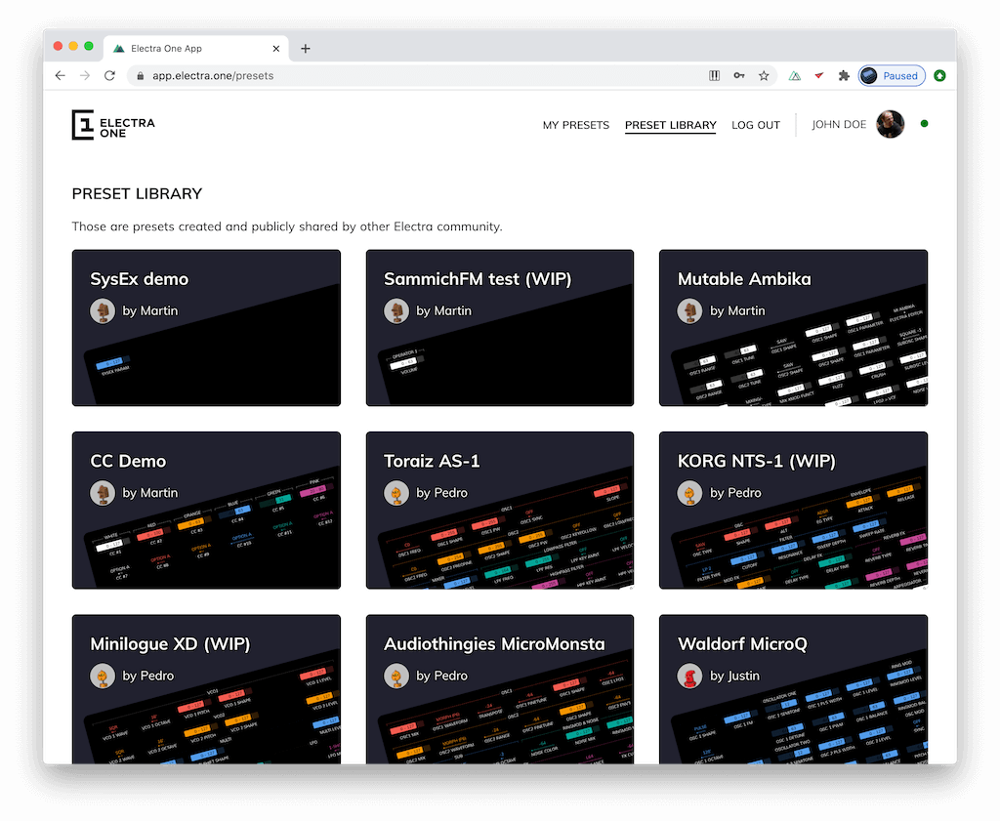
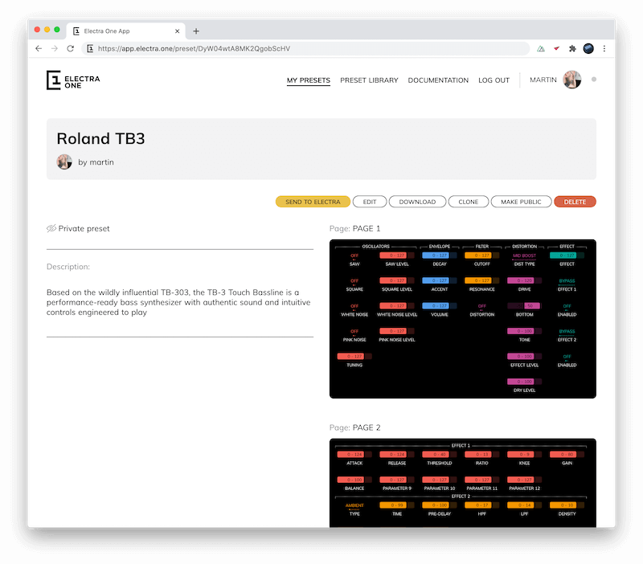

# Quick Start Guide

::: note Thank you for buying Electra One!
Electra One is a MIDI controller, a USB host, and a MIDI USB interface capable of streamlining your entire music production process. We hope Electra One will do the job you bought it for!
:::

### 1. Connect your Electra One to a computer
Use the bundled USB cable to connect Electra One to your computer's USB port.

### 2. Create your Electra One account
Open [Chrome](https://www.google.com/chrome/) or [Edge](https://www.microsoft.com/cs-cz/edge) browser and go to [https://app.electra.one/register](https://app.electra.one/register) to create your Electra One account. An account will grant you access to the Preset library and the Preset editor.

### 3. Allow use of MIDI devices
If you get a prompt asking about the use of MIDI devices, accept it by clicking **ALLOW** button.

### 5. Verify that your Electra One is connected
Check the Connection indicator at the top right corner of the screen to see that Electra One is successfully connected. If the indicator is green, you are good to go. If it is grey, refer to [The&nbsp;Connection&nbsp;Troubleshooting&nbsp;Guide](/troubleshooting/connectionissues.md)

### 6. Go to the Preset library
Click on the **PRESET LIBRARY** link in the menu to pick one of many available presets. Click the preset you would like to send to your Electra One.

### 7. Send the preset to your Electra One
Hit the **SEND TO ELECTRA** button. Et voilà, the preset you picked is now loaded and ready to be used in your Electra One Midi Controller!

If you twist the knobs or use the LCD touch, your Electra One will send MIDI data according to the preset definition. To get more familiar with your new midi controller, proceed to the next chapter of the User Guide - [Hardware overview](./overview.md).
