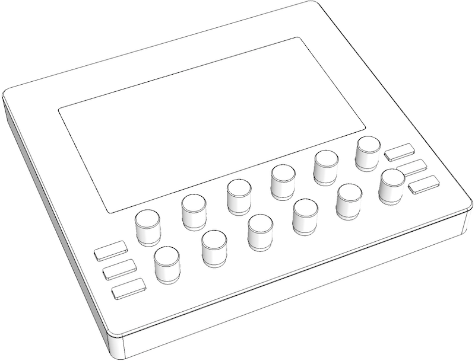
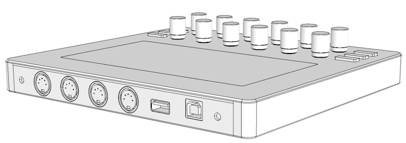
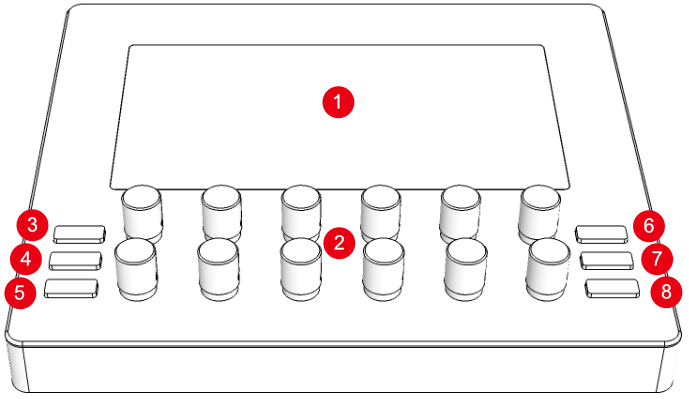
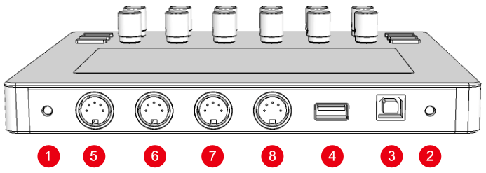
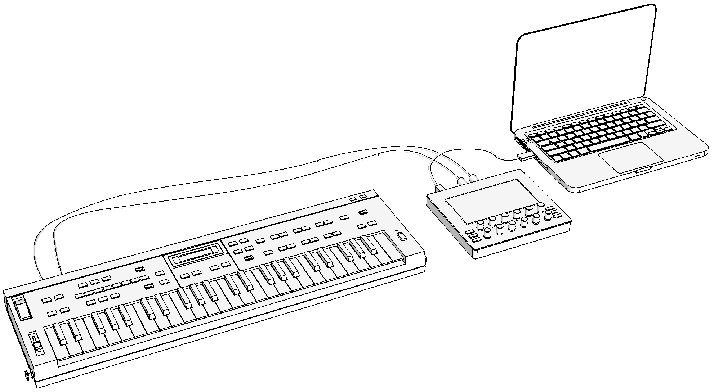
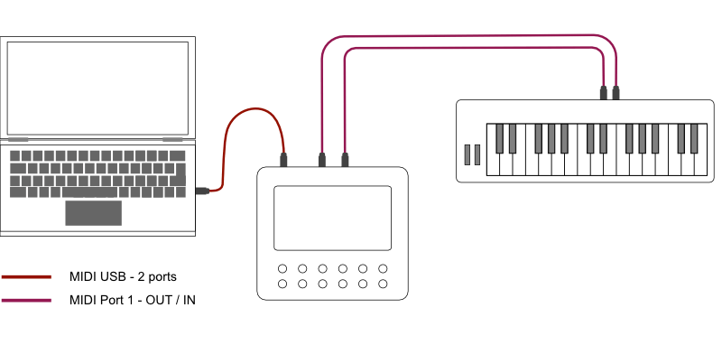
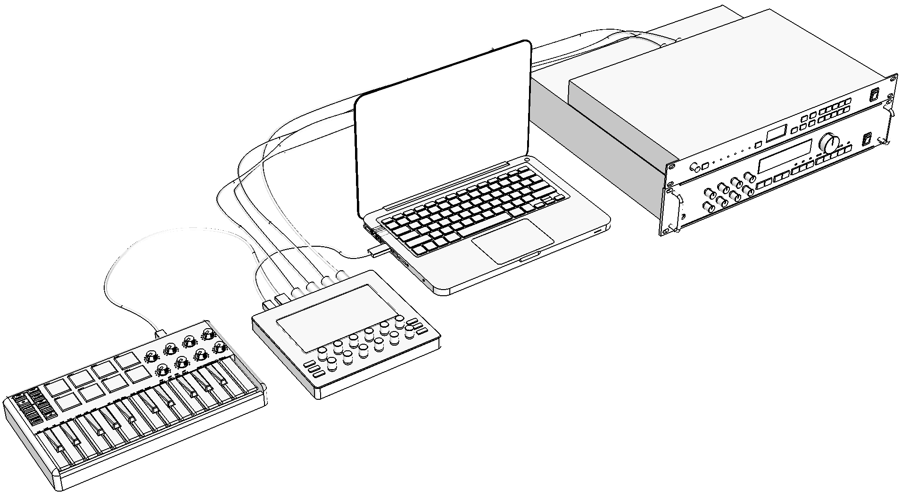
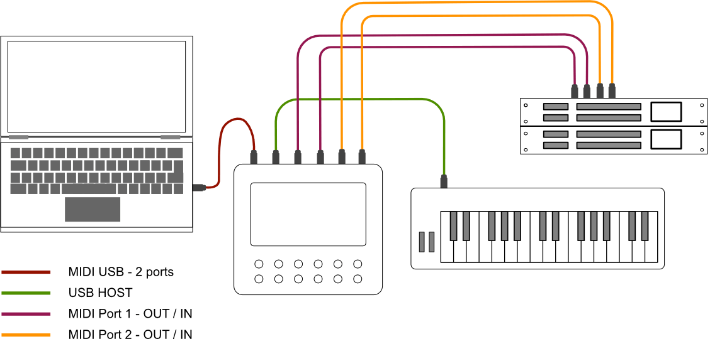

# Hardware overview

Electra One is a MIDI controller, a USB host, and a MIDI USB interface capable of streamlining your entire music production process.

You can modify sound parameters by turning 12 smooth 360-degree knobs or with the touchscreen display. If you’ve ever wanted to control the cutoff filter of 10 synths at once then this controller is the answer. With 12 pages of controls and over 400 MIDI parameters within, Electra can satisfy all your MIDI requirements across multiple devices and synthesizers.

The controller has a USB MIDI Host port for plugging in other USB devices and two MIDI IN and OUT ports for connecting your MIDI gear.

The controller does not only send MIDI messages to your instruments but it also visualizes all inbound data and it can even parse incoming SysEx messages with the patch settings. This gives you an insight into your gear’s full capabilities.

The controller is programmed with a [web based editor](https://app.electra.one/). The editor provides an intuitive way to create, edit, and share presets. Electra One’s sheer versatility makes it a powerful tool in both live and studio settings.

## Panel layout and connectors

### Front panel

The front panel is the place where you interact with Electra One. A large touch-sensitive LCD displays all the controls and allows you to modify their values with a touch. 12 touch-sensitive knobs are assigned to on-screen controls and allow you to change values as well. The rubber buttons are here to navigate within Electra's pages, presets, and configuration.

1. Touch-sensitive display
1. Touch-sensitive 360-degree knobs. They are referred as KNOB1 (top-left) to KNOB12
1. `[SECTION 1]` button to make the upper section of controls active
1. `[SECTION 2]` button to make the middle section of controls active
1. `[SECTION 3]` button to make the bottom section of controls active
1. `[PATCH REQUEST]` button to download current patches from connected devices
1. `[SAVE]` button
1. `[MENU]` button

### Back panel and connectors

The back panel serves two purposes. It is the place to connect your gear and the computer. There are also buttons to reset Electra and initiate the firmware update.

1. `[UPDATE]` button
1. `[RESET]` button
1. `<USB DEVICE>` port
1. `<USB HOST>` port
1. `<MIDI 2 IN>` port
1. `<MIDI 2 OUT>` port
1. `<MIDI 1 IN>` port
1. `<MIDI 1 OUT>` port

Ports `<MIDI 1 OUT>`, `<MIDI 1 IN>`, `<MIDI 2 OUT>`, `<MIDI 2 IN>` are often referred as to `<MIDI IO>`

### Display layout

The display is the place where all the magic happens. It displays controls assigned to the synthesizer parameters as defined in the currently loaded preset. The display also provides information about activity on the ports, current preset, and page. The controls are organized in 6 x 6 grid, giving you access to 36 controls per page.

1. Status bar with MIDI port activity indicators
1. Active section of controls
1. Inactive sections of controls
1. Bottom bar with the preset name and current page name
1. Indicator of activity on `<USB DEVICE>` port
1. Devices connected to `<USB HOST>` port and indicator of activity
1. Indicator of activity on `<MIDI 1 OUT>` port
1. Indicator of activity on `<MIDI 1 IN>` port
1. Indicator of activity on `<MIDI 2 OUT>` port
1. Indicator of activity on `<MIDI 2 IN>` port
1. Group of Controls
1. List Control
1. Fader Control

## Connecting Electra

### A basic setup

Electra can be connected to your studio setup in many ways. For the start, the following configuration is ideal:

In this setup, Electra can control sound parameters of the synthesizer connected to `<MIDI IO>` port. You will see Electra' USB Device ports on the connected computers, we refer to them as `<USB DEVICE>`. These ports can be used to send and receive MIDI messages to and from the synthesizer. It means Electra acts here as a MIDI controller as well as a MIDI USB interface.

There are three USB device ports:

- `Electra Port 1`
- `Electra Port 2`
- `Electra CTRL`

Any MIDI message sent to USB device Port 1 OUT, will be forwarded to `<MIDI 1 OUT>` port. Any message received on `<MIDI 1 IN>` port, will be forwarded to USB device Port 1 IN. Ports 2 work in the same way.

Electra CTRL is dedicated to communication between Electra and Electra Editor.

::: tip
If you do not see Electra CTRL, it might be called Port 3. Some versions of operating systems do not read the port name correctly. Please review [The Connection Troubleshooting Guide](/troubleshooting/connectionissues.md).
:::

### A complex setup

To illustrate Electra's capabilities let's take a look at a more complex setup:

Here we connect more gear to the `<MIDI IO>` ports. Next to that, the Master keyboard is connected to Electra’s `<USB HOST>` port.

In this setup, you can have full bi-directional control over two hardware synth modules. The MIDI messages generated by the Master keyboard are automatically forwarded to both `<MIDI IO>` ports and to the `<USB DEVICE>` ports.

MIDI messages generated by turning the knobs are being merged to the flow of MIDI data according to Electra’s settings. These messages will be sent to both `<USB DEVICE>` port as well as to `<MIDI IO>` ports.

## Rear panel buttons

The Reset and Update buttons are here to help you out when you get into a tricky situation. As these should be very rare events, the buttons are recessed and can be reached with a pen or with another thin object.

### Reset button
`[RESET]` button will power recycle the controller. The effect of pressing the preset button is the same as disconnecting and reconnecting the USB cable. Note, resetting Electra will not delete any of our presets or settings stored in the device.

### Update button
 `[UPDATE]` button is used to initiate a forced firmware update. Under normal circumstances, firmware updates can be initiated from the Electra One Console application without pressing the `[UPDATE]` button. If, however, your firmware update fails or if you upload a corrupted firmware file to Electra and it becomes bricked, pressing the `[UPDATE]` will allow you to restore the controller to the working state. Full description of the recovery procedure is described at [Firmware recovery](./troubleshooting/hardrestart.md).

## Switching Electra One on and off

Electra One starts up immediately after it is connected to the USB power. It does not matter whether it is connected to a computer or a USB power adapter.

The controller can be put on standby mode by pressing and holding the `[MENU]` button and pressing the `[SECTION 3]` button shortly after the `[MENU]` button is held down at least for 2 seconds.

Subsequent pressing of the `[MENU]` button will activate the controller.

Electra turns off the display, knob reading, and touch sensors in the standby mode. It does still, however, process and routes incoming MIDI data on all interfaces.
