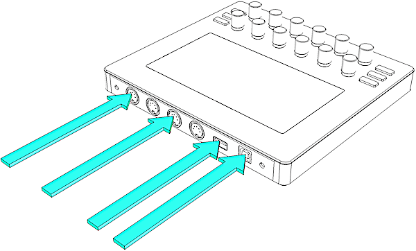
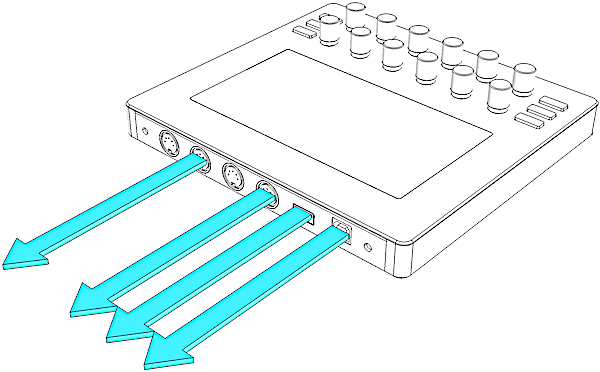
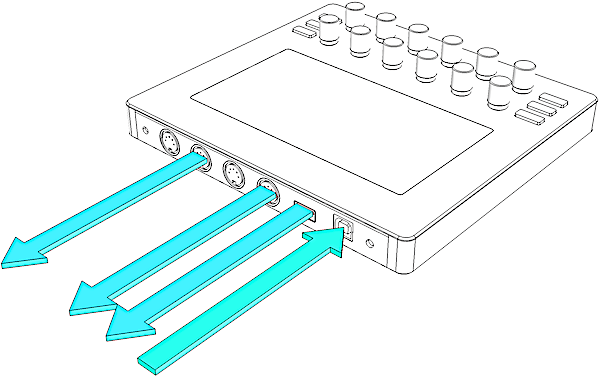
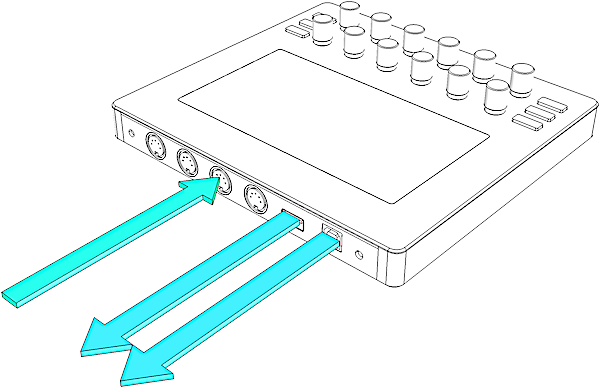
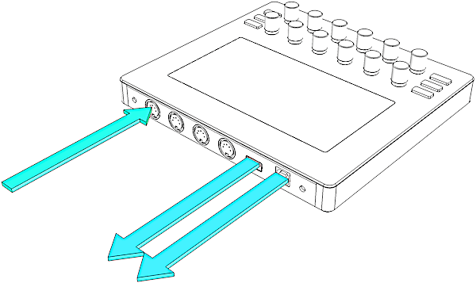
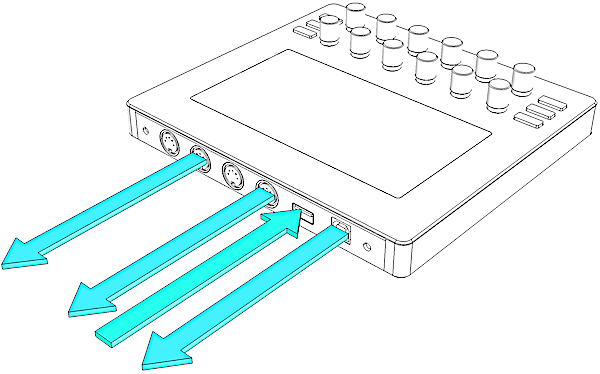
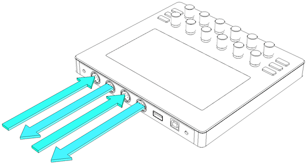

# MIDI message routing

Electra One is not only a conventional MIDI controller but it is also a programable MIDI router and merger. Electra's internal router can pass MIDI messages between all types of interfaces. MIDI IO, USB device, and USB host.

Each type of interface has two ports. You can see those ports as a communication channels, where all ports 1 are interconnected as well as there is a connection between all port 2.

In the default configuration, all MIDI messages received on one type of interface are forwarded to other interfaces, keeping the same port and MIDI channel. The same rule applies to messages generated by twisting Electra's knobs or using LCD touch. These messages are sent to all interfaces and merged with other MIDI messages flowing through the controller. This configuration can be overridden by uploading a custom Electra One configuration.

Electra One forwards and merges all types of MIDI messages, including SysEx messages with size up to 1MB.

As this may not be still clear, let's take a look at a few examples.

### Electra In
MIDI messages generated with external gear or software can be received on all Electra's interfaces, ie. `<MIDI IO>`, `<USB DEVICE>`, and `<USB HOST>`.

If the configuration of a Control matches the incoming MIDI message information about the port and channel (*defined by the device configuration*), the MIDI message will affect the value of the Control and you will get visual feedback on the display.

In other words, Electra monitors all incoming MIDI messages on all interfaces, if the preset consists of a Control listening to that given message, you will be able to see it.

### Electra Out
MIDI message created by twisting Electra's knobs and using the display touch is sent to all Electra's interfaces, ie. `<MIDI IO>`, `<USB DEVICE>`, and `<USB HOST>`.

A control is always assigned to a particular device, which in turn represents  a port and channel. When you twist a knob and it affects the value, a MIDI message is generated and send out to all interfaces.

In other words, twisting a knob will cause the same MIDI message to be sent out on the same port and channel of `<MIDI IO>`, `<USB DEVICE>`, and `<USB HOST>` interfaces.

### USB Device input
A MIDI messages received from a computer over the USB cable, ie. received on the `<USB DEVICE>` interface.

Inbound `<USB DEVICE>` MIDI message received on port 1, will be automatically forwarded to port 1 of `<USB HOST>` interface and `<MIDI 1 OUT>` port. Of course, if the MIDI message matches a configuration of any Control within a preset, the value of that Control will be updated and shown.

The `<USB DEVICE>` interface makes the following ports (MIDI cables) available on the computer, where Electra One is connected to:

- `Electra Controller Port 1`
- `Electra Controller Port 2`
- `Electra Controller CTRL`

::: warning
On some systems the port names are not detected correctly, please review information in [Troubleshooting connection issues](./troubleshooting/connectionissues.md) article for more details.
:::

`Electra Controller CTRL` is Electra's management port. It is used for data transfers between Electra and the computer.

### MIDI IO input
A MIDI message received from external MIDI gear connected to `<MIDI 1 IN>` or `<MIDI 2 IN>` will be forwarded to a corresponding port of `<USB DEVICE>` and `<USB HOST>` interface.

All messages received on `<MIDI 1 IN>` port will be forwarded to `<USB HOST>` port 1 and `<USB DEVICE>` port 1.

All messages received on `<MIDI 2 IN>` port will be forwarded to `<USB HOST>` port 2 and `<USB DEVICE>` port 2.

### USB Host port assignments
The USB host interface is a bit different from the USB device and MIDI IO interfaces. USB host does not have hard-wired port assignments. The default Electra configuration assigns devices to ports in the order as they are connected. The device you connect first will be assigned to port 1, the device connected as second will be assigned to port 2.

This might not be appropriate in all situations. The USB Host configuration page gives you an option to change the port assignments. These assignments will be, however, lost, when you turn Electra off.

Should you require a permanent assignment of devices, a custom Electra configuration must be uploaded to your Electra.

### USB Host input
A MIDI Message received from a device connected to the `<USB HOST>` port will be forwarded to `<USB DEVICE>` interface and `<MIDI IO>` interface, keeping the information about the port.

### USB Host CTRL port
Messages sent to the `<USB HOST>` CTRL port are not forwarded to any other interface. They are interpreted as commands for Electra. The CTRL port is used for an [External MIDI control](/extcontrol.md).

### MIDI IO thru

When MIDI IO thru is enabled for port 1, all messages received on `<MIDI 1 IN>` port are forwarded and sent out on `<MIDI 1 OUT>` port. The same applies for port 2.

