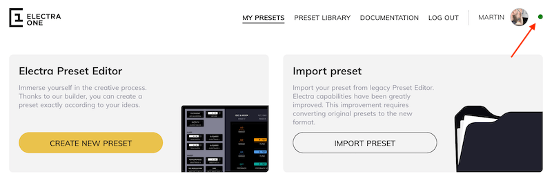
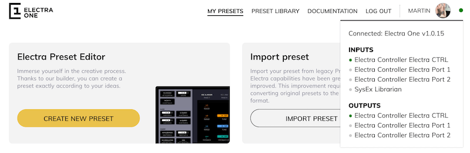
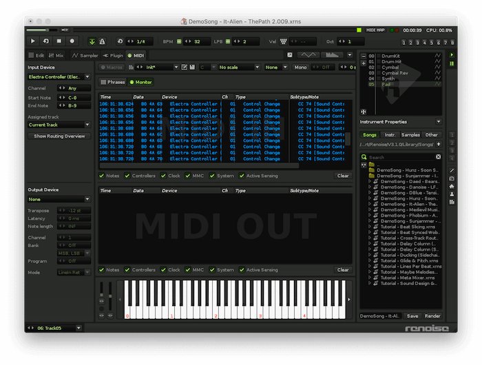
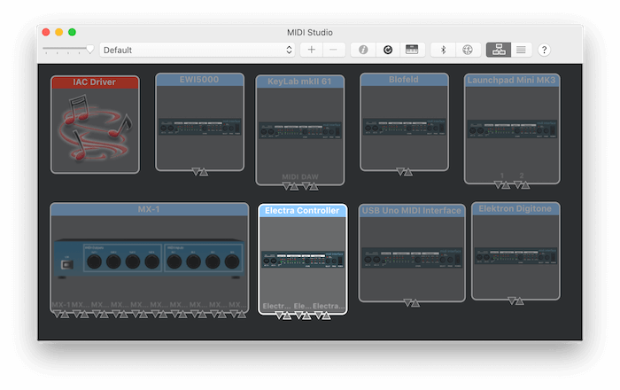
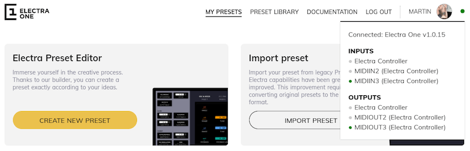

#  USB connection issues

::: note Problem description
- The connection indicator in the Electra App is not green
- Electra App and/or the Electra Editor do not communicate with Electra One
- You can send presets to Electra One, but you cannot read them
:::

This article describes steps to take to resolve problems with communication with the computer and the Electra One MIDI controller.

## Electra USB MIDI ports
Electra One MIDI controller has three distinct USB MIDI ports. They are named:

- `Electra Port 1`
- `Electra Port 2`
- `Electra CTRL`

These ports are implemented as virtual MIDI ports (sometimes called cables) of one USB MIDI device `Electra Controller`. Whenever you connect the Electra One MIDI controller to a computer, the `Electra Controller` USB MIDI device should be registered by the operating system.

Even though the port names are set and configured properly within the USB device descriptor, some versions of operating systems do not recognize it correctly, please see the details below.

If your Electra does not seem to communicate properly with Electra Editor, you need to check two important things:

1. Is your system / your browser using the correct MIDI port for the communication?
1. Are the message MIDI messages exchanged between Electra controller and Electra Editor?

## Browser compatibility
A common problem with USB MIDI communication comes out the fact that users do not use a browser with WebMIDI support.

[Chrome](https://www.google.com/chrome/) or [Edge](https://www.microsoft.com/cs-cz/edge) browsers required to run Electra App account and Electra Editor applications. Other browsers do not support WebMIDI standard yet and therefore fail to communicate with the Electra One MIDI controller.

## Verifying USB MIDI Ports
As described above, the Electra One MIDI controller has three different USB MIDI ports.

Ports `Electra Port 1` and `Electra Port 2` are dedicated to the communication with your gear, DAW, and software plugins.

Port `Electra CTRL` is solely used for communication between Electra One MIDI controller and the Electra App and Electra Editor web applications. A common reason for problems with USB communication is caused by Electra App not being configured to use `Electra CTRL` port.

### Identify your Electra port names
The Electra editor has a connection status indicator. It is next to the Electra One editor title in the sidebar.

When the indicator is grey, the Electra App account cannot see any of Electra standard MIDI ports and it is unable to establish the communication over USB.

This can be caused by two reasons:

- Electra is not connected or detected correctly by your operating system
- The names of the ports are not picked up correctly or differ from expected port names

When the **indicator is clicked** the list of available MIDI ports is shown. Normally you should see the following ports:

Alternatively, you can take a look at the list of MIDI ports in your DAW or other application:

or in the MIDI Studio on MacOS X:

### Changing MIDI port for communication with the Editor

The list of MIDI ports in the Editor sidebar can be used to switch the port that will be used for communication with the Electra One MIDI controller.

To do so, simply click the any of available inputs or outputs. When the _Electra CTRL_ input and output is not present, it is usually listed there as:

- **Port 3**
- **MIDIIN3** / **MIDIOUT3**.

If not, please contact us and send us your list of ports, we will review it for you and will come back with the correct settings for your setup.

The screenshot below shows how to switch the MIDI ports when they are not picked up automatically. Also, it is a valid configuration for Windows 10, when virtual port names are not recognized correctly:

