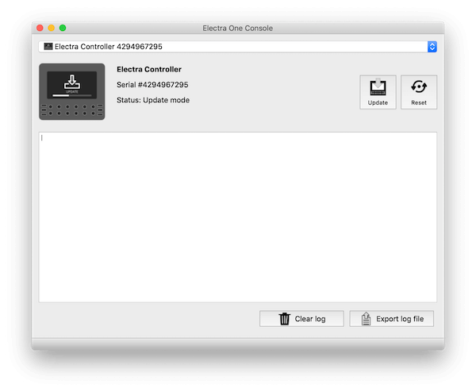

# Firmware recovery

::: note Problem description
- Your Electra is not reacting and it seems to be frozen
- There is a blank / black screen when powered on, nothing else happens.
- It is not possible to upload new firmware.
:::

Even though we are working hard to make the firmware stable, there are occasional system freezes. This article is meant to help you to resolve the problems that it might bring. The most common situation when you need to perform the hard restart is a bricked Electra after a failed firmware update.

## Recovering from a system freeze

### Simple restart / reset
Usually, it is enough to disconnect Electra One and connect it again. Another option is pressing the Reset button on the rear side of the controller. To do so, you will need a pen or some think stick. The reset button is located on the back panel next to the USB device port. If you have ElectraOneConsole application open, you can restart Electra from there by clicking the `Restart` button.

### Hard reset procedure
If your Electra is not booting up and you are unable to load a new firmware using the standard update procedure, take the following steps to get your Electra working again:

1. Disconnect Electra One MIDI controller from the computer.
1. Start [Electra One Console](../electraoneconsole.md) application.
1. Press the Update button on the back panel and hold it pressed .
1. While you keep the button pressed, connect Electra to the USB port of a computer where ElectraOneConsole application is running.
1. Keep holding the button pressed for at least 10 seconds.
1. Release the button.
1. The ElectraOneConsole should announce that Electra is ready for flashing the firmware .
1. Use the Upload button in the application to [upload firmware](/electraoneconsole.html#firmware-update) to the Electra One MIDI controller.
1. After the firmware is uploaded, Electra will re-restart and should act normally.
