# AU/VST control in Ableton

::: note Goal of the tutorial
In this article, we will look at Ableton Live 10 and you will learn how to:
- control track parameters
- control VST plugin parameters
- keep Electra's Controls synced with AU/VST plugin parameters
:::

Electra One is fully compatible with Ableton's remote parameter control. The MIDI controller allows you to control parameters of almost everything in the Ableton as well as parameters of AU/VST plugins.

## 1. Load the demo preset
Connect Electra One to your computer's USB port. Open [Chrome](https://www.google.com/chrome/) or [Edge](https://www.microsoft.com/cs-cz/edge) browser and go to [https://app.electra.one/](https://app.electra.one/) and sign in to the Electra App.

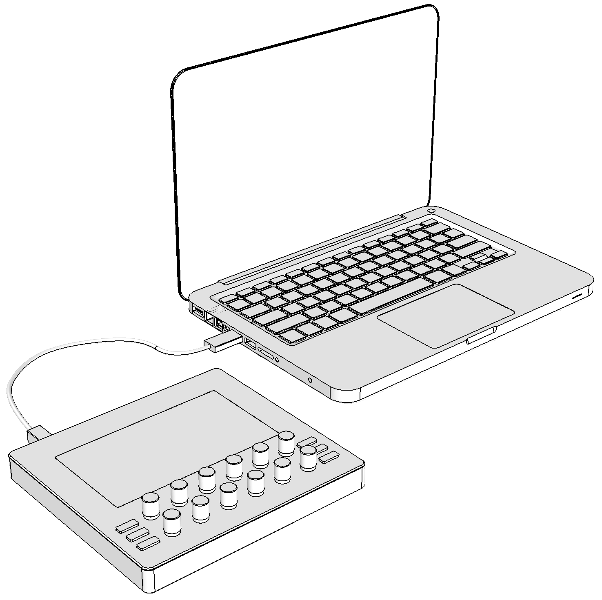

Go to the `Preset library` and choose the Ableton VST demo preset. Click `SEND TO ELECTRA` to upload the preset to Electra One controller.

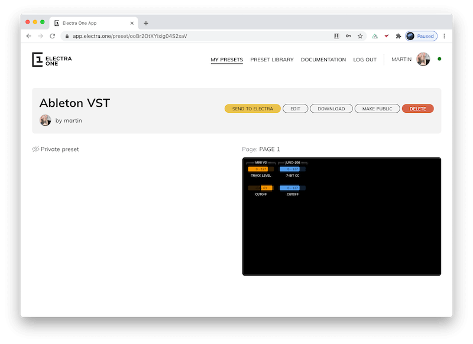

The preset has four Controls to control two parameters of Ableton and two parameters of AU/VST plugins.

| MIDI message  | Parameter number  | Description                      |
|---------------|-------------------|----------------------------------|
| CC            | 10                | Level of track #1                |
| CC            | 11                | Filter Cutoff of Arturia Mini V3 |
| CC            | 20                | Level of track #2                |
| CC            | 21                | Filter Cutoff of Roland June-106 |

## 2. Configure MIDI in Ableton
Launch Ableton Live 10. When running configure MIDI settings so that Electra One is recognized by the Ableton as a control surface.

Go to `Preferences`, switch to `Link MIDI` tab, enable Remote option for:

- Input: Electra Controller (Electra Port 1)
- Output: Electra Controller (Electra Port 1)

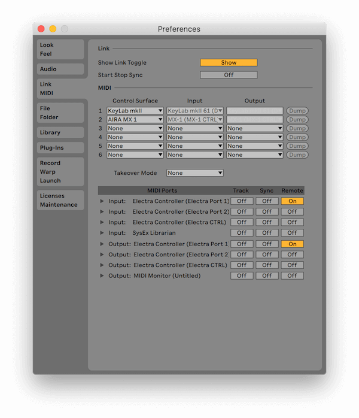

## 3. Assign plugins to the tracks
Open the browser sidebar by selecting the `Show browser` in the `View` menu. Click on `Plugins` collection in the sidebar:

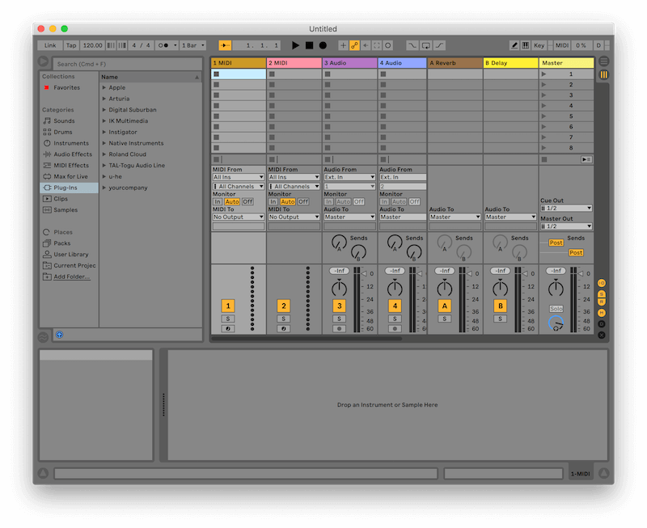

Pick Arturia Mini V3 plugin and assign it to track MIDI 1, then pick Roland Cloud JUNO-106 and assign it to track MIDI 2. Of course, you might not have these plugins, use any other plugins.

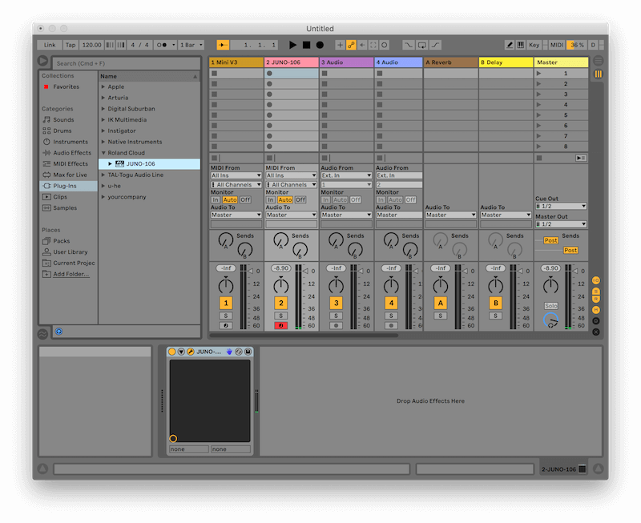

## 4. Map track levels to Electra Controls
Switch to MIDI mapping mode (`CMD + M` / `CTRL + M`) or click the MIDI toggle in the top-right corner of the main window. All of assignable Ableton's controls will become highlighted.

Click on the Track Volume of Mini V3 track and twist the TRACK LEVEL knob in the MIDI V3 group on the controller. The Track Volume is now linked to TRACK LEVEL knob.

Now click on the Track Volume of JUNO-106 track and twist the TRACK LEVEL in the JUNO-106 group on the controller.

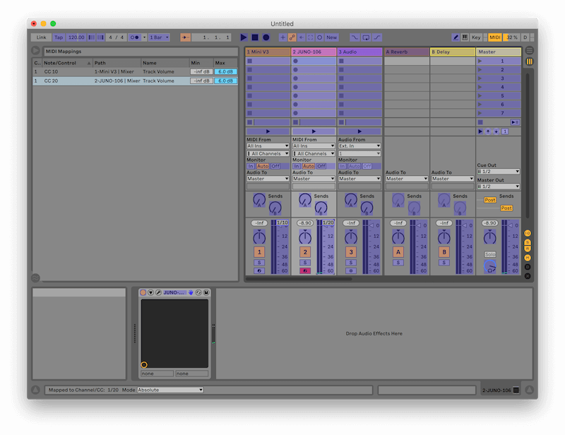

If you have done everything correctly, you will see in the MIDI mappings sidebar that:

- CC 10 is assigned to Mini V3 Track value
- CC 20 is assigned to JUNO-106 Track volume

Now disable the MIDI mapping mode (eg. press `Esc`).

## 5. Verify that MIDI mapping works
Twist both TRACK LEVEL Controls. You should see that the Track Volume of Mini V3 track and the Track Volume of JUNO-106 tracks are moving.

Now, change the value of the Track Volume using the mouse on the computer. The TRACK LEVEL Controls on the Electra One controller should reflect the changes. If not, review and repeat the above steps.

## 6. Extract plugin parameters
Select Mini V3 track by clicking on it. the Detail view underneath the Tracks will display Details about Mini V3 plugin.

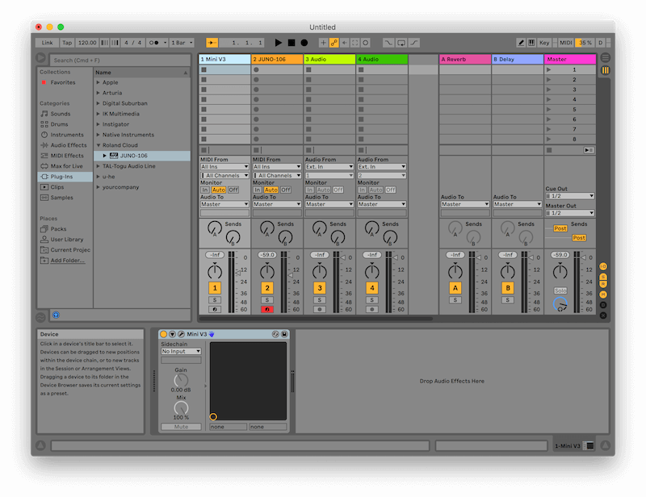

Click both `Unfold Device Parameters` and `Show/Hide Plugin Window`. The Device detail will unfold and will show the `Configure` button.

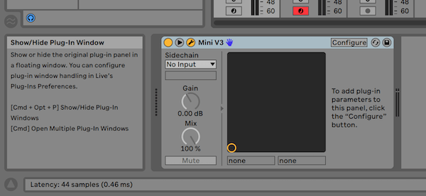

The plugin window will show up as well.

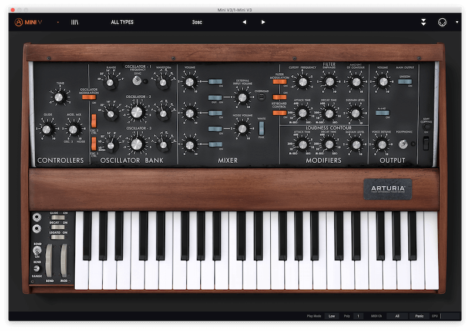

Now, click the `Configure` button, it will become lit green. Then click on the `Cutoff frequency` knob in the plugin window. The Device detail should now show that `Cutoff` has been added to the device.

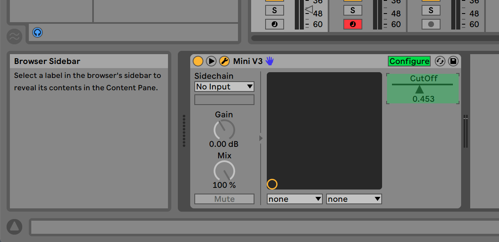

## 7. Map the extracted parameter to Electra Control
The mapping of an extracted parameter is done in the same way as we mapped the Track Volume earlier in this tutorial. Enable MIDI mapping (`CMD + M` / `CTRL + M`). Click on the extracted `CUTOFF` parameter and twist the CUTOFF knob in the MINI V3 group on the controller. Press `Esc` to leave the MIDI mapping mode.

Repeat the steps for mapping the cutoff frequency of Roland JUNO-106 plugin. If done correctly, your MIDI mapping should read:

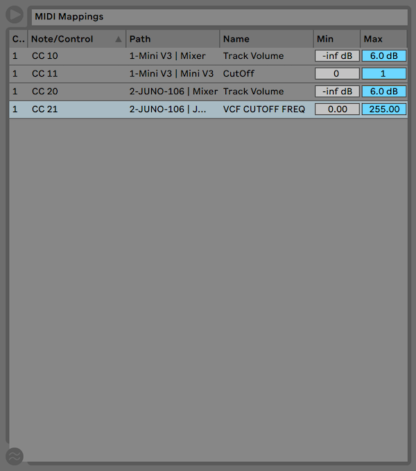

## 8. Well done
If you did everything listed above:

- you will be able to change values of cutoff frequencies of both synths from Electra One MIDI Controller
- Electra One MIDI Controller will reflect all changes of cutoff frequencies done on the computer, including switching of the sounds/patches in the plugin.
