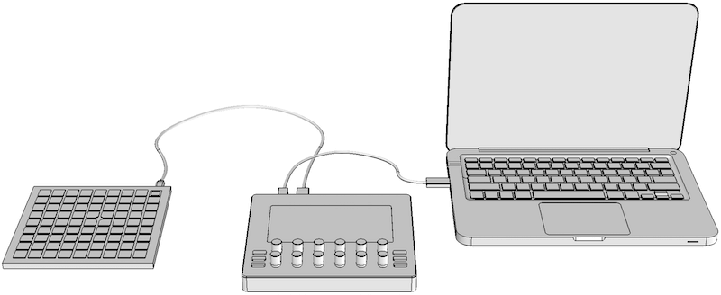
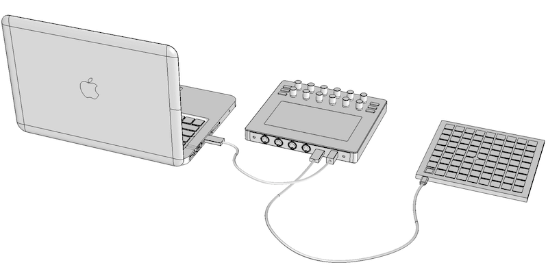
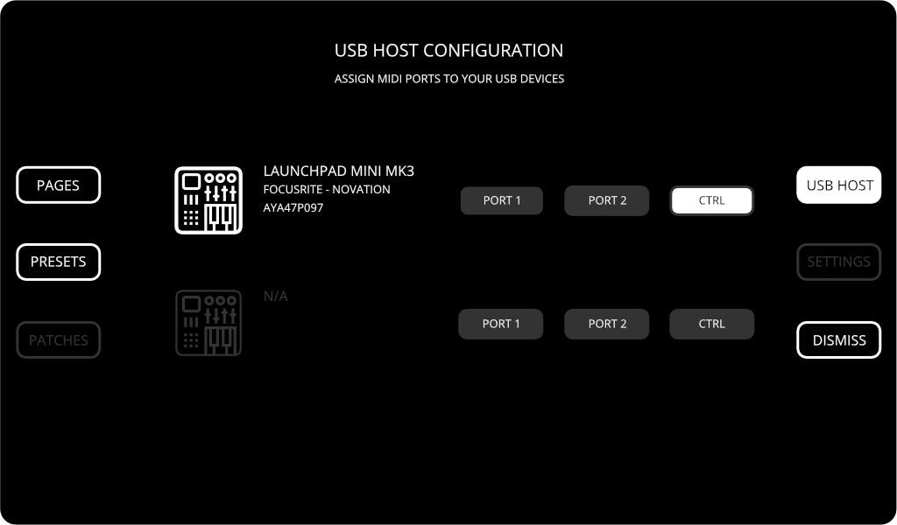

# External control with LaunchPad

::: note Goal of the tutorial
In this article you will learn how to use Novation LauchPad Mini to switch between the first six presets stored in Electra One.
:::

Novation LaunchPad is a great companion of Electra One MIDI controller. Amongst other things it can speed up switching between presets.



## 1. Connect LaunchPad
Connect LaunchPad with USB cable to Electra One MIDI controller's `<USB HOST>` port on the rear panel.




## 2. Assign LaunchPad to CTRL port
In order to use LaunchPad to send commands to Electra, it must be assigned to `<USB HOST>` CTRL port:

- Press the `[ MENU ]` button to open the Menu selection window.
- Select USB Host configuration, by touching the `[ USB HOST ]` on-screen button.
- Finally assign the CTRL port to LaunchPad device, by touching the `[ CTRL ]` on-screen button.

Your screen should read now:



LaunchPad now sends MIDI messages to Electra's CTRL port. Close the USB Host configuration by hitting the `[ DISMISS ]`.

## 3. Configure MIDI messages
LaunchPad now sends MIDI messages to Electra, but the messages do not match Electra's default assignments, see [External MIDI control](/extcontrol.md) for details.

Let's reconfigure Electra so that it switch presets with LaunchPad's Note On MIDI messages.

- Make sure LaunchPad is switched to "Keys" mode.
- Prepare Configuration file with customized assignments.
- Upload the Configuration file to Electra.

The customized configuration file:
``` json
{
   "version":1,
   "midiControl":[
      {
         "event":"switchPreset",
         "eventParameter":1,
         "midiMessage":"note",
         "parameterNumber":36
      },
      {
         "event":"switchPreset",
         "eventParameter":2,
         "midiMessage":"note",
         "parameterNumber":38
      },
      {
         "event":"switchPreset",
         "eventParameter":3,
         "midiMessage":"note",
         "parameterNumber":40
      },
      {
         "event":"switchPreset",
         "eventParameter":4,
         "midiMessage":"note",
         "parameterNumber":41
      },
      {
         "event":"switchPreset",
         "eventParameter":5,
         "midiMessage":"note",
         "parameterNumber":43
      },
      {
        "event":"switchPreset",
        "eventParameter":6,
        "midiMessage":"note",
        "parameterNumber":45
      }
   ]
}
```

Now if you press any of C, D, E, F, G, A pads of the first row on the LaunchPad you will switch between the presets.


## 4. Auto-assign LauchPad to CTRL port
Now you have MIDI messages configured. This configuration is permanent, it means that it will stay in Electra after you power it off. The LaunchPad assignment to CTRL port, however, will be forgotten on powering Electra off.

If you wanted to have this assignment permanent, adjust the Configuration as follows:
``` json
{
   "version":1,
   "usbHostAssigments":[
      {
         "pattern":"launchpad",
         "port":3
      }
   ],
   "midiControl":[
      {
         "event":"switchPreset",
         "eventParameter":1,
         "midiMessage":"note",
         "parameterNumber":36
      },
      {
         "event":"switchPreset",
         "eventParameter":2,
         "midiMessage":"note",
         "parameterNumber":38
      },
      {
         "event":"switchPreset",
         "eventParameter":3,
         "midiMessage":"note",
         "parameterNumber":40
      },
      {
         "event":"switchPreset",
         "eventParameter":4,
         "midiMessage":"note",
         "parameterNumber":41
      },
      {
         "event":"switchPreset",
         "eventParameter":5,
         "midiMessage":"note",
         "parameterNumber":43
      },
      {
        "event":"switchPreset",
        "eventParameter":6,
        "midiMessage":"note",
        "parameterNumber":45
      }
   ]
}
```

With this new configuration, LaunchPad will be automatically assigned to `<USB HOST>` port CTRL.
