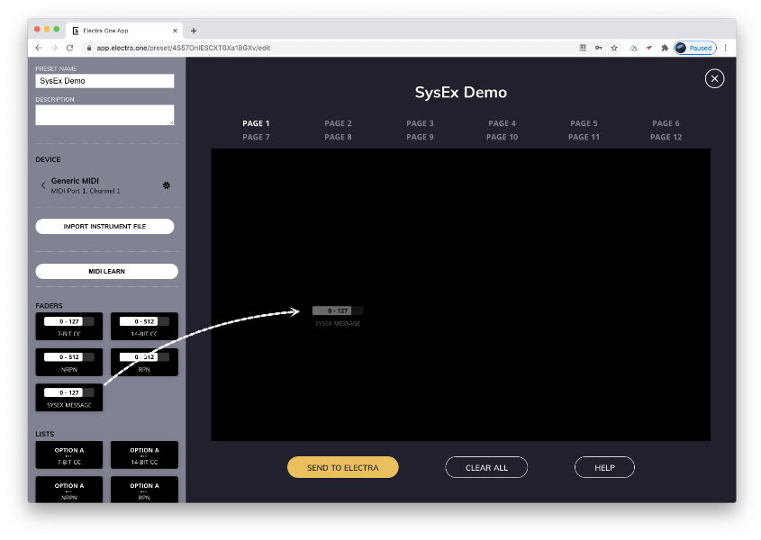
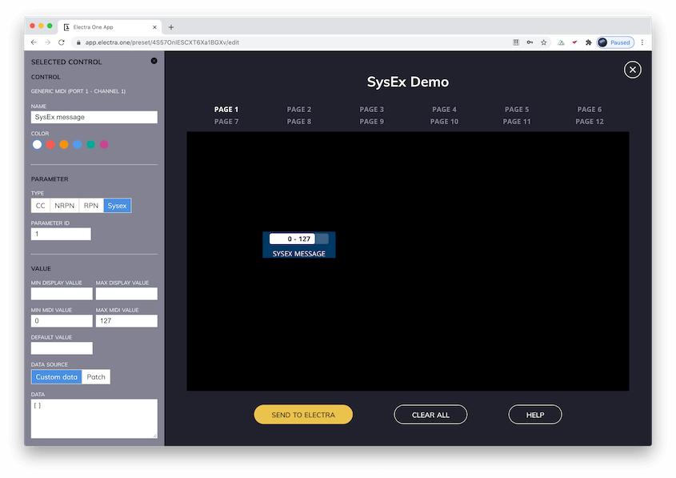
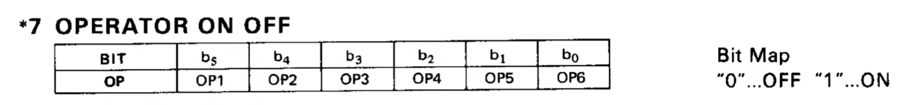

# Writing SysEx templates

::: note Goal of the tutorial
In this article, you will learn how to compose SysEx templates. SysEx templates will allow you to control parameters of your synths that are accessible only via SysEx messaging.
:::

Electra One supports a number of MIDI message types. Some of them are very easy to use, for example, CC messages. Others are more complex and require a bit of technical knowledge of MIDI protocol. This article describes how to write **SysEx templates** - a way to compose SysEx messages sent to your gear when you twist the knobs.


## SysEx message type

To control a SysEx parameter of your synth, you will need to pick a SysEx message Control from the palette and drag it on the canvas.



When the SysEx message Control is on the canvas, you can edit its properties in the sidebar.



There are two attributes specific to the SysEx message Control type:

1. Data source
1. Data

### Data source
Data source tells Electra One what is the source of the SysEx data. it can be either _Custom data_ or _Patch_. The _Custom data_ allows you to enter a sequence of SysEx bytes and various variables for each Control individually. The _Patch_, on the other hand, will use a one patch definition of the device as the template for all your SysEx messages sent to one device.

We will focus on the _Custom data_ only in this tutorial. The topic of using Patch is too complex and will be described in a separate tutorial.

### Data
The _Data_ text field is available only when Data source is set to _Custom data_. The field accepts JSON encoded data that describes the SysEx message. At present time entering the JSON formatted data is the only way of creating a SysEx template.

## Creating an example SysEx messages

### Constant bytes
This is quite a rare example, but let's start with that. It is the most simple SysEx message possible. Imagine a situation when you need to send a constant message of the following SysEx bytes:

`F0h 3Eh 0Eh 00h 20h 00h 00h 3Eh 40h 7F F7h`

This is a SysEx message for Waldorf Microwave XT. It will set filter cutoff to 50% of its range. In order to create such a message, the following JSON needs to be inserted to the _Data_ text field:

``` json
[ "3E", "0E", "00", "20", "00", "00", "3E", "40", "7F" ]
```

The leading F0 and F7 bytes are omitted. They are SysEx start and stop bytes, Electra inserts those to the message automatically. The rest is just an array of the bytes to be sent. The bytes may be entered in the hexadecimal format - quotes are required for hexadecimal notation. Another option is to use decimal notation. Above SysEx message can be expressed also as:

``` json
[ 62, 14, 0, 32, 0, 0, 62, 64, 127 ]
```

Now, when you turn the knob assigned to this Control, the above SysEx message will be sent to corresponding MIDI ports. Good as the first example, but not very useful in the real world. The message will be the same disregarding the value of the Control.


### Simple value
The above example sets the filter cutoff frequency of Waldorf Microwave XT to 50%. The 50% is represented by the eighth byte "40". This is the byte holding the value of the cutoff frequency. "40" is a hexadecimal equivalent of number 64. If you will be changing this number, the cutoff frequency will change accordingly.

``` json
[ "3E", "0E", "00", "20", "00", "00", "3E", "00", "7F" ]
```

will close the filter, while

``` json
[ "3E", "0E", "00", "20", "00", "00", "3E", "7F", "7F" ]
```

will open the filter and will let all harmonics to pass. "00" till "7F" express a full range between 0 and 127 in decimal numbers.

A next logical step is to replace this eight byte with a variable that will be changing as you twist the knobs. The _Value_ placeholder is what you use for that:

``` json
[ "3E", "0E", "00", "20", "00", "00", "3E", {"type":"value"}, "7F" ]
```

Above SysEx template will send the SysEx bytes whenever the value of the Control changes. It will, however, replace the `{"type":"value"}` placeholder with the current value of the Control.


### Particular bits
The simple value placeholder is sufficient in the majority of situations. Unfortunately, there are moments when you need to have more control over inserting the value to the SysEx message. Electra One offers a few handy tools to handle such obstacles.

The value placeholder may have a few optional attributes. These can be used to specify:

1. what parameter the value comes from
1. what bits of the parameter value should be used
1. where the value should be placed within the SysEx byte
1. how many bits it will use.

This is an example of such a message (Yamaha DX7):

`F0h 43h 10h 00h 60h 2_bits_of_parameter_96 F7`

In Electra JSON you will express the same in the following way:


``` json
[  
  "43",
  "10",
  "00",
  "60",
  {  
    "type": "value",
    "rules": [  
      {  
        "parameterNumber": 96,
        "byteBitPosition": 0,
        "bitWidth": 2
      }
    ]
  }
]
```

The nested rules array provides additional info on how to compose the SysEx bytes. In this particular example, it says: place 2 bits (LSB) of the value of parameter 96 to the bit position 0 (LSB) in the SysEx byte.

| attribute       | function |
|-----------------|----------|
| parameterNumber | id of the parameter as specified in the sidebar (always decimal)|
| byteBitPosition | bit position in the SysEx byte, ie. where the value will be placed  |
| bitWidth        | number of bits to be used |


### Two nibbles
As MIDI effectively uses 7-bits only, synthesizer manufacturers were quite creative about how to get values with higher resolution to their SysEx messages. That is where you meet nibbles, MSB bits, 7-bit encoded high-resolution numbers, and many more. Let's take a look at how Electra can divide one value into two separate SysEx bytes. Imagine following SysEx message (Roland TB3 without checksum):

`F0h 41h 10h 00h 00h 7Bh 12h 00h 20h 30h 0Ah value_upper_nibble value_lower_nibble F7h`

In this message, we have to place the upper 4 bits of the value to the _value_upper_nibble_ SysEx byte and the lower 4 bits of the value to the _ value_lower_nibble_ SysEx byte. This is the way to do it, using the Electra's JSON:

``` json
[
  "41",
  "10",
  "00",
  "00",
  "7B",
  "12",
  "00",
  "20",
  "30",
  "0A",
  {
    "type": "value",
    "rules": [
      {
        "parameterNumber": 39,
        "parameterBitPosition": 4,
        "byteBitPosition": 0,
        "bitWidth": 4
      }
    ]
  },
  {
    "type": "value",
    "rules": [
      {
        "parameterNumber": 39,
        "parameterBitPosition": 0,
        "byteBitPosition": 0,
        "bitWidth": 4
      }
    ]
  }
]
```

For the first byte,s the message says: take 4 bits of the parameter 39 starting at bit position 4 and place them to this SysEx byte at position 0. For the second SysEx byte, it say: take 4 bits of parameter 39 but this time starting at position 0 and place them to the SysEx byte at position 0.

Now, when you twist the knob, Electra will split the value according to rules. You have just learned here about a new Rules attribute:

| attribute            | function |
|----------------------|----------|
| parameterBitPosition | bit position within the parameter value |


### Complex composed value
In early MIDI days, the memory of the machines was very limited. Manufacturers often used one SysEx byte to hold several parameter values. A very good example of this is the Operator switches byte of Yamaha DX7. Within this SysEx byte, 6 individual bits express if each of the six voice operators is switched on or off. From what you read above, you know you can address each of those bits by using _byteBitPosition_ and _bitWidth_ rule attributes. The tricky part here is, however, the fact that you always need to provide all six bits. Even if you work just with one operator.



If you wondered why rules are a JSON array, you might know where we are heading to. This is how you would resolve this pickle in Electra JSON:

``` json
[  
  "43",
  "10",
  "01",
  "1B",
  {  
    "type": "value",
    "rules": [  
      {  
        "parameterNumber": 155,
        "byteBitPosition": 5,
        "bitWidth": 1
      },
      {  
        "parameterNumber": 156,
        "byteBitPosition": 4,
        "bitWidth": 1
      },
      {  
        "parameterNumber": 157,
        "byteBitPosition": 3,
        "bitWidth": 1
      },
      {  
        "parameterNumber": 158,
        "byteBitPosition": 2,
        "bitWidth": 1
      },
      {  
        "parameterNumber": 159,
        "byteBitPosition": 1,
        "bitWidth": 1
      },
      {  
        "parameterNumber": 160,
        "byteBitPosition": 0,
        "bitWidth": 1
      }
    ]
  }
]
```

Please note, that in this JSON you do not have 6 different value placeholders. Instead, you have one value placeholder with six rules in it. These rules do so-called SysEx byte composition - they take more parameter values to compose just one SysEx byte.

In order to do this, you create 6 Controls in the Electra Editor and assign them any unique parameter id. In this example, we will use parameter ids 155, 156, 157, 158, 159, and 160. Make each of the Controls a list with O and 1 value. All of these controls have the same Data JSON defined. When you turn the knob, for instance, of Operator 3, Electra will not only use the value of parameter 157, it will compose the SysEx byte using the values of all six parameters.

## Checksums
Checksums are special SysEx bytes that are meant to provide information on whether or not the data in the message is correct. They are mathematical formulae applied to part of the bytes of the SysEx message. The result of this calculation is placed at the end of the SysEx message. This allows the receiving MIDI device to know that the data was not malformed during the transmission. SysEx messages with wrong checksum byte are usually ignored by the receiving device.

By definition, the checksum will be a constant number for messages that are made of constant bytes only. As soon as you include a value placeholder to the JSON, the constant checksum will stop working. The checksum placeholder comes in play in such a situation.

Above we have shown an example SysEx message for Roland TB3. This message is not actually complete and would not work. Roland often uses checksums in their messages. We simplified that example on purpose. Now, let's take a look at how the correct message would look like:

```json
[
  "41",
  "10",
  "00",
  "00",
  "7B",
  "12",
  "00",
  "20",
  "30",
  "0A",
  {
    "type":"value",
    "rules":[
      {
        "parameterNumber":39,
        "parameterBitPosition":4,
        "byteBitPosition":0,
        "bitWidth":4
      }
    ]
  },
  {
    "type": "value",
    "rules": [
      {
        "parameterNumber": 39,
        "parameterBitPosition": 0,
        "byteBitPosition": 0,
        "bitWidth": 4
      }
    ]
  },
  {
    "type": "checksum",
    "algorithm": "roland",
    "start": 6,
    "length": 6
  }
]
```

The last SysEx byte is a _Checksum_ placeholder. It has three attributes that define what data should be part of checksum calculation and what type of the checksum calculation should be used.

The _Checksum_ placeholder will be replaced with the result of the calculation in the outgoing SysEx message.

| attribute | function |
|-----------|----------|
| algorithm | type of checksum calculation formulae. Often based on manufacturer|
| start     | position of the first byte to be included in calculation |
| length    | number of bytes to be included in the calculation |

Currently, we support the following algorithms:

```
roland
waldorf
fractal
```

If you wish to have a new one, please create a github issue or contact us.


## Final words

We have designed the Data JSON so that it can be easily extended with new types of placeholders or new types of attributes can be added to existing ones. Please feel free to talk to us if you have suggestions or ideas.

If you had trouble with getting your SysEx messages working, contact us using the integrated Chat system in the Electra Editor. Always mention what synth you are working on. We will try to help you to get it working. Either immediately on the chat or later on when we have time to work on it.

Last but not least, JSON is used because it is handy to describe data objects. This is easy to understand for tech-savvy people. For those who do not have the technical skills or who do not want to spend time on it, we will provide soon a visual editor.
