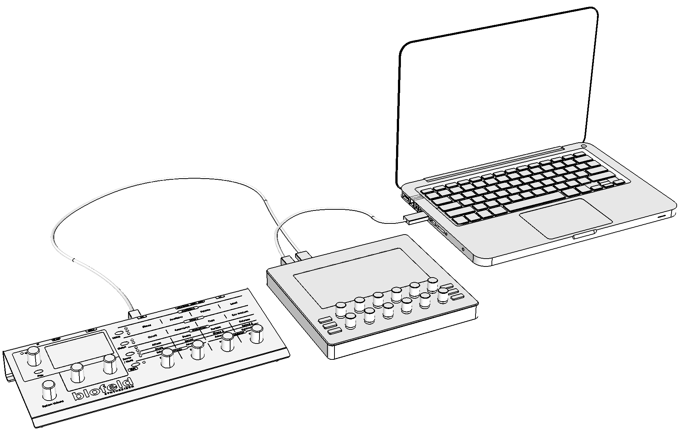
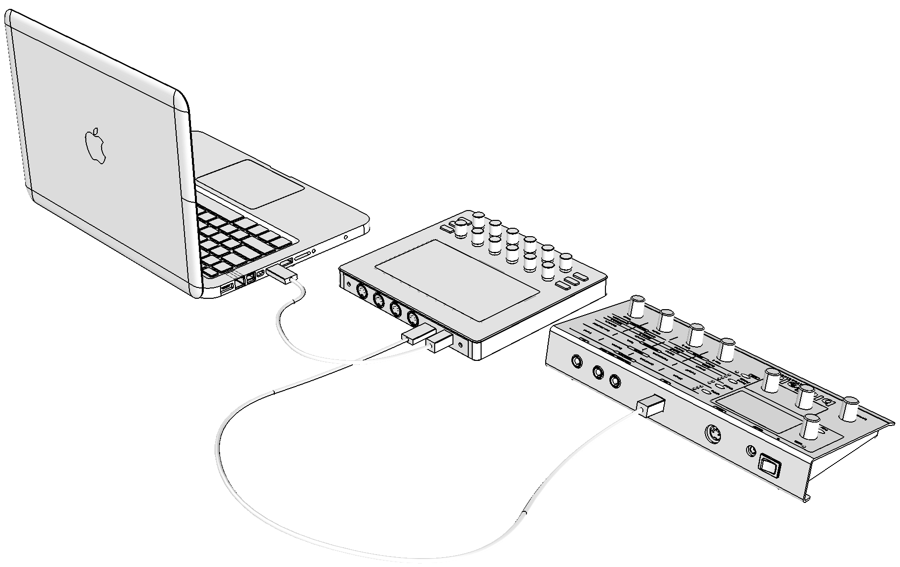
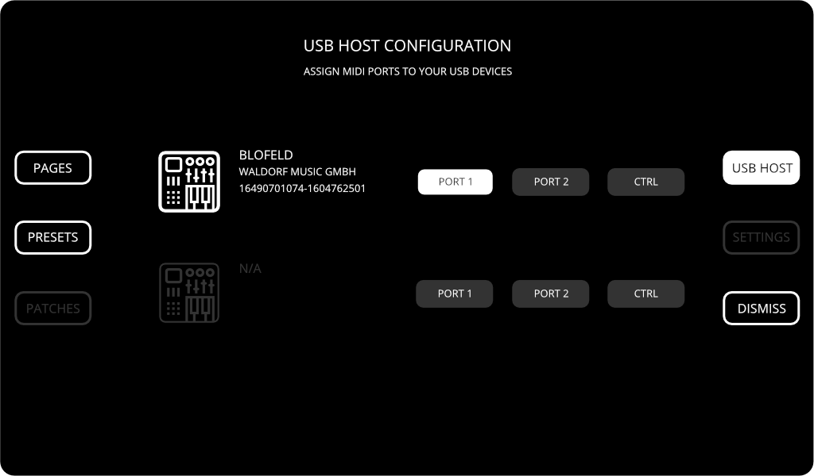

# Synth on the USB host

::: note Goal of the tutorial
Create a simple preset for a synth connected to Electra's USB Host port.
:::

We will demonstrate how to connect a synth to Electra's USB host port and make a simple preset for controlling a few parameters. We will used Waldorf Blofeld in this tutorial.

## 1. Connect Blofeld
Connect Blofeld with the USB cable to Electra One MIDI controller's `<USB HOST>` port on the rear panel.

## 2. Assign Blofeld to port 1
To exercise USB host port assignments, we will take steps to connect Blofeld to `<USB HOST>` port 1:

- Press the `[ MENU ]` button to open the Menu selection window.
- Select USB Host configuration, by touching the `[ USB HOST ]` on-screen button.
- Finally assign the port 1 to Blofeld device, by touching the `[ PORT 1 ]` on-screen button.

Your screen should read now:

Blofeld now sends MIDI messages to Electra's port 1. Close the USB Host configuration by hitting the `[ DISMISS ]`.
