# Electra’s User Interface

Electra One user interface is designed so that a computer is not needed once the presets are uploaded to the controller. All information that a user might need is available and accessible directly from the hardware. Of course, you may leave Electra One connected to a computer while using it. If you want to work with software VST plugins or DAW, you even have to keep it connected.

## Elements of the user interface

The user interface relies on four important elements:

- the color display that shows information about presets and displays navigation means
- the display touch, that allows working with Controls and navigate between pages, presets, and configurations.
- the buttons to switch between sections, pages, as well as to load and save your data
- the touch-sensitive knobs that are used to improve orientation on the pages of Controls and to make choices on the selection screens.

## The display

### The status bar
The Status bar is located at the top of the screen. The status bar is meant to provide information about the USB device port, devices connected to the USB Host port, and MIDI IO ports.

The status bar is updated dynamically in real-time. The location of the status bar labels reflects the physical location of the ports on the rear panel.

#### USB Device port
The rightmost item of the status bar. It indicates the physical position and MIDI activity of the USB device port `<USB DEVICE>`.

#### USB Host devices
USB Host devices item provides information about MIDI USB devices connected to Electra’s USB Host port. The item is also an indicator of MIDI activity on the MIDI USB host port `<USB HOST>`. The indicator is flashing whenever there is a flow of MIDI data. The MIDI USB devices are identified by their “Product name”

#### MIDI IO ports
Indicators of the MIDI activity on the MIDI IO DIN-5 ports are referred to as `<MIDI IO>`. The indicators are flashing whenever there is a flow of MIDI data.

### Active section

Electra’s display can show up to 36 Controls on one screen. There are, however, only 12 knobs. To allow the user to easily reach all 36 Controls, the screen is divided into three sections of 12 Controls.

Only one section can be active at the time. The Controls of the active section are connected to the 12 knobs. Turning a knob will cause a change of the value of the corresponding Control.

The Active section is selected with the three buttons on the left side of Electra.

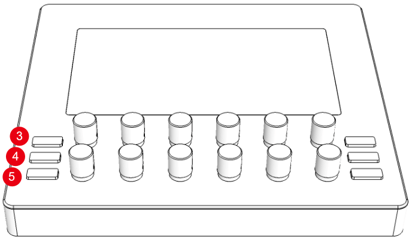

- Button 3, referred to as `[SECTION 1]`, makes the top section active
- Button 4, referred to as `[SECTION 2]`, makes the middle section active
- Button 5, referred to as `[SECTION 3]`, makes the bottom section active

The Active section is always highlighted, while the inactive sections are dimmed. The section highlighting helps users to get oriented on the screen and make a visual connection between the knobs and the controls.

The Active section can be also switched by clicking a Control on the display. The click will activate the section where the Control is located.

Top section active

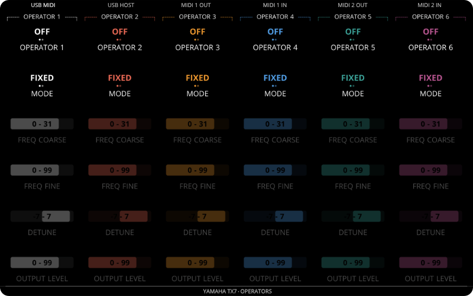

Middle section active

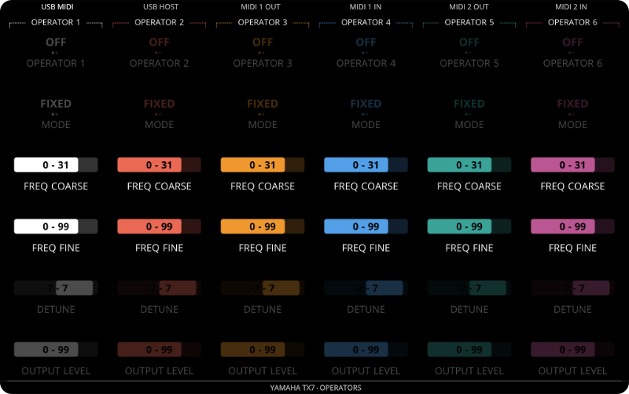

Bottom section active

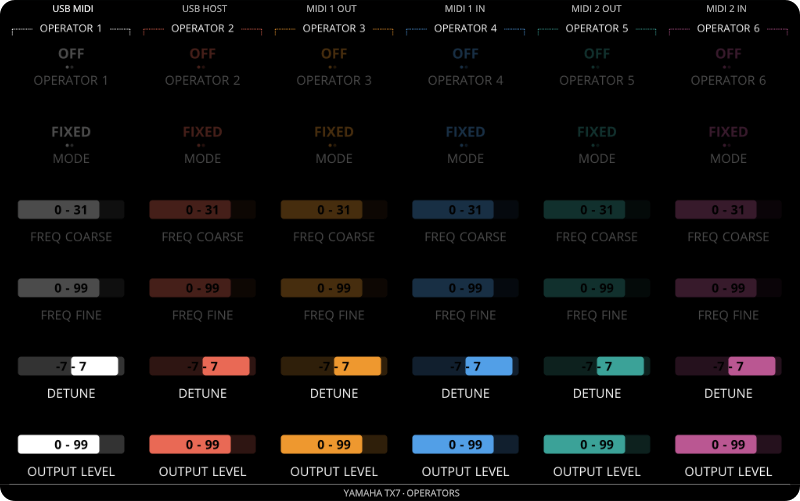

## Right side buttons

Right side buttons provide access to preset synchronization operations and the Electra general menu.

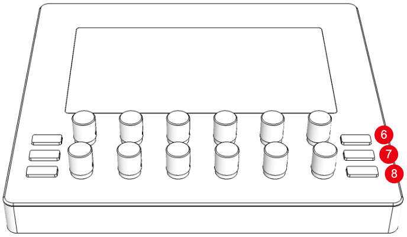

- Button 6, referred to as `[PATCH REQUEST]`
- Button 7, referred to as `[SAVE]`
- Button 8, referred to as `[MENU]`

### Patch request
If preset consists of instructions to request and parse device patch data, the requests are sent when the `[PATCH REQUEST]` button is pressed. Electra One controller will update the values of the Controls according to their patch settings as soon as the Device responds with the patch dump MIDI data.

### Save
Pressing the `[SAVE]` button will initiate a SysEx dump of the current preset to Electra CTRL port.

###  Menu
Pressing `[MENU]` switches Electra to the menu window mode. The menu window can be used to:

- switch between preset Pages
- switch between Preset banks and Presets stored in Electra One's internal storage
- configure assignment of USB devices connected to USB Host port `<USB HOST>`

#### Page selection

Each Electra preset may have up to 12 pages of Controls. There are two ways to switch between the pages:

- Quick page browsing
- Page selection menu

##### Quick page browsing

When `[MENU]` button is pressed and held pressed a list of all pages will appear at the bottom of the screen.

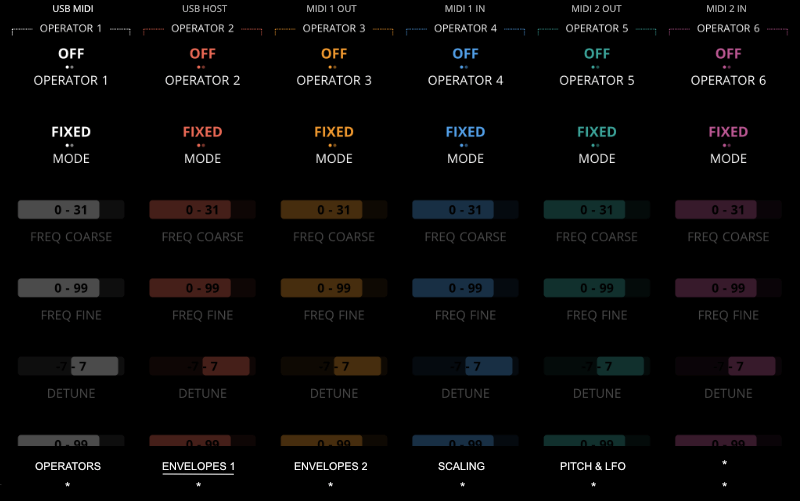

The currently selected page is marked with an underlined label. The page names are displayed so that their position corresponds to the knobs. The knob touch can be used to preview the pages. Pages marked as * are unused pages, these cannot be previewed or switched to.

If you change the selected page with knob touch, the Quick page view will disappear when the `[MENU]` button is released. If the `[MENU]` was just clicked without making a page selection, the Electra menu will be shown.

##### Page selection menu

The Page selection window is shown upon releasing the `[MENU]` button. It provides an overview of all pages and allows users to change the current page.

The page can be switched either by tapping the corresponding knob or touching the page name on the display.

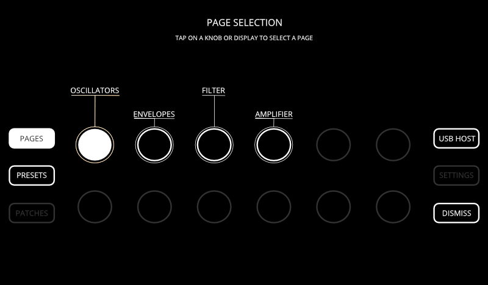

The Page selection is displayed immediately after pressing the Menu button. It is done that way to provide a fast way to page switching.

The dimmed page icons represent empty pages. It is not possible to switch to them.

#### Preset selection

Not only that each preset has 12 pages, Electra One gives you a very fast way to switch between 72 presets, organized in 6 banks.

##### Changing the current preset
To reach the Preset selection, press the `[MENU]` and then tap the `[PRESETS]` on-screen button or press the left-middle hardware button that is temporarily assigned this function. The Preset selection window with 12 preset slots will appear.

The selection is done in the same way as selecting pages. You can use either tapping the knobs or with the touch on the display.

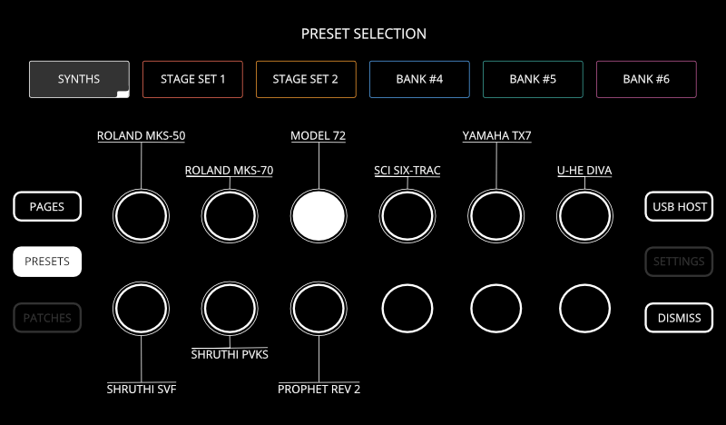

The preset is loaded immediately after it is selected. If the preset slot is empty, an empty preset will be loaded and shown.

The Electra App and the Electra Editor always send presets to the currently selected preset slot. If the selected slot contains a preset, sending a new preset from the editor will overwrite the original preset.

##### Changing the current preset bank
The banks can be switched by tapping the on-screen bank buttons

Each bank may have up to 12 presets. Once the preset bank is changed, you can choose the preset as described above.

The active bank is highlighted with a color background:

The bank that consists of the currently loaded preset has a special indicator at the right-bottom corner:

#### USB Host configuration
Electra features a `<USB HOST>` port to connect USB MIDI devices and Electra accessories. Although there is only one USB port, it is possible to connect a standard USB Hub to increase the number of USB ports.

Any USB MIDI device connected to Electra’s `<USB HOST>` port can be assigned to PORT 1, PORT 2, or CTRL.

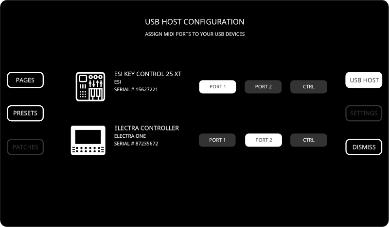

If the USB device, for example, a master keyboard, is connected to PORT 1, the messages it sends will be forwarded to `<USB DEVICE>` port Electra Port 1 and `<MIDI 1 OUT>` port. Any MIDI message sent to either `<USB DEVICE>` port Electra Port 1 or `<MIDI 1 IN>` port will be automatically forwarded to the USB device connected to the `<USB HOST>` port 1. PORT 2 uses the same principle.

The CTRL port is used for Electra's external MIDI control. External control allows you to switch pages and presets by sending MIDI messages to Electra's `<USB HOST>` port.

## Interacting with controls

### Active control
To make orientation even easier, the touch on knobs marks corresponding controls underlined. It means you can see what Control is active even if you do not turn the knob.

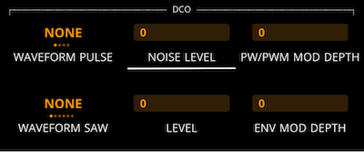

### Switching the Active section
A single tap on a Control will switch to the Active section where the control is located.

### Control detail

Touch and prolonged hold of the Control will display a Control detail window with a full-size version of the Control. The Control detail provides you with fine control over the value. The detail window can be also revealed by holding the knob and pressing the `[SECTION 1]` button.

Each type of Control has its special detail window:

#### Fader detail
The fader detail is meant to allow maximum width sweeps of the Control value. The fader strip is wide and high enough to provide adequate room for your finger.

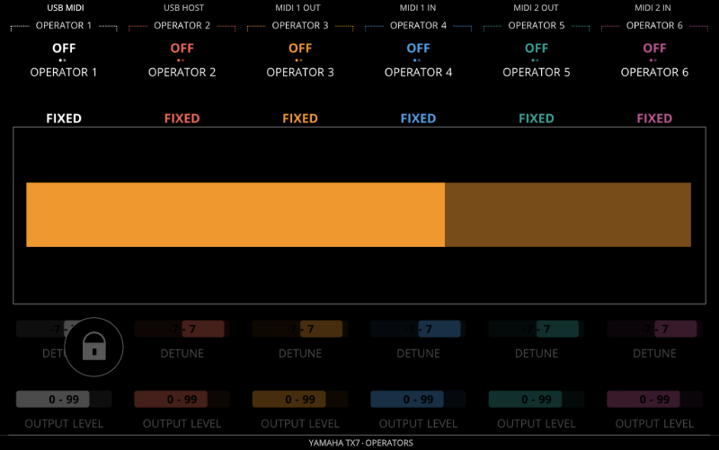

#### List detail
The list detail is meant to provide a tablet like swipeable list of values. The values can be browsed by swiping the items up and down. The item is selected with a single tap on the display.

#### Envelope detail
The envelope detail is meant to allow users to change all envelope values from one place. When the detail window is shown, Electra re-assigns knobs to individual envelope values. This temporary knob assignment is available only as long as the detail window is shown.

#### Locking the detail window

Normally, the detail window is closed immediately after changing the value or making a selection. This could be inappropriate in some situations. To prevent this the window can be locked by tapping the lock symbol:

When the lock is tapped, the symbol gets highlighted and the detail window can be used to change the value many times.

The locked detail window can be closed by tapping the lock symbol again or tapping the display elsewhere outside the detail window.

#### Detail window knob assignment

The detail window keeps the assignment of the original knob. It means you can use the same knob to change the value of the Control when it is displayed in the detail window.

### Resetting to the default value
A double-tap on the Control resets its value to the default defined in the preset.

### Changing active value of envelopes

The multi-value controls, such as envelopes, have knobs assigned to one of their values when the preset is loaded. This default assignment is set by the user in the Preset editor. There are situations, however, when a different value needs to be adjusted and opening the envelope detail window is not appropriate. In such situation, a quick active value change gesture can be used. There are two ways to achieve changing the value that is assigned to the knob:

- hold the knob of the envelope (it means the name of the control is underlined) and tap the envelope control on the display. The value assigned to the knob will be switched to the next available and will become highlighted.
- hold the knob of the envelope (it means the name of the control is underlined) and press either `[SECTION 2]` or `[SECTION 3]` button. The `[SECTION 2]` will switch to the next available value within the envelope. The `[SECTION 3]` will switch to the sprevious available value within the envelope.
